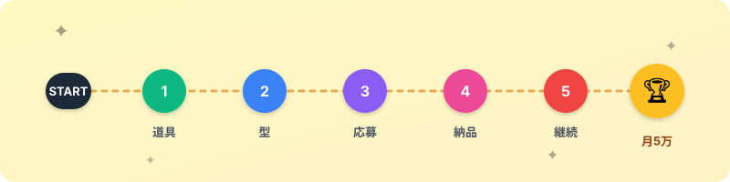
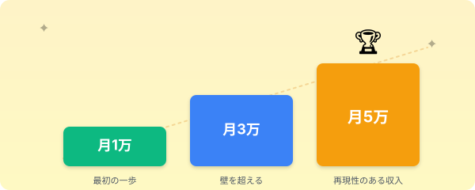

# World1の始まり｜「自分にもできそう」を体験する

> **ゴール**: World1 の全体マップが頭に入って、「これなら自分にもできそう」と感じられる状態になる。

## ようこそ、World1へ

このコースは、こんなあなたのために作りました。

- 副業をやってみたいけど、何から始めればいいか分からない
- AI ってよく聞くけど、ほとんど触ったことがない
- プログラミングなんて当然できない
- でも、月5万くらいは自分の力で稼げるようになりたい

そんな状態でも、**最初の1件納品まで自分でやり切れるようになる**。

それが、この講座のゴールです。

---

## 「3時間 vs 30分」の話

リサーチ案件、というものをご存知ですか？

クラウドワークスでよく見る、こんな仕事です。

> 「楽天で人気の家電を100件リストアップしてください」

これ、普通にやると **3時間** くらいかかります。

商品ページを開く。

商品名をコピー。

URL をコピー。

評価をコピー。

スプレッドシートに貼り付け。

これを **100回** 繰り返すんです。

時給に換算すると500円を切ります。

正直、割に合わないんですよね。

でも、**AIに任せたらどうなるか。**

<strong>普通のやり方</strong>

100件 × 平均1.5分 = <strong>3時間</strong>

集中力もメンタルも消耗していく

<strong>AIに任せた場合</strong>

指示と確認だけで <strong>30分</strong>

AIが代わりに手を動かしてくれる

これが、この講座で身につけられる「型」です。

特別な才能もプログラミング知識もいりません。

**やり方を知っているか、知らないか。**

それだけの違いなんです。

---

## World1のステージマップ

ゲームみたいに、5つのステージを順番にクリアしていきます。

<strong>進め方</strong>: 各ステージには checkpoint（クリア条件）があります。これをクリアしてから次へ進む。順番に積み上げていくのが World1 攻略のコツです。

1<strong>w1-1：道具をそろえる</strong>

Claude Code とスプレッドシートの役割を理解する。

あなたの作業環境を整える、最初のステージ。

2<strong>w1-2：型を覚える</strong>

このコースの心臓部。

模擬案件を使って「3ステップで案件を回す型」を体に染み込ませる。

3<strong>w1-3：案件を取りにいく</strong>

クラウドワークスで狙うべき案件を見極める目を養い、実際に応募文を出す。

4<strong>w1-4：実案件をやり切る</strong>

受注した案件を、AIと一緒に最後まで納品する。

これが最初の1件。

5<strong>w1-5：月5万への道筋をつかむ</strong>

月1万 → 3万 → 5万のロードマップと、続けるための行動計画を作る。

---

## ゴールは月5万。最初の目標はもっとシンプル

最終ゴールは月5万円ですが、いきなりそこを目指す必要はありません。

**最初の目標は、たった1件の案件をやり切ること。**

1件できれば、2件目はもっと早くできます。

3件目はさらに早く。

その積み上げで、月5万に届きます。

<strong>大丈夫</strong>: プログラミングはできなくてOK。Claude Code はターミナル上で日本語で話しかけるだけで動きます。コードは1文字も書きません。

<strong>あなたが手に入れるもの</strong>: 月5万円より大きいのは、「AIを使って自分の時間を増やす型」を持っていること。これは、リサーチ案件以外のあらゆる場面で一生使える武器になります。

---

## さあ、始めましょう

不安があるなら、まず読み進めてみてください。

1ステージずつ、checkpoint を順番にクリアしていけば、気づいたら最初の1件を納品しています。

**次のアクション** → [w1-1攻略｜まず何の道具が必要なのかを知ろう](./1-0_w1-1攻略.html)
