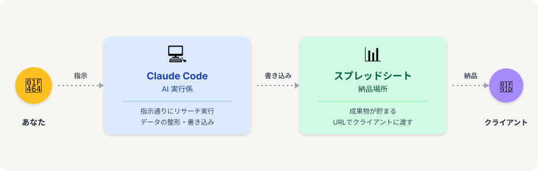
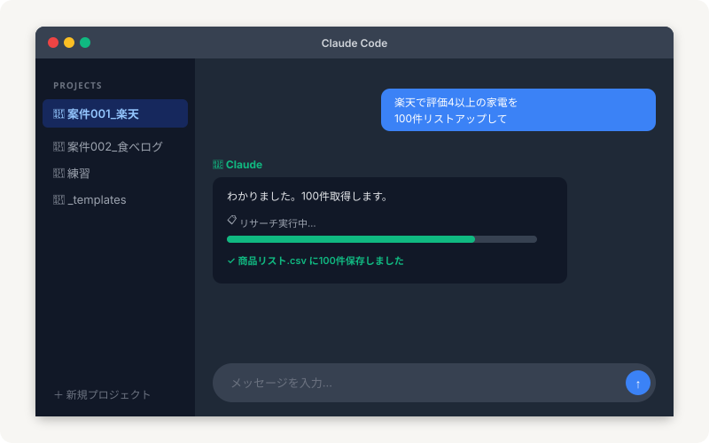
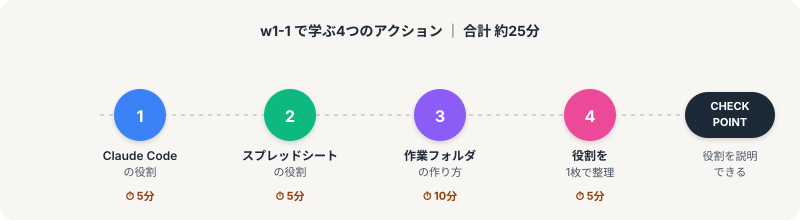

# w1-1 攻略｜まず何の道具が必要なのかを知ろう

> **ゴール**: World1 で使う道具は2つだけ。「これなら自分にも揃えられる」と納得して、次のアクションへ進める状態。

## ようこそ、最初のステージへ

World1 の最初のステージ「w1-1」へようこそ。

このステージでは、AIでリサーチ案件を半自動化するために必要な **道具を見極める** ことだけをやります。

道具の役割さえハッキリすれば、作業中に「これってどのツールでやるんだっけ？」と迷うことがなくなる。

実はこれが、副業で挫折する人の **一番大きな原因** だったりします。

---

## なぜ「2つだけ」なのか

世の中、AIツールやリサーチ系のツールは **数百種類** あります。

ChatGPT、Gemini、Notion AI、Perplexity、Cursor、Bardimo、Devin……。

毎週のように新しいものが出てきて、「結局どれを使えばいいの？」と混乱しますよね。

でも、**リサーチ案件を半自動化するために必要なのは、たった2つだけ**。

<strong>ミニマルでいい理由</strong>: 道具は多ければ多いほど良い、というのは罠です。 2つに絞ることで、覚えるコストが下がる・迷う時間が消える・上達が早くなる。これは最初に掴んでほしい原則です。

---

## 2つの道具を一言で

### 💻 Claude Code（クロードコード）

PC にインストールする **デスクトップアプリ** で動く AI 実行係です。

「楽天で評価4以上の商品を100件リストアップして」のように日本語で指示するだけで、実際に手を動かしてくれる相棒。

リサーチ実行・データ整形・スプレッドシートへの書き込みまで、一気通貫でやってくれます。

### 📊 スプレッドシート（Google Sheets）

成果物が貯まる **納品場所**。

Claude Code が調べてきた結果がここに蓄積されていきます。

最終的にはこのスプレッドシートの URL をクライアントに渡せば、案件は完了です。

---

## Claude Code はこんな見た目

普段使うチャットアプリ（Slack や LINE）と似た感覚で操作できます。

画面の見方は3つだけ覚えれば OK：

1<strong>左サイドバー：プロジェクト一覧</strong>

案件ごとにフォルダが並ぶ。w1-1 の最後で「1案件 = 1プロジェクト」のフォルダ構成を作ります。

2<strong>中央：チャット画面</strong>

あなたが打ったメッセージ（青い吹き出し）と、Claude の返答（左側）が並ぶ。LINE のトーク画面と同じ感覚。

3<strong>下部：入力欄</strong>

ここに日本語で「やってほしいこと」を打つだけ。Enter キーで送信、↑ボタンでも送信できます。

<strong>コードは1文字も書きません</strong>: 「Claude Code」って名前から「プログラミングが必要？」と感じるかもしれませんが、実際は普通のチャットです。日本語で会話するだけで動きます。

---

## w1-1 で学ぶこと

このステージは **4つのアクション** で構成されています。

合計で約25分。順番にクリアしていけば、checkpoint「**道具の役割を1枚で説明できる**」に到達します。

1<strong>Claude Code の役割</strong> ⏱ 5分

ターミナルで動く AI が、リサーチ案件で何をしてくれるのかを掴む。

2<strong>スプレッドシートの役割</strong> ⏱ 5分

なぜ納品はスプレッドシートなのか、どんな形で渡すのが正解なのかを理解。

3<strong>作業フォルダの作り方</strong> ⏱ 10分

「1案件 = 1フォルダ」のルールで、迷わない作業環境を整える。実際に手を動かす唯一のアクション。

4<strong>役割を1枚で整理</strong> ⏱ 5分

ここまでで学んだことを、自分の言葉で1枚にまとめて checkpoint クリア。

---

## checkpoint：道具の役割を1枚で説明できる

w1-1 を終えた時、こんな問いに答えられるようになります。

- リサーチ案件を半自動化するために必要な道具を2つ言える？
- それぞれの役割を一言で説明できる？
- 案件が来たとき、まず何のツールを使う？

声に出して答えられたら、それが checkpoint クリアの合図です。

<strong>「説明できる」が大事な理由</strong>: 理解したつもりでも、自分の言葉で説明できなければ使いこなせません。「説明できる」を基準にすることで、曖昧な理解を防ぎます。

---

## さあ、最初のアクションへ

まずは Claude Code がどんな道具なのかを知るところから。

**次のアクション** → [1-2 Claude Code の役割](./1-2_claude-codeの役割.html)
