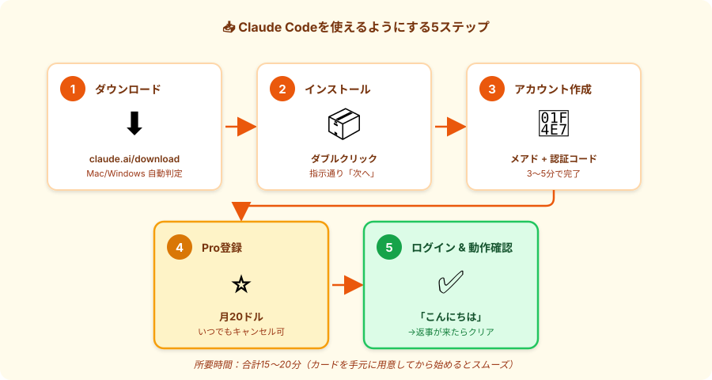
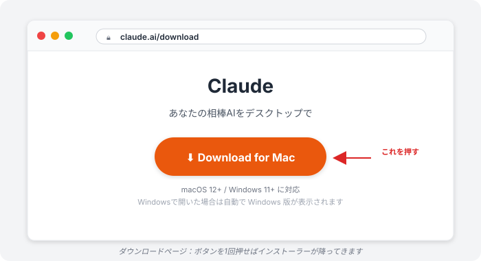
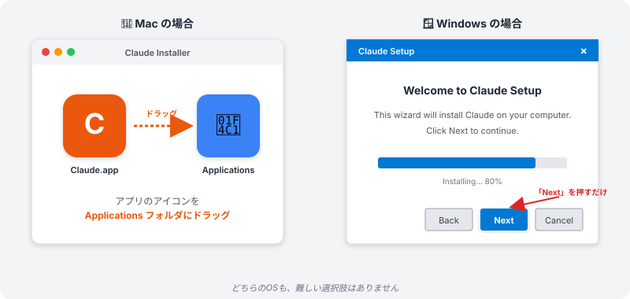
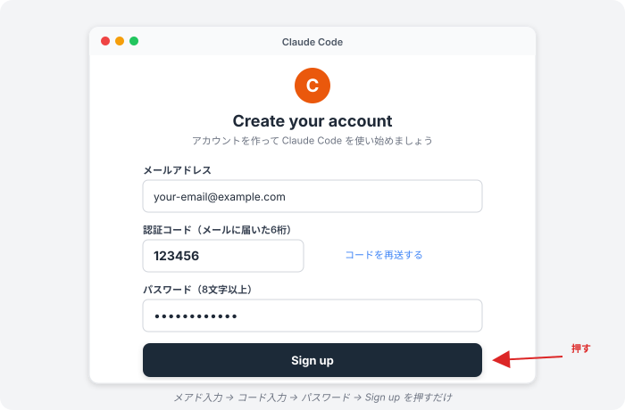
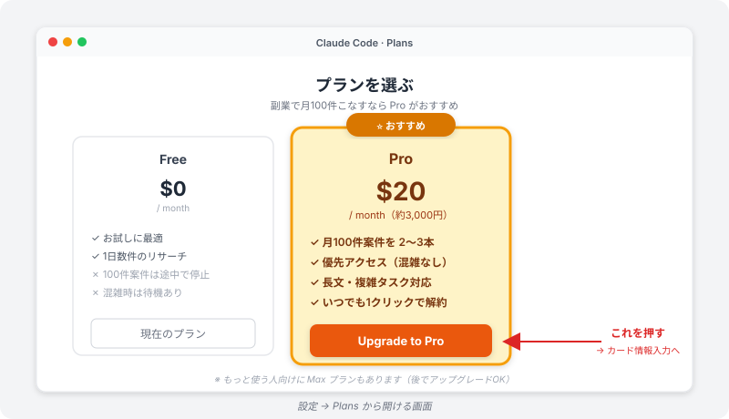
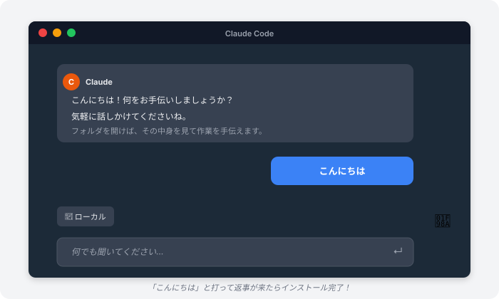

# Claude Code をインストール｜まずは道具を手に入れる

> **ゴール**: Claude Code がインストール済み・ログイン済みで、いつでも「こんにちは」と話しかければ返事が返ってくる状態。

## このページで何をするか

Claude Code は **専用のデスクトップアプリ**。スマホアプリのように、PCにインストールして使います。

「インストール」と聞くと身構えるかもしれませんが、やることは **5ステップ・所要時間15〜20分** だけ。最後に「こんにちは」と打って返事が返ってきたらクリアです。

---

## はじめに｜カードを手元に用意してください

このページのステップ4で **クレジットカードを使ってPro（月20ドル）に登録** します。

<strong>なぜ最初から Pro なの？</strong> 
無料枠だと、100件のリサーチを途中で「今月の上限に達しました」と止められて、続きができなくなります。Pro なら月100件のリサーチを **2〜3案件分** こなせる余裕があります。 
副業で月5万を狙うなら、月20ドル（約3,000円）の投資は十分回収できます。<strong>いつでも1クリックでキャンセルできる</strong> ので、まず1ヶ月だけ試す感覚でOK。

---

## ステップ1｜ダウンロードする

1<strong>ブラウザで <code>claude.ai/download</code> を開く</strong>

Chrome / Safari / Edge どれでもOK。

2<strong>「Download」ボタンを押す</strong>

ページが自動で Mac / Windows を判別して、適切なインストーラーをダウンロードしてくれます。 
ダウンロードフォルダに <code>.dmg</code>（Mac）または <code>.exe</code>（Windows）が降ってきます。

---

## ステップ2｜インストールする

<strong>OSによってやり方が少し違います</strong>。自分のPCに合わせて読んでください。

### 🍎 Mac の場合

1<strong>ダウンロードした <code>.dmg</code> ファイルをダブルクリック</strong>

ウィンドウが開いて、Claude Code のアイコンと「Applications」フォルダが並んで表示されます。

2<strong>Claude Code のアイコンを「Applications」にドラッグ＆ドロップ</strong>

これで Mac の中にインストール完了。

3<strong>Launchpad から「Claude Code」を起動</strong>

「開発元が未確認です」と出たら、システム設定 → プライバシーとセキュリティ → 「このまま開く」を押せばOK。

### 🪟 Windows の場合

1<strong>ダウンロードした <code>.exe</code> ファイルをダブルクリック</strong>

「このアプリがデバイスに変更を加えることを許可しますか？」と出たら「はい」。

2<strong>インストーラーの指示通り「次へ」を押していく</strong>

途中で迷うところはありません。ぜんぶデフォルトのままでOK。

3<strong>スタートメニューから「Claude Code」を起動</strong>

デスクトップにショートカットができていれば、そこからでもOK。

---

## ステップ3｜アカウントを作る

起動すると **サインイン画面** が出ます。アカウントを持っていない人は、ここから新規登録します。

1<strong>「Sign up（新規登録）」を選ぶ</strong>

「Log in」ではなく「Sign up」を選んでください。

2<strong>メールアドレスを入力</strong>

普段使っているメアドでOK。

3<strong>メールに届いた認証コードを入力</strong>

数分以内に「Verify your email」みたいな件名のメールが届きます。 
本文の6桁コードをコピーしてアプリに貼り付け。

4<strong>パスワードを設定</strong>

8文字以上、英数字混在で。

<strong>ここまで3〜5分</strong>。アカウントができたら次はプラン登録です。

---

## ステップ4｜Proプランに登録（月20ドル）

1<strong>アプリの設定（⚙️）→「Plans」または「Subscription」を開く</strong>

画面右上のアイコンから入れます。

2<strong>「Upgrade to Pro」を押す</strong>

月20ドル（約3,000円）のプランです。

3<strong>カード情報を入力して「Subscribe」</strong>

カード番号 / 有効期限 / セキュリティコード / 名前。 
完了したら、アプリのアカウント表示が「Pro」になります。

<strong>キャンセル方法</strong>: 同じく設定 → Plans → 「Cancel subscription」で1クリック。次の請求日まで使えます。日割り返金はないですが、損はしません。

---

## ステップ5｜ログインして「こんにちは」と打つ

1<strong>アプリで「Sign in」を押す</strong>

ブラウザが自動で開いて、認証画面が出ます。

2<strong>「Allow（許可）」を押す</strong>

「Claude Code がアカウントにアクセスする許可を求めています」と出るので「Allow」。

3<strong>アプリに戻ると、チャット欄が使える状態に</strong>

画面下にメッセージ入力欄が表示されていればログイン成功。

4<strong>チャット欄に「こんにちは」と入力 → Enter</strong>

数秒以内に Claude から挨拶が返ってきたら **インストール完走** です。

---

## ⚠️ よくあるエラーと対処

### エラー①｜「OAuthError: Unable to start session ... (503)」

ログインボタンを押した時に出るエラー。Anthropic 側のログイン用サーバーが一時的に混んでいるだけです。

**対処**：
- **30秒〜1分待ってから「Sign in」をもう一度押す**
- それでもダメなら、アプリを **一度閉じて再起動** → もう一度ログイン

このエラーは自分のPCや設定の問題ではないので、待てば解決します。

### エラー②｜「開発元が未確認です」（Mac）

セキュリティ警告。Claude Code は安全なアプリなので、許可してOKです。

**対処**：
- **システム設定** → **プライバシーとセキュリティ** をスクロール
- 「Claude Code をブロックしました」のとなりにある **「このまま開く」** を押す

### エラー③｜認証メールが届かない

**対処**：
- **迷惑メールフォルダ** を確認
- それでもなければ「Resend code」を押して再送
- 5分待っても来なければ、メアドの入力ミスを疑って入力し直す

---

## ✓ できたら、ステージクリア！

下のチェックリスト、全部 ✓ を入れたらこのアクション完了です。

👇 全部 ✓ できたらインストール完走

<label class="check-item">
<input type="checkbox" class="c-1">
claude.ai/download からインストーラーをダウンロードした
</label>

<label class="check-item">
<input type="checkbox" class="c-2">
Claude Code がアプリ一覧（Applications / スタートメニュー）に入っている
</label>

<label class="check-item">
<input type="checkbox" class="c-3">
アカウントを作って、メール認証も完了した
</label>

<label class="check-item">
<input type="checkbox" class="c-4">
Pro プラン（月20ドル）に登録した
</label>

<label class="check-item">
<input type="checkbox" class="c-5">
アプリにサインインできた
</label>

<label class="check-item">
<input type="checkbox" class="c-6">
「こんにちは」と打って、返事が返ってきた
</label>

🎉

道具GET！

これで Claude Code がいつでも使えるようになりました。次は役割を理解するステージへ。

---

## 次のアクションへ

道具が手に入りました。次は、この道具が **何をしてくれるのか** を理解しましょう。

**次のアクション** → [1-2 Claude Codeの役割](./1-2_claude-codeの役割.html)
