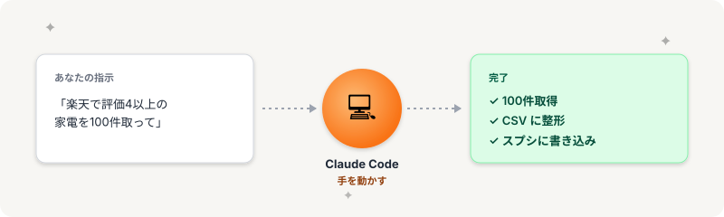

# Claude Code の役割｜「答える」じゃなく「手を動かす」AI



> **ゴール**: Claude Code がどんな AI なのかが腑に落ちて、「すぐ触ってみたい」と思える状態になる。

## 普通のAIとは、ここが違う

ChatGPT を触ったことがある人なら、こんな経験があるかもしれません。

「楽天で人気の家電を調べて」と聞く。

返ってくるのは、こんな感じの答え。

> 「人気のある家電は◯◯、△△、□□などです。詳しくは公式サイトでご確認ください」

…で、結局どうする？

自分で楽天を開いて、商品を探して、リストにまとめる。

**全部、自分で手を動かす羽目になる。**

これが「答えるだけ」のAI。便利だけど、作業は減らない。

---

## Claude Code は「手を動かす」

同じ指示を Claude Code に投げると、こうなります。

> 「楽天で評価4以上の家電を100件取って、CSVにまとめて」

```
✓ 楽天にアクセスしました
✓ 100件の商品情報を取得しました  
✓ products.csv に保存しました
```

ファイルが、本当に手元にできあがる。

これが Claude Code の核心です。

<div class="callout callout--tip">
<strong>「答える」と「やる」は違う</strong>: 普通のAIが「コーチ」として教えてくれる存在だとしたら、Claude Code は「実行係」。実際に作業を完了させてくれます。
</div>

---

## Claude Code に頼めること（4つの例）

実際にどんなことをやってくれるのか、具体例で見てみましょう。

<div class="step-card">
<span class="step-card__num">1</span><strong>食べログ調査・店舗リスト化</strong>

「渋谷で評価4以上の和食レストラン20件、Googleスプシにまとめて」

→ 食べログを巡回し、店名・評価・URL・住所をスプシに整理。
</div>

<div class="step-card">
<span class="step-card__num">2</span><strong>既存スプシのデータ整理・クリーニング</strong>

「このスプシ、重複行を削除して、列名も整えて」

→ スプシを直接読み込んで編集。手作業の整理が一瞬で終わる。
</div>

<div class="step-card">
<span class="step-card__num">3</span><strong>メール文面・応募文の作成</strong>

「クラウドワークスのこの案件への応募文、3パターン作って」

→ 案件文を読み込んで、刺さる応募文を複数案、ファイルとして生成。
</div>

<div class="step-card">
<span class="step-card__num">4</span><strong>Webからの情報スクレイピング</strong>

「楽天で評価4以上、レビュー50件以上の家電を100件取って」

→ サイトから情報を取得し、納品形式の CSV に整形して出力。
</div>

<div class="callout callout--info">
<strong>共通点</strong>: 4つとも、あなたが手を動かす作業はゼロ。日本語で指示するだけで、ファイルや結果が手元にできあがります。
</div>

---

## 使い方の流れ（イメージだけ）

実際の手順は次のアクションから順に学んでいきますが、流れだけ先にお見せすると——

<div class="step-card">
<span class="step-card__num">1</span><strong>PC にインストール</strong>（次のステージで）
</div>

<div class="step-card">
<span class="step-card__num">2</span><strong>案件のフォルダを作って Claude Code で開く</strong>
</div>

<div class="step-card">
<span class="step-card__num">3</span><strong>チャット欄に日本語で「やってほしいこと」を打つ</strong>
</div>

<div class="step-card">
<span class="step-card__num">4</span><strong>Claude Code が結果を作って返してくれる</strong>
</div>

<div class="step-card">
<span class="step-card__num">5</span><strong>違ったら「ここ直して」と指摘 → その場で修正</strong>
</div>

たったこれだけ。

コードは1文字も書きません。日本語で指示するだけです。

---

## ちょっと比較：普通のチャットAIとの違い

参考までに、普通のチャットAI（ChatGPT、Gemini など）との違いを軽く整理しておきます。

<div class="compare-table">
<div class="compare-table__bad">
<strong>普通のチャットAI</strong>

質問に答える

文章を生成する

提案・アイデア出し
</div>
<div class="compare-table__good">
<strong>Claude Code</strong>

ファイルを作る・編集する

Webにアクセスして情報取得

スプシ・CSV を直接書き換える
</div>
</div>

両方とも優秀なAIですが、**「実際の作業を完了させる」のは Claude Code の得意分野** です。

---

## 触ってみたくなりましたね？

ここまで読んで、「これ、自分の案件にも使えそう」「とりあえず触ってみたい」と思ったあなた。

ちょうどよかった。次のアクションでは、Claude Code とセットで使う **もう1つの道具**——スプレッドシートの役割を見ていきます。

道具の理解が揃ったら、いよいよインストール、そして実際に動かしていきます。

**次のアクション** → [1-3 スプレッドシートの役割](./1-3_スプレッドシートの役割.html)
