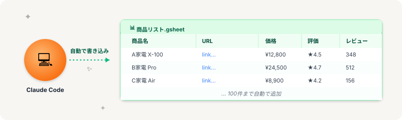

# スプレッドシートの役割｜Claude Code が書き込む場所

> **ゴール**: 「Claude Code がここに書き込むんだな」という接続が見えていて、納品の感覚が掴めている状態。

## リサーチ案件、9割はスプシで納品

クラウドワークスを覗いてみると、リサーチ案件のほぼすべてに、こんな指示が入っています。

> 「100件のリストをスプレッドシート（Google Sheets）で提出してください」

データを納品する形は、もうほぼスプシで決まり。

なぜそうなっているのか、その答えは後ほど。

まずは、World1 の中でスプシがどんな立ち位置にあるかを確認します。

---

## Claude Code の "出力先"

w1-1 の冒頭で見たフローを思い出してください。

> **あなた → Claude Code → スプレッドシート → クライアント**

Claude Code が調べた結果は、最終的にスプレッドシートに書き込まれてクライアントに渡る。

つまり——

**スプレッドシートは、リサーチ案件における「成果物の形そのもの」**。

Claude Code がいくらすごい処理をしても、最後はここに整って入っていなければ納品は完了しません。

<strong>ポイント</strong>: Claude Code（実行係）と スプレッドシート（納品場所）は、必ずペアで動きます。片方だけだと半自動化は完成しません。

---

## なぜスプシなのか、特に大事な2つの理由

クライアントが「スプシで欲しい」と言う理由はいくつかありますが、特に大事なのは **この2つ**。

### 1. 使いやすい

スプシは、フィルタ・並び替え・集計が **ワンクリックでできる** のが強みです。

クライアントが受け取った後、たとえば——

- 100件を「価格が安い順」に並べたい？ → 列ヘッダーをクリックするだけ
- 「評価4.5以上」だけ抽出したい？ → フィルタを1つかけるだけ
- 平均価格を出したい？ → SUM関数1つで終わる

**「データを使い倒せる」** のがスプシの最大のメリットです。

### 2. 修正依頼が出しやすい

もし内容にズレがあった時、クライアントは具体的に指摘できます。

> 「B列の3行目のURLが違うので確認してください」

「あの行のあの商品の…」のような曖昧な指摘にならない。

これは納品後のやりとりが **驚くほどスムーズ** になる、地味だけど大きなメリットです。

<strong>他にも</strong>: 共有しやすい（URLワンクリック）・確認しやすい（視認性）・Claude Codeとの相性が良い…など、メリットは色々ありますが、まずは「使いやすい」「修正依頼しやすい」の2つを覚えておけばOK。

---

## 納品スプシの典型的な列構成

リサーチ案件の納品スプシは、シンプルな構造が基本です。

例えば「楽天商品リサーチ」案件なら、こんな形になります。

| 列 | 項目 | 例 |
|---|---|---|
| **A** | 商品名 | A家電 X-100 |
| **B** | 商品URL | https://item.rakuten.co.jp/... |
| **C** | 価格（税込） | ¥12,800 |
| **D** | 評価 | 4.5 |
| **E** | レビュー件数 | 348 |
| **F** | 備考 | セール中 |

案件によって列の数や名前は変わりますが、**基本構造はだいたい同じ**。

「商品の特定情報 + URL + 数値データ + 備考」の組み合わせを覚えておけば、どんなリサーチ案件でも応用できます。

<strong>注意</strong>: 案件文に「列の指定」がある場合は <strong>必ずそれに従う</strong>。指定がない場合は、事前に「何列でどんな情報を入れますか？」とクライアントに確認するのが、プロの仕事です。

---

## Google Sheets と Excel、どっち？

World1 では **Google Sheets を強く推奨** します。

理由はシンプル：

- **URL を共有するだけで渡せる**：メール添付不要、最新版が常に見られる
- **Claude Code との連携がスムーズ**：自動で書き込んでくれる仕組みが整っている
- **クラウドワークスのリサーチ案件は Google Sheets が主流**

無料で使えるので、まだ持っていない人は Google アカウントだけ用意しておけば OK。

実際の連携設定は w1-4 以降のアクションで詳しくやります。今は「**Claude Code はスプシに書き込めるんだな**」と知っておくだけで十分です。

---

## 次のステップ

道具の役割が見えてきましたね。

次は、Claude Code とスプレッドシートを **すっきり扱うための環境** を整えます。

「**作業フォルダの作り方**」——w1-1 で唯一、実際に手を動かすアクションです。

**次のアクション** → [1-4 作業フォルダの作り方](./1-4_作業フォルダの作り方.html)
