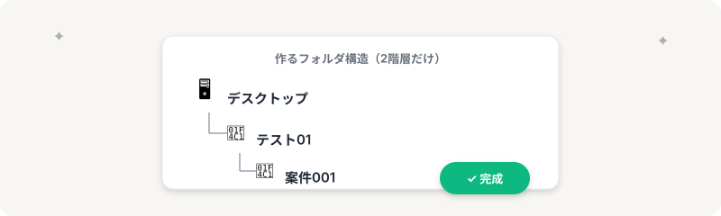
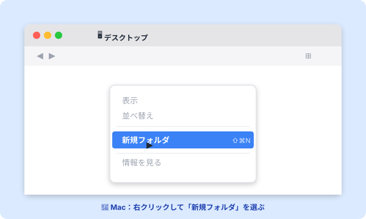
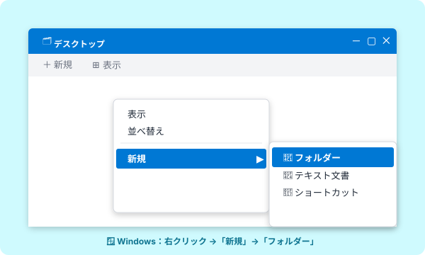
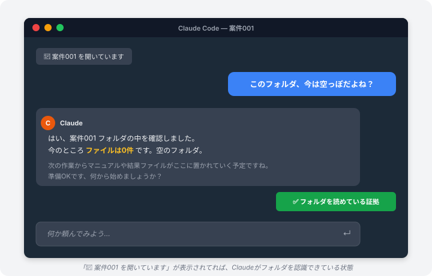

# 作業フォルダの作り方｜「1案件 = 1フォルダ」を5分で

> **ゴール**: デスクトップに「テスト01／案件001」の2階層フォルダができている状態。

## 「1案件 = 1フォルダ」が、後で効いてくる

整理しないまま作業を始めると、案件が3つ4つ重なった時に **カオス** になります。

「あれ、このCSVどの案件のだっけ？」が頻発する。

最初に「**1案件 = 1フォルダ**」のルールを守るだけで、後の作業速度が一気に上がります。

そして、これが **Claude Code との相性も最高** なんです。

---

## なぜフォルダが大事？ Claude Code との関係

Claude Code は、起動した **フォルダの中のファイルを直接読み書き** できる AI です。

つまり、「このフォルダを Claude Code で開く」 = 「このフォルダがあなたの作業場所になる」。

整理されたフォルダがあると、Claude Code に「**この案件文を読んで**」「**結果をここに保存して**」と指示するだけで、迷わず動いてくれます。

<strong>逆に言うと</strong>: 散らかったデスクトップで Claude Code を起動すると、AI も「どのファイルが何のためのものか」が分かりません。最初の整理が、後の指示の精度に直結します。

---

## 今回作るフォルダ（最小構成）

シンプルに **2階層だけ** 作ります。

| 階層 | 名前 | 役割 |
|---|---|---|
| 1階層目 | **テスト01** | あなたのワークスペース全体（後で他の案件もここに入る） |
| 2階層目 | **案件001** | 1つの案件専用フォルダ |

これだけ。中にファイルを置いたりは、まだしなくて OK。

次のステージで実案件をやる時、`案件001` の中で Claude Code を起動するだけ、という土台ができあがります。

---

## Mac の手順

1<strong>Finder でデスクトップを開く</strong>

ドックの Finder アイコンをクリック → 左メニューの「デスクトップ」を選択。

2<strong>何もない所を右クリック →「新規フォルダ」</strong>

トラックパッドなら2本指タップ。または <kbd class="kbd">⇧</kbd> + <kbd class="kbd">⌘</kbd> + <kbd class="kbd">N</kbd> でも作れます。

3<strong>「テスト01」と入力 → Enter</strong>

フォルダ名を「テスト01」に変更。

4<strong>「テスト01」をダブルクリックで開く</strong>

5<strong>中で右クリック →「新規フォルダ」→「案件001」と入力</strong>

これでデスクトップ → テスト01 → 案件001 の2階層が完成。

---

## Windows の手順

1<strong>エクスプローラーでデスクトップを開く</strong>

タスクバーのファイルアイコンから「デスクトップ」へ。

2<strong>何もない所で右クリック →「新規」→「フォルダー」</strong>

または <kbd class="kbd">Ctrl</kbd> + <kbd class="kbd">Shift</kbd> + <kbd class="kbd">N</kbd> でも作れます。

3<strong>「テスト01」と入力 → Enter</strong>

4<strong>「テスト01」をダブルクリックで開く</strong>

5<strong>中で右クリック →「新規」→「フォルダー」→「案件001」と入力</strong>

---

## checkpoint：完成しましたか？

- デスクトップに「テスト01」フォルダがある
- その中に「案件001」フォルダがある
- パスは `デスクトップ → テスト01 → 案件001` になっている

3つともOKなら完了。所要時間 **5分以内** が目標です。

<strong>よくある間違い</strong>: ❌ デスクトップに直接「案件001」を作る。 
✅ 必ず「テスト01」の中に作ること。後で他の案件を増やす時、この親フォルダがあると一気に整理しやすくなります。

---

## 練習｜作ったフォルダを Claude Code で開いてみよう

フォルダができたら、**実際に Claude Code で開いて、対話してみる練習** をしましょう。これができると「フォルダ = Claudeの作業場所」が体感で分かります。

<strong>前提</strong>: <a href="./1-1_claude-codeをインストール.html">1-1 Claude Code をインストール</a> が完了していること。

1<strong>Claude Code（デスクトップアプリ）を起動</strong>

すでに開いていればそのままでOK。

2<strong>「フォルダを開く」を押す</strong>

画面のメニューやサイドバーに「フォルダを開く（Open folder）」ボタンがあります。これを押すと、ファイル選択ダイアログが開きます。

3<strong>さっき作った <code>案件001</code> フォルダを選ぶ</strong>

ダイアログで <strong>デスクトップ → テスト01 → 案件001</strong> と進んで、<code>案件001</code> を選択して「開く」を押す。 
（テスト01 を選んでもOKだけど、より具体的な「案件001」を選んだ方が後で楽です）

4<strong>「このフォルダを信頼しますか？」→「信頼する」</strong>

初めて開くフォルダだと確認ダイアログが出ます。**「信頼する（Trust）」** を押してください。 
（自分で作ったフォルダなので安全です）

5<strong>チャットに「このフォルダ、今は空っぽだよね？」と打ってみる</strong>

Claudeが実際にフォルダの中身を確認して、「はい、空です」と返事してくれたら、**Claudeがちゃんとフォルダを読めている証拠** です。

<strong>これが「フォルダで作業する」感覚</strong>: 次のステージ（w1-2）からは、この <code>案件001</code> フォルダを Claude Code で開いた状態で、マニュアルを渡してリサーチ業務を進めていきます。「<strong>フォルダを開く → 話しかける</strong>」のリズムが体に入っていれば、もう道具は使いこなせています。

---

## 次のステップ

ハードな作業はこれでおしまい。

次のアクションで w1-1 のチェックポイント、「**道具の役割を1枚で説明できる**」を達成して、ステージクリアです。

**次のアクション** → [1-5 道具の役割を1枚で整理](./1-5_道具の役割を1枚で整理.html)
