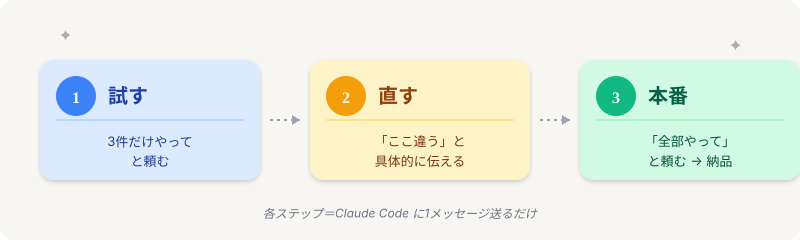
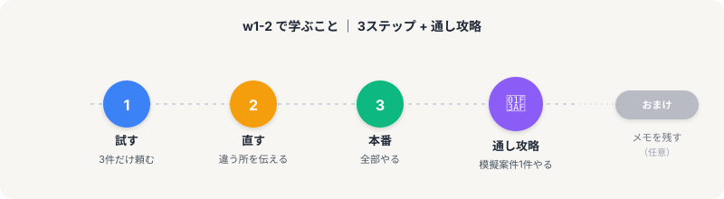

# w1-2攻略｜3ステップで案件を回す

> **ゴール**: 「3ステップさえ覚えれば、どんなリサーチ案件でも同じやり方で回せる」と腹落ちした状態。

## ここから本番

w1-1 で道具の準備は終わりました。

ここからは、その道具を使って **案件を実際にこなす型** を覚えていきます。

タイトルにあるとおり、たった **3ステップ**。

頭を使うのは最初だけ。覚えてしまえば、どんな案件が来ても同じ手順で回せるようになります。

---

## なぜ「型」が必要なのか

リサーチ案件で稼げない人と稼げる人の差は、たった1つ。

**型を持っているかどうか。**

毎回ゼロから「どう進めようか」と考える人は、1件あたり3時間かかります。

一方、型を持っている人は、新しい案件が来ても **同じ手順を当てはめるだけ** で進めるので、1件30分で終わります。

時給で言えば6,000円 vs 500円。  
同じ案件なのに、12倍の差。

<strong>"型"の正体</strong>: 才能でも経験でもなく、「次にこれをやる」が決まっている流れのこと。型を覚えるのは1回でいい。あとは使うだけ。

---

## 3ステップの中身

### ① 試す

Claude Code に「**3件だけやって**」と頼む。

100件をいきなり頼むと、もし方向が違ってた時に100件分やり直しになります。

最初は **3件だけ試して、方向が合ってるか確認**。これだけ。

### ② 直す

3件の結果を見て、おかしい所があれば「**ここ違う、こうして**」と伝える。

Claude Code は素直に直してくれます。

### ③ 本番

方向が合ったら、「**全部やって**」と頼む。

100件できたら、スプシの URL をクライアントに送って完了。

---

## ポイントは "シンプル" さ

注目してほしいのは、**3ステップそれぞれが、Claude Code に1メッセージ送るだけ** で済むこと。

- ステップ1：`3件だけやって` — 1メッセージ
- ステップ2：`ここ違うから直して` — 1メッセージ
- ステップ3：`全部やって` — 1メッセージ

3メッセージで、リサーチ案件1件が完了します。

<strong>これが半自動化</strong>: あなたが手を動かすのは、たった3回のメッセージ送信だけ。あとは Claude Code が勝手に動いてくれます。

---

## w1-2 で学ぶこと

このステージは **5アクション + おまけ** の構成。

1<strong>試す</strong>

「3件だけやって」をどう書く？実例つきで覚える。

2<strong>直す</strong>

「ここ違う」を具体的に伝えるコツ。

3<strong>本番</strong>

「全部やって」と納品まで。

4<strong>通し攻略</strong>

模擬案件1件を、3ステップで通しでやり切る。**これが checkpoint**。

＋<strong>（おまけ）次回用にメモを残す</strong>

慣れてきた人向け。次の案件で同じ手順をすぐ使い回せるようにメモする方法。任意。

---

## checkpoint：模擬案件を3ステップでやり切る

w1-2 を終えた時、こんな状態になります。

<strong>達成イメージ</strong>: 楽天リサーチの模擬案件が手元にあって、「試す → 直す → 本番」の3ステップで結果のスプシが手元にできあがっている状態。これができれば、あとはどんな案件が来ても同じ流れでこなせます。

---

## さあ、最初のステップへ

頭で理解するより、手を動かしてみるのが一番早い。

次のアクションでは、最初のステップ「**試す**」を実例つきで見ていきます。

**次のアクション** → [2-1 試す](./2-1_試す.html)
