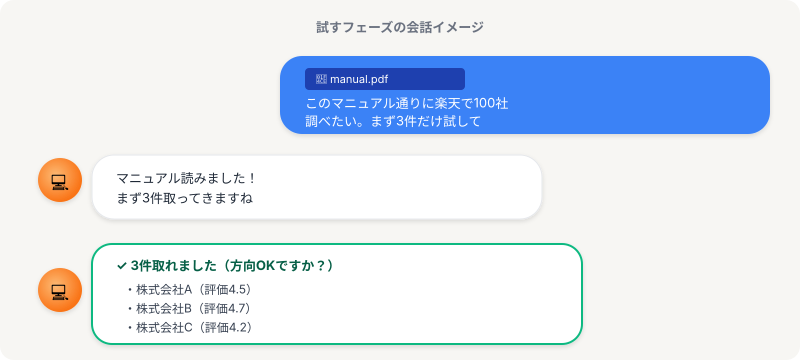

# 試す｜まず3件だけやってもらう

> **ゴール**: 「自分の案件にも、このまま話しかければいいんだ」と自信を持てる状態。

## いきなり100件はやらない

ちょっと想像してみてください。

100万円持ってる人が、新しい銘柄に **いきなり100万全額** を突っ込む人、いますか？

いないですよね。

普通は **まず1万円とか少額** で試して、株の動きを見て、合いそうだったら追加投入する。

最初の1万円が、100万円の大失敗から救ってくれます。

リサーチ案件も、実はこれと同じ。

100件いきなり頼んで、方向が違ってたら **100件分やり直し**。

だから、まず **3件だけ試す**。

少額で株の動きを確かめる感覚と、まったく同じです。

<strong>3件って何のため？</strong>: 「方向が合ってるか」を確かめるための少額テスト。3件で OK だったら、本番（100件）にいきなり進んでも大丈夫、という安心感が手に入ります。

---

## リサーチ案件は「マニュアル付き」で来る

実際のリサーチ案件は、ほとんどの場合、クライアントから **マニュアル文書** が一緒に渡されます。

「ここのページを参照してください」「この形式で取得してください」「この条件は除外」など、進め方が書いてある資料です。

あなたがやるのは、そのマニュアルを **Claude Code に読み込ませて**、

> このマニュアル通りに、まず3件だけ試して

と伝えるだけ。

Claude Code がマニュアルを読み込んで、その通りに3件動かしてくれます。

---

## 模擬案件の例

ここで、リアルな例を見てみましょう。

楽天市場で、ショップ100社の会社情報を調査する案件。クライアントから `manual.pdf` が渡されました。

実際の Claude Code との会話、こんな感じです。

👆 上の画像（チャット例）を見てください。 
あなたが <code>manual.pdf</code> を添付して「100社調べたい、まず3件だけ」と頼むと、Claude がマニュアルを読み込んで3件取ってきます。あなたは結果を見て「方向OK？」を判断するだけ。

---

## ポイント：完璧な指示文はいらない

ここで大事な気づき。

Claude Code に話しかける時、**完璧な指示文を書く必要はない**。

普段の会話と同じトーンで「マニュアル渡すから、まず3件試して」と言えば OK です。

<strong>カチッとした完璧な指示文</strong>

「楽天市場における、評価4.0以上のショップを対象とし、所定のフォーマットに従って…」

→ 書くのに時間がかかる、堅苦しい

<strong>普段の会話</strong>

「マニュアル添付したよ。これ通りに楽天で100社調べたい。まず3件だけ試して」

→ 普段話す感じでOK、Claude が必要な確認を返してくれる

---

## 自分の案件に当てはめてみよう

実際に案件文＋マニュアルが渡された時、こんな手順で進めれば OK。

1<strong>マニュアル文書を Claude Code に渡す</strong>

クライアントから来た PDF や文書をそのまま添付。

2<strong>「まず3件だけ試して」と頼む</strong>

これだけ。「件数」と「マニュアル通りに」が伝わればOK。

3<strong>結果を見て、次のステップへ</strong>

3件が手元にきたら、それを目で見て、次のフェーズ「直す」に進みます。

<strong>感覚を掴む鍵</strong>: 「完璧なプロンプトを書こう」と力まず、「マニュアル渡すから3件試して」って気軽に言うだけ。試して結果を見るまでが、このステップです。

---

## 次のアクション

3件試して結果が返ってきた状態を作れたら、次はその結果を見て **おかしい所を直す** フェーズへ。

**次のアクション** → [2-2 直す](./2-2_直す.html)
