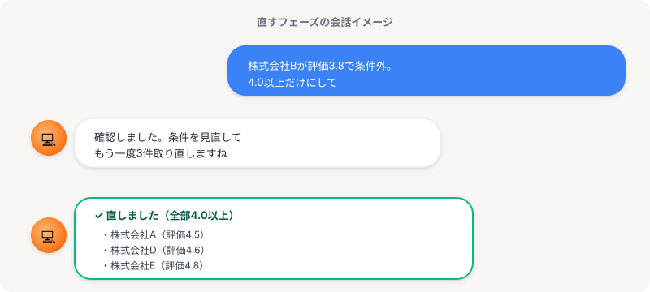

# 直す｜「ここ違う」と具体的に伝える

> **ゴール**: 「具体的に指摘するコツ」が分かって、**気軽に「直して」って言える** 自信が手に入った状態。

## 料理の味見と同じ感覚

味噌汁を作って、味見してみる。

「ちょっと薄いな」と思ったら、当たり前に **塩を足す** ですよね。

濃かったら水を足す。具が足りなかったら追加する。

完璧な味噌汁を最初から作らなくても、**味見して気づいた所を直す** だけ。

リサーチ案件の「直す」ステップは、これとまったく同じ感覚です。

3件試して結果を見て、「ここ違う」と思った所を、そのまま伝える。

それだけで OK。

<strong>気軽でいい理由</strong>: 「完璧に直してから次に進もう」と力まなくていい。気づいた瞬間にAIに伝えれば、AIがその場で直してくれます。

---

## 模擬案件で見てみる

楽天市場のショップ100社調査の例。

マニュアルには「**評価4.0以上**」という条件がありました。

3件試してみたら、**株式会社B が評価3.8** で混ざってる。条件が反映されてない。

こんな時の会話、↑ の画像のように **一言伝えるだけ**。

> 「株式会社Bが評価3.8で条件外。4.0以上だけにして」

これで Claude Code が条件を見直して、4.0以上の3件で取り直してくれます。

---

## 「具体的に指摘」の3つのコツ

「直して」だけだと、AI もどこを直していいか分からない。

具体的に伝える時の **3つのコツ** はこれ。

1<strong>どこが違うかを1つに絞る</strong>

❌「全体的におかしい」 
✅「2件目の評価が3.8、これ条件外」

2<strong>正しい状態をそのまま伝える</strong>

❌「直して」 
✅「4.0以上だけにして」

3<strong>もう一度やってもらう</strong>

✅「条件見直して、3件取り直して」

この3つだけ意識すれば、十分伝わります。

---

## 違うパターンの「直す」例

実際の案件では、いろんな種類の「ここ違う」が出てきます。バリエーションをいくつか紹介。

### パターンA：条件のズレ
> 「株式会社B が評価3.8で条件外。**4.0以上だけ** にして」

→ マニュアルの条件と違う行が混じってる時。

### パターンB：URL が違う
> 「URLが楽天モールのページになってる。**会社の独自サイト** に直して」

→ 取得したリンクが期待と違う時。

### パターンC：項目が抜けてる
> 「住所列が抜けてる。**マニュアル通り** に追加して」

→ 列やフィールドが足りない時。

<strong>共通点</strong>: 3つとも「気づいたことを、そのまま素直に伝える」だけ。難しい言葉も、丁寧な敬語もいりません。

---

## 自分の案件で使う時

3件が手元にきたら、こう進めます。

1<strong>3件の結果を1つずつ目で見る</strong>

「マニュアルの条件と合ってる？」「列は揃ってる？」を確認。

2<strong>違う所を1つずつ伝える</strong>

複数あれば、1つずつ。「これと、これも違う」とまとめてもOK。

3<strong>修正版を見て、OKなら次へ</strong>

直った3件を確認して、問題なければ次のステップ「本番」に進みます。

---

## 次のアクション

3件の方向が定まったら、いよいよ **本番**（全件100件）へ。

**次のアクション** → [2-3 本番](./2-3_本番.html)
