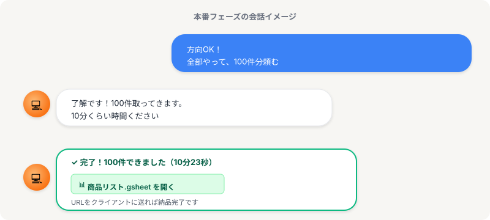

# 本番｜全部頼んで納品まで

> **ゴール**: 「これで1件、完走できた」という達成感と、納品までの流れがクリアにイメージできる状態。

## 少額テストOKだったから、本格投入

投資の話に戻ります。

最初の1万円で試してみて、株の動きが良さそうだったら、次にやることは？

そう、**思い切って本格投入**。

少額で方向が合ってる確信があるから、もう怖くない。

<strong>余談ですが</strong>……これと逆をやって稼ぐのが「投資詐欺」です（笑）。 
最初の少額で順調に回収させて信用させて、いざ大きなお金を振り込んだ瞬間に音信不通——というやつ。 
ご安心ください。Claude Code は逃げません。

リサーチ案件もまったく同じです。

3件試して、直して、OK の状態が手に入った。

ここから先は、もう **全部任せて大丈夫**。

100件、Claude Code が一気にやってくれます。

<strong>本番に進む前の合図</strong>: 3件の方向が合っていて、ズレも直し終わっているなら、もう怖がる必要ありません。あとは「全部やって」と頼むだけ。

---

## 模擬案件で見てみる

3件で方向が固まった状態。

「方向OK！全部やって、100件分頼む」と一言伝えるだけ。

↑ の画像のように、Claude Code が「了解です」と受けて、しばらくして「✓ 完了しました」と返してきます。

100件取得して、スプシに自動で書き込まれている状態が、手元にできあがります。

---

## 「全部やって」だけでOK

ここまで来たら、追加の細かい指示はいりません。

3件試した時に Claude Code はマニュアルを読んでいるし、ズレも直し終わっている。

あとは **そのまま全部やってもらう** だけ。

1<strong>「全部やって」と頼む</strong>

「方向OK！全部やって、100件分頼む」のように一言。

2<strong>Claude Code が動く（しばらく待つ）</strong>

100件は数分〜十数分かかります。コーヒーでも飲みながら待ちましょう。

3<strong>完了通知 + スプシURL が返ってくる</strong>

「✓ 完了しました」と Claude が報告してくれます。スプシを開いて中身を最終確認。

---

## 納品はURLを送るだけ

スプシは Google Sheets。**URLを共有してクライアントに送ればOK** です。

> 「ご依頼の100社分、まとめました：[スプシURL]」

これだけ。

メール添付やZIP化は不要。クライアント側もURLをクリックするだけで開けます。

<strong>納品メッセージのコツ</strong>: 「ご確認お願いします、修正点あればお知らせください」と一言添えると丁寧。修正依頼が来ても、また Claude Code に「ここ直して」と頼めば即対応できます。

---

## あなたが手を動かしたのは…

ここで振り返ってみましょう。

リサーチ案件1件を完了させるのに、あなたが Claude Code に送ったメッセージは——

| ステップ | メッセージ数 |
|---|---|
| 試す | 1メッセージ |
| 直す | 1〜数メッセージ |
| 本番 | 1メッセージ |
| **合計** | **3〜5メッセージくらい** |

それだけで、100件のリサーチが完了して納品まで届く。

これが、半自動化の正体です。

<strong>あなたの本来の仕事</strong>: 手を動かすのは AI。あなたがやるのは「方向を決める」「ズレを見抜く」「OKを出す」だけ。これが、AI時代の働き方です。

---

## 次のアクション

3ステップの流れが頭に入ったら、いよいよ **模擬案件で通しでやる** 番。

実際にこの3ステップを使って、模擬案件を1件最後までやり切ります。

w1-2 の checkpoint 達成ページです。

**次のアクション** → [2-4 通し攻略](./2-4_通し攻略.html)
