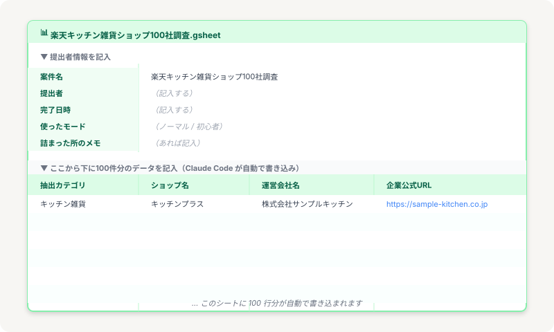

# 通し攻略｜模擬案件1件を3ステップでやり切る

> **ゴール**: 3ステップで1件、最後までやり切る達成感とともに、「型が体に染み込んだ」確信が手に入った状態。

## w1-2 のチェックポイント

このページは **w1-2 の checkpoint**。

これまで覚えた **試す → 直す → 本番** の3ステップを土台に、本番案件を意識した **5フェーズの流れ** で1件、通しでやり切ります。

> **計画 → 試す → 本番 → チェック → 納品**

最後まで行ければ、w1-2 クリア。あとはどんな案件が来ても、同じ流れでこなせるようになります。

---

## 今回の模擬案件

| 項目 | 内容 |
|---|---|
| **ジャンル** | 楽天市場のキッチン用品・食器・調理器具 |
| **件数** | 100社 |
| **取得項目** | ショップ名 / 運営会社名 / 企業公式URL |
| **マニュアル** | [📄 楽天キッチン雑貨_抽出マニュアル.md](../assets/manuals/楽天キッチン雑貨_抽出マニュアル.md) |
| **提出用スプシ** | [📊 Google Sheets で開く](https://docs.google.com/spreadsheets/d/1-b35tfITmHzzQwXW6HUvUgtrLPiB1UC1qZQAaCcHGFk/edit?gid=1141798124#gid=1141798124)（[CSVダウンロード](../assets/manuals/楽天キッチン雑貨_提出用スプシ.csv)） |
| **完成形** | 100行のスプレッドシート |

<details class="manual-doc">
<summary>📄 マニュアル文書を見る（クリックで展開）</summary>
<div class="manual-doc__content">

## 【楽天市場版】データ抽出マニュアル

**目的**：楽天市場からショップ情報を確認し、運営会社名と企業公式URLを取得する

---

## ■ 抽出ゴール

1企業につき、以下3点を取得すること

- ショップ名（楽天上の店舗名）
- 運営会社名（法人名）
- 企業公式URL（コーポレートサイト）

※ 楽天市場内のショップURLは不可  
※ 楽天・Amazon・Yahoo・BASE・STORESなどのモールURLは不可

---

## ■ 使用サイト

- 楽天市場：https://www.rakuten.co.jp/
- Google検索
- 本Googleスプレッドシート（運営から共有）

---

## ■ 手順① 楽天市場を開く

楽天市場トップページへアクセス。

左サイドバーまたはメニューの「ジャンル一覧」をクリック。

---

## ■ 手順② カテゴリーで絞り込む

指定された大カテゴリ **「キッチン用品・食器・調理器具」** を選択。

指示された小カテゴリ（例：キッチン雑貨、調理器具、食器、保存容器 等）をクリック。

商品一覧ページが表示されたら準備完了。

抽出カテゴリをスプレッドシートのA列に記載する。

---

## ■ 手順③ ショップ情報を確認する

商品一覧から任意の商品をクリック。

商品ページ内のショップ名付近にある **「会社概要」** または **「ショップをお気に入りに追加」の下部にある店舗情報** を確認。

もしくは、ショップトップページの「会社概要（決済・配送・返品）」ページへ移動。

---

## ■ 手順④ 運営会社名を確認

「会社概要」ページ内の **「代表者」や「店舗運営責任者」の項目付近にある商号（法人名）** を確認。

下記を取得：

- ショップ名
- 運営会社名（例：〇〇株式会社、合同会社〇〇）

---

## ■ 手順⑤ Google で企業URLを調べる

取得した「運営会社名」をコピーして Google で検索。

例：`〇〇株式会社 公式サイト` / `〇〇株式会社 コーポレートサイト`

検索結果から **「公式サイト（企業HP）」** を探す。

コーポレートサイトのトップURLをコピー。

> ⚠️ **注意**：楽天・Amazon・Yahoo等の「モール内店舗URL」は企業の公式URLとは見なしません。必ず独自のドメイン（.co.jp, .jp, .com 等）を持つサイトを優先してください。

---

## ■ 手順⑥ スプレッドシートに記入

以下の形式で1行ずつ記入する：

```
ショップ名｜運営会社名｜企業公式URL
```

**記入例**：

```
キッチンプラス｜株式会社サンプルキッチン｜https://sample-kitchen.co.jp
```

---

## ■ 注意事項

- **重複禁止**：同キーワード内、および別カテゴリで既に出た企業はカウントしません
- **個人は除外**：明らかに個人（個人名のみの運営）の場合はスキップしてください
- **不明時は空欄**：公式HPが見つからない場合は、会社名まで記載し URL は空欄で構いません

</div>
</details>

---

## 📊 提出用スプレッドシート（運営から共有）

実際の案件では、運営から **Google Sheets の URL が共有されます**。今回の模擬案件用のテンプレートを以下に用意しました。



シートの構造はシンプルに **2 段構成**：

<div class="step-card">
<span class="step-card__num">1</span><strong>上段：提出者情報</strong>

案件名（記入済み）／ 提出者 ／ 完了日時 ／ 使ったモード ／ 詰まった所のメモ。  
→ ここはあなたが手で記入。
</div>

<div class="step-card">
<span class="step-card__num">2</span><strong>下段：データ100行</strong>

抽出カテゴリ ／ ショップ名 ／ 運営会社名 ／ 企業公式URL の4列。  
→ ここは Claude Code が自動で書き込み。
</div>

<div class="callout callout--tip">
<strong>使い方</strong>: 上の「📊 Google Sheets で開く」リンクからスプシを開いて、URL を Claude Code に渡してください。Claude が直接書き込んでくれます。<br>
（オフラインで使いたい場合は CSV ダウンロード → Google Sheets の「ファイル → インポート」からも読み込めます）
</div>

---

## 2つのモードから選んでください

このページは **レベル別に2つのモード** を用意しています。自分に合う方を選んで進めてください。

### 🎯 ノーマルモード（推奨）

3ステップを **自分で進める** モード。マニュアルを Claude Code に読み込ませて、3件試して、直して、本番。w1-2 で習った通り。

**こんな人におすすめ**: 2-1〜2-3 の流れが頭に入ってる、自分でやってみたい。

### 🤝 初心者モード

Claude Code が **教師役** として一歩ずつ案内してくれるモード。「次はこれをやります」「ここで詰まりやすい」と能動的にガイドしてくれます。

**こんな人におすすめ**: 自分1人で進める自信がない、最初の1件は伴走してほしい。

<div class="callout callout--info">
<strong>どちらでも OK</strong>: 達成できることが大事。自分に合うモードでクリアしてください。両モードとも、同じ checkpoint を満たせば達成扱いです。
</div>

---

## ノーマルモードでやる場合

<div class="step-card">
<span class="step-card__num">1</span><strong>マニュアルを開いて、Claude Code に渡す</strong>

「このマニュアル通りに、楽天キッチン雑貨のショップを100社調べたい。<strong>まず Plan Mode で計画を立てて見せて</strong>」
</div>

<div class="step-card">
<span class="step-card__num">2</span><strong>計画を確認 → 3件だけ試す</strong>

計画でOKを出したら「じゃあまず3件だけ試して」と頼む。
</div>

<div class="step-card">
<span class="step-card__num">3</span><strong>3件の結果を見て、直す</strong>

ズレがあれば「ここ違う」と具体的に伝える。
</div>

<div class="step-card">
<span class="step-card__num">4</span><strong>「全部やって、100件分頼む」</strong>

本番実行。コーヒー1杯分の時間を待ちます。
</div>

<div class="step-card">
<span class="step-card__num">5</span><strong>結果をチェック → スプシに貼り付け</strong>

ザッと目を通して、おかしい行があれば修正。OKなら、提出用スプシURLを Claude に渡して **「該当行に貼り付けて」** と頼む。
</div>

<div class="callout callout--info">
<strong>件数の現実</strong>: 実際にやってみると、100件取って有効なのが80〜90件くらい、というのが普通です（モール内URLしかない・個人運営・重複などで弾かれる）。<strong>「100件取って有効が何件」を意識してチェックする</strong> 感覚を身につけましょう。
</div>

<details class="manual-doc">
<summary>📋 模範解答（完成形のサンプル）を見る</summary>
<div class="manual-doc__content">

実際にこの模擬案件をやり切ると、こんな感じのスプシができあがります。**100社分のキッチン雑貨ショップ** が、抽出カテゴリ・ショップ名・運営会社名・企業公式URLの4列で整然と並びます。

<a href="https://drive.google.com/file/d/1FWpEgcC9XsLH9bVBJQ_tAhGnxBq_R3No/view?usp=sharing" target="_blank" rel="noopener">

</a>

<p style="text-align: center; font-size: 0.85em; color: #6b7280; margin-top: 4px;">画像をクリックすると Google Drive で原寸表示できます</p>

<div class="callout callout--info">
<strong>見るポイント</strong>: 全行が「<strong>キッチン用品・食器・調理器具</strong>」カテゴリで揃っていて、ショップ名・運営会社名・URLにヌケがほぼない状態。これが「<strong>有効データ</strong>」として運営に提出できる完成形です。<br>
※ 100件取って <strong>有効80〜90件</strong> くらいが普通の歩留まり。モール内URLしかない店・個人運営は弾かれます。
</div>

</div>
</details>

---

## 初心者モードでやる場合

初心者モード用の **専用パッケージ** を用意しています。Google Drive からフォルダをダウンロードして Claude Code（デスクトップアプリ）で開くだけで、初心者モードが自動で開始されます。

<div class="callout callout--info">
<strong>📁 Google Drive からダウンロード</strong>: <a href="https://drive.google.com/drive/folders/1WWlCJgEPUMzZfTbpcThWcZPcMrGGl57r?usp=sharing" target="_blank" rel="noopener"><strong>初心者モードパッケージ（Google Drive）</strong></a><br>
リンクを開いたら、右上の <strong>⬇️ ダウンロード</strong> ボタンを押すと <code>support-package.zip</code> として降ってきます。
</div>

### サポーター（Claude）が案内してくれる5フェーズ

<ol>
<li><strong>マニュアルを渡して、Plan Mode で一緒に計画を立てる</strong></li>
<li><strong>3件だけ試す</strong>（方向確認のパイロット）</li>
<li><strong>100件本番</strong>（ゆっくりコーヒー時間）</li>
<li><strong>結果をチェック</strong>（おかしい行を見つけて修正）</li>
<li><strong>Google スプレッドシートに貼り付け</strong>（提出用URLを渡すだけ）</li>
</ol>

→ 1フェーズずつ Claude が「次は◯◯します」と案内してくれます。

### 使い方（5ステップ・ターミナル不要）

<div class="step-card">
<span class="step-card__num">1</span><strong>Drive リンクを開いて「ダウンロード」 → ダブルクリックで解凍</strong>

上の Drive リンクを開いて、画面右上の <strong>⬇️ ダウンロード</strong> を押す。<br>
ZIPで降ってくるので、デスクトップなど分かりやすい場所に置いてダブルクリック → <code>support-package</code> フォルダができます。
</div>

<div class="step-card">
<span class="step-card__num">2</span><strong>Claude Code（デスクトップアプリ）を起動</strong>

すでに起動している場合はそのままでOK。
</div>

<div class="step-card">
<span class="step-card__num">3</span><strong>「フォルダを開く」で <code>support-package</code> を選ぶ</strong>

Claude Code 内のメニューから「フォルダを開く」を選び、解凍した <code>support-package</code> フォルダを指定するだけ。
</div>

<div class="step-card">
<span class="step-card__num">4</span><strong>「このフォルダを信頼しますか？」→「信頼する」を選ぶ</strong>

初めて開くフォルダだと確認ダイアログが出ます。**「信頼する（Trust）」** を押してください。<br>
（自分でダウンロードしたフォルダなので安全です）
</div>

<div class="step-card">
<span class="step-card__num">5</span><strong>チャット欄に「こんにちは」と入力</strong>

それだけ。Claude が自動で <code>CLAUDE.md</code> を読み込んで、初心者モードで案内を始めてくれます。あとは Claude の指示に従うだけ。
</div>

<div class="callout callout--warn">
<strong>⚠️ 「OAuthError: Unable to start session ... (503)」が出たら</strong><br>
Claude Code のログイン用サーバーが一時的に混んでいるだけです。<strong>30秒〜1分待ってから「こんにちは」を再送信</strong> してください。それでもダメなら Claude Code を一度閉じて再起動 → もう一度フォルダを開く。このパッケージの問題ではないので、待てば解決します。
</div>

<div class="callout callout--tip">
<strong>パッケージの中身</strong>: <code>CLAUDE.md</code>（Claude が自動で読む役割定義）+ <code>manual.md</code>（マニュアル本体）+ <code>README.md</code>（使い方）。Claude Code は開いたフォルダ内の <code>CLAUDE.md</code> を自動で読むので、追加の設定は一切不要です。
</div>

---

## checkpoint 提出

完成したスプシを、メモ欄（A1セルなど目立つ場所）に以下を記入して、**URLを運営に送ってください**。

| 項目 | 例 |
|---|---|
| 名前 | 山田 太郎 |
| 完了日時 | 2026/04/30 18:00 |
| 使ったモード | ノーマルモード / 初心者モード |
| 詰まった所のメモ（あれば） | 「直す」のステップで、何を直せばいいか迷った |

提出されたスプシを運営側で確認 → checkpoint 達成判定。

---

## ✓ できたら、ステージクリア！

下のチェックリスト、全部 ✓ を入れたら w1-2 クリアです。

<div class="stage-checklist">
<p class="stage-checklist__title">👇 全部 ✓ できたらステージクリア</p>

<label class="check-item">
<input type="checkbox" class="c-1">
<span>マニュアルを Claude Code に渡して、Plan Mode で計画を立てた</span>
</label>

<label class="check-item">
<input type="checkbox" class="c-2">
<span>3件試して、結果を目で確認した</span>
</label>

<label class="check-item">
<input type="checkbox" class="c-3">
<span>ズレを「ここ違う」と伝えて、直してもらった</span>
</label>

<label class="check-item">
<input type="checkbox" class="c-4">
<span>「全部やって」と頼んで、100件分の結果を受け取った</span>
</label>

<label class="check-item">
<input type="checkbox" class="c-5">
<span>結果をチェックして、Google スプレッドシートに貼り付けた</span>
</label>

<label class="check-item">
<input type="checkbox" class="c-6">
<span>スプシのメモ欄に情報を記入して、URLを運営に提出した</span>
</label>

<div class="stage-clear-banner">
<div class="stage-clear-banner__emoji">🎉</div>
<p class="stage-clear-banner__title">w1-2 STAGE CLEAR!</p>
<p class="stage-clear-banner__sub">3ステップが体に染み込みました。これでどんな案件もこなせます。</p>
</div>
</div>

---

## 次のステージへ

w1-2 で「型」が手に入りました。

次の **w1-3** からは、いよいよ **実案件を取りにいく** 段階。クラウドワークスでの案件選びと、応募文の作り方を学びます。

模擬案件で身につけた3ステップが、実案件で活きる場面です。

**次のステージ** → [3-0 w1-3攻略｜案件を取りにいく](./3-0_w1-3攻略.html)
