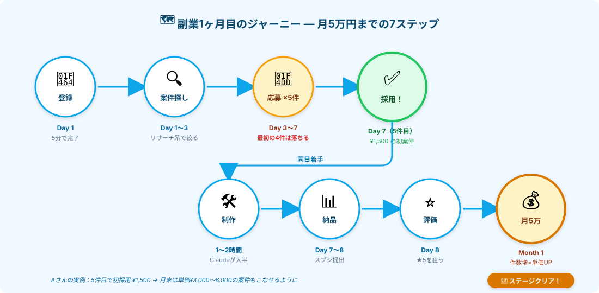
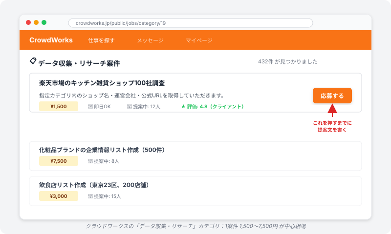

# w1-3攻略｜案件を取りにいく



> **ゴール**: クラウドワークスの **仕組み・相場・採用フロー** が腹落ちして、応募ボタンを押す手前の **心の準備** ができている状態。

## 「練習」から「実戦」へ

w1-2 まで来たあなたは、もう **道具と型** を持っています。

ここからは、その型を **本当のお金になる場所** ＝クラウドワークスに持って行きます。

w1-3 は w1-1 / w1-2 と違って、**自分のPC内の練習ではなく、外の世界とのやり取り**。だからこそ、最初に「全体像」を腹落ちさせておくことが超大事。このページでそこを固めます。

---

## 不安の正体に向き合う

応募ボタンの前で、誰もが感じる **2つの不安**：

### 不安①｜「応募しても選ばれないんじゃ…」

**正解です**。最初の数件は **落ちます**。

でも、これは失敗じゃなくて **想定通り**。実例（Aさん）を見てください：

<div class="terminal-block">
<pre><code># Aさんの初月応募ログ
1件目 → 落選
2件目 → 落選
3件目 → 落選
4件目 → 落選
<strong>5件目 → 採用！ ¥1,500</strong>
</code></pre>
</div>

**4件落ちて1件取れる**、というのが副業1ヶ月目のリアル。
だから「**最初の4件は落ちる前提**」で量を打つ。これが正しいマインドセットです。

### 不安②｜「採用されたのに、できなかったらどうしよう…」

これも自然な不安。だから **w1-2 で型を作りました**。

> 計画 → 3件試す → 直す → 100件本番 → チェック → 納品

この5フェーズが体に入っていれば、初案件はほぼ確実にこなせます。
**「型がある」**という事実が、不安の最大の解毒剤です。

<div class="callout callout--info">
<strong>もし詰まったら</strong>: クライアントに「もう少し時間ください」と伝えればOK。1日延びても、誠実なコミュニケーションがあれば信頼は失われません。<strong>無言で消える</strong>のだけはダメ、それ以外はリカバリ可能。
</div>

---

## マインドセット｜AIで応募・AIで納品。罪悪感はいらない

このステージで **一番大事なマインドセット** を最初に固めます。

### 「AIに応募文を書かせていいの？」→ いい

**応募文も、納品物も、AI（Claude）に書かせていい**。

クライアントが評価するのは：
- ✅ **結果**（ちゃんとデータが揃っているか）
- ✅ **コミュニケーション**（質問への返答が早いか、誠実か）

これだけ。あなたが裏で何を使ってるかは関係ありません。

### 「AIなしならできない仕事を取っていいの？」→ いい

AI は道具です。Excel で仕事してる人を「Excelなしならできないくせに」とは言わない。
**Claude Code というツールを使いこなして納品する**、それだけのこと。

副業として AI を活用するのは、もう普通のスキルです。

### 罪悪感を捨てる3つの確認

下の3つさえ守れば、AI フル活用は **完全にOK**：

<div class="checkpoint">

- ✅ **納期を守る**
- ✅ **約束した品質で納品する**
- ✅ **クライアントとちゃんとコミュニケーションする**

</div>

むしろ、AI を使わずに無理して時給500円で消耗する方が **本当に避けるべき**こと。
道具は使うためにある。胸を張って使いましょう。

---

## クラウドワークスってどんな場所？



ざっくり言うと、**仕事を発注したい人と、仕事を受けたい人をマッチングするサイト**。
日本最大級なので、リサーチ案件の数が圧倒的に多いです。

| 項目 | 内容 |
|---|---|
| 案件カテゴリ | データ収集・リサーチ／記事作成／デザイン／プログラミング 等 |
| 私たちが狙うのは | **データ収集・リサーチ**（w1-2 で習った型がそのまま使える） |
| 案件の見つけ方 | カテゴリで絞る → 報酬・提案中人数・クライアント評価でフィルタ |
| 採用の決まり方 | クライアントが提案文を読んで選ぶ（早い順ではない） |

---

## 相場感｜リサーチ案件のお金事情

| 案件タイプ | 相場 | 所要時間 | 時給換算 |
|---|---|---|---|
| **100件リサーチ** | **¥1,500〜3,000** | 1〜2時間 | **¥750〜3,000** |
| 500件リサーチ | ¥7,000〜15,000 | 5〜10時間 | ¥1,400〜3,000 |
| カテゴリ縛りの精密リサーチ | ¥3,000〜5,000 | 2〜3時間 | ¥1,000〜2,500 |

Aさんの初案件: **¥1,500、所要時間1〜2時間**。  
ここから1ヶ月かけて、**件数も単価も上がっていく** のが現実的な伸び方です。

### 月5万までのリアルな推移（Aさん）

最初の月は **同じ単価の繰り返しではなく、評価が積み上がるごとに単価も件数も伸びる** のが普通：

| 期間 | 案件数 | 単価帯 | 週合計 |
|---|---|---|---|
| **Week 1**（採用された週） | 1件 | ¥1,500 | **¥1,500** |
| **Week 2**（★4が付き始める） | 3件 | ¥1,500〜¥2,500 | **約¥6,000** |
| **Week 3**（★5でリピート提案も来る） | 4件 | ¥2,000〜¥3,500 | **約¥11,000** |
| **Week 4**（単価交渉も通り始める） | 5件 | ¥3,000〜¥6,000 | **約¥22,000** |
| **月合計** | **約13件** | 平均 ¥3,000前後 | **約¥40,000〜50,000** |

<div class="callout callout--tip">
<strong>ポイント</strong>: 月5万 = ¥1,500を34件こなす、ではなく <strong>「件数増 × 単価UP」の組み合わせ</strong>。<br>
評価★5を1〜2件積むと、クライアント側から「他にもお願いできる？」とリピート依頼が来ます。これで <strong>応募ゼロでも案件が入る</strong>状態に。
</div>

### なぜ単価が上がっていくのか

- ★5評価が積み上がる → プロフィールが目に止まる → 応募の通過率UP
- 一度採用されたクライアントから **リピート発注** が来る（応募不要）
- 「同じ仕事ならもう少し出すから」と単価UP交渉が成立しやすい
- 慣れてきて **2倍速で同じ品質** を出せるようになる（時給換算がさらに上がる）

最初の1件で全部決まる、と思わなくて大丈夫。<strong>1件目で採用されることがスタート</strong>です。

---

## 採用フロー｜最短8日で初収入

```
Day 1   ← 登録（5分）
Day 1〜3 ← 案件を探す（リサーチ系で絞る）
Day 3〜7 ← 応募する（5件くらい、AIに書かせる）
Day 7   ← 採用通知が来る（5件目あたり）
Day 7   ← マニュアル受領 → 制作（Claude Code で1〜2時間）
Day 7〜8 ← 納品 → 評価★5
            ↓
Month 1 ← 月5万円達成
```

**最短8日**で初収入、1ヶ月で月5万。これが現実的なスピードです。

---

## w1-3 の進み方

このステージは **6つのアクション** で構成されています：

| アクション | 内容 |
|---|---|
| **3-1** | クラウドワークスに登録する |
| **3-2** | 案件の選び方（どこを見る？） |
| **3-3** | AIに応募文・自己紹介文を書かせる |
| **3-4** | 応募を量産する（1日のルーティンで回す） |
| **3-5** | 採用後の動き方（やり取り・納品） |
| **3-6** | w1-3 通し攻略｜実際に1件取りにいく |
| **🎮 3-EX** | 応募の完全自動化（**任意エキストラ**・上級者向け） |

**ポイント**: 全アクション通して、**AIに応募・AIに制作** が大前提です。あなたは **判断と確認** をする役割。

---

## ✓ できたら、次のアクションへ

このページを読み終えたら、下のチェックリストを確認してください。

<div class="stage-checklist">
<p class="stage-checklist__title">👇 全部 ✓ できたら次へ</p>

<label class="check-item">
<input type="checkbox" class="c-1">
<span>クラウドワークスの仕組み（マッチングサイト）が分かった</span>
</label>

<label class="check-item">
<input type="checkbox" class="c-2">
<span>リサーチ案件の相場（1案件 1,500〜3,000円）が頭に入った</span>
</label>

<label class="check-item">
<input type="checkbox" class="c-3">
<span>採用フロー（Day 1 登録 → Day 7 採用 → Month 1 で月5万）のイメージがついた</span>
</label>

<label class="check-item">
<input type="checkbox" class="c-4">
<span>「最初の4件は落ちる前提」で量を打つ、というマインドセットが入った</span>
</label>

<label class="check-item">
<input type="checkbox" class="c-5">
<span>「AIで応募・AIで納品して全然OK」という罪悪感ゼロのスタンスを持てた</span>
</label>

<div class="stage-clear-banner">
<div class="stage-clear-banner__emoji">🚀</div>
<p class="stage-clear-banner__title">w1-3 STAGE START!</p>
<p class="stage-clear-banner__sub">全体像が腹落ちしました。ここから具体行動です。まずは登録から。</p>
</div>
</div>

---

## 次のアクションへ

**次のアクション** → [3-1 クラウドワークスに登録する](./3-1_クラウドワークスに登録.html)
