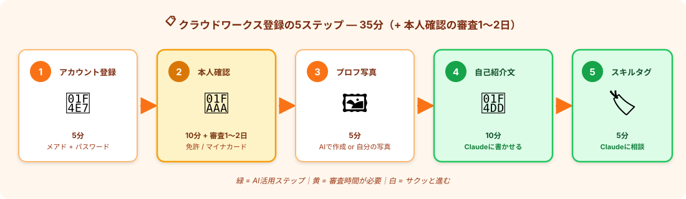
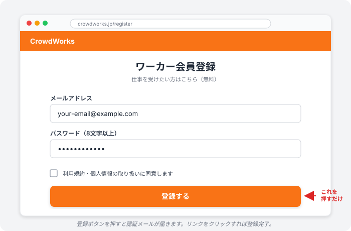

# クラウドワークスに登録｜応募準備を完成させる

> **ゴール**: アカウント作成 → 本人確認 → プロフィール完成（写真・自己紹介・スキルタグ）まで終わって、**いつでも応募ボタンを押せる状態**。

## このページで完成させること

合計 **35分** + 本人確認の審査時間（1〜2日）で、応募準備が全部整います。

| ステップ | 内容 | 時間 |
|---|---|---|
| 1 | アカウント登録（メアド+パスワード） | 5分 |
| 2 | 本人確認（身分証アップロード） | 10分 + 審査1〜2日 |
| 3 | プロフィール写真（AIで作成 or 自分の写真） | 5分 |
| 4 | 自己紹介文（**Claudeに書かせる**） | 10分 |
| 5 | スキルタグ選び（**Claudeに相談**） | 5分 |

<strong>事前準備</strong>: 本人確認用の身分証（運転免許証 or マイナンバーカード or パスポート）を手元に用意しておくとスムーズ。スマホで撮影してアップロードします。

---

## ステップ1｜アカウント登録（5分）

1<strong>ブラウザで <code>crowdworks.jp</code> を開く</strong>

Chrome / Safari どれでもOK。

2<strong>右上の「会員登録」ボタンを押す</strong>

→ ワーカー（仕事を受ける側）/ クライアント（仕事を出す側）の選択画面が出る。

3<strong>「ワーカーとして登録」を選ぶ</strong>

私たちは仕事を受ける側なのでこちら。

4<strong>メアド・パスワードを入力 →「登録する」</strong>

普段使っているメアドでOK。パスワードは8文字以上、英数字混在で。

5<strong>認証メールが届くのでクリック</strong>

数分以内に「【クラウドワークス】会員登録のご確認」みたいな件名のメールが届く。本文のリンクをクリックすれば登録完了。

<strong>認証メールが届かないとき</strong>：① 迷惑メールフォルダを確認 ② それでもなければ「再送」を押す ③ 5分待ってもダメならメアドの入力ミスを疑って再登録。

---

## ステップ2｜本人確認（10分 + 審査1〜2日）

副業を本格的にやるなら **後で必須**になるので、今のうちに済ませておきます。

<strong>本人確認のメリット</strong>: クライアントが「<strong>本人確認済み</strong>」のバッジを見て安心して採用してくれる。実は採用率に直結します。 
やらなくても応募はできるけど、最初の壁を1つ高くしてしまうのでもったいない。

1<strong>マイページ →「本人確認」を選ぶ</strong>

ログイン後、右上のアカウントメニューから入れます。

2<strong>身分証を選ぶ</strong>

以下のどれか1つを用意：
- 運転免許証
- マイナンバーカード（顔写真面）
- パスポート
- 在留カード（外国籍の方）

3<strong>スマホで撮影してアップロード</strong>

画面の指示に従って、表面・裏面（必要な場合）を撮影。文字がブレずに読める明るさで撮るのがコツ。

4<strong>申請完了 → 審査を待つ</strong>

通常 **1〜2営業日** で審査結果のメールが届きます。 
**審査中も応募はできる** ので、続きの作業に進みましょう。

---

## ステップ3｜プロフィール写真（5分）

クライアントが提案文を見る時、最初に目に入るのが **プロフィール写真**。
顔出しでも、AIイラストでもOK。

### 選択肢

| 選択肢 | 特徴 |
|---|---|
| **A. 自分の顔写真** | 信頼度が高い。本人らしさが出る。スーツ or ビジネスカジュアル推奨 |
| **B. AIで作るアバター** | 顔出しNG派や、用意できない人向け。プロっぽい雰囲気が出せる |
| C. ペット・趣味の写真 | カジュアルだが、リサーチ案件では信頼感がやや落ちる |

<strong>迷ったら B（AIで作る）</strong>。AIアバターでも採用率は変わりません。<strong>「写真がない」より100倍マシ</strong>。

### AIで作る方法

Claude Code でこんなふうに頼んで、AI画像生成ツールに渡すプロンプトを作ってもらいます：

<pre><code>クラウドワークスのプロフィール画像用に、
副業ワーカー向けのシンプルで信頼感のある
アバターイラストのプロンプトを作って。

条件：
- 雰囲気：親しみやすく、でも誠実
- スタイル：イラスト調（実写ではない）
- 背景：シンプル（オフィス or 無地）
- AIツール：DALL-E / Midjourney / Canva のAI画像生成 で使える形式で
</code></pre>

→ Claudeがプロンプトを出してくれる → **ChatGPT (Plus)** / **Canva の AI画像生成** / **Midjourney** などにコピペ → 出てきた画像をダウンロード。

おすすめ無料ツール：
- [Canva](https://www.canva.com/)（AI画像生成、月数枚まで無料）
- [Bing Image Creator](https://www.bing.com/images/create)（無料、Microsoftアカウントでログイン）

### 設定方法

マイページ → プロフィール編集 → プロフィール画像 → アップロード。

---

## ステップ4｜自己紹介文（10分・Claudeに書かせる）

ここが **採用率を一番左右する部分** です。クライアントは応募時に必ず自己紹介を読みます。

### 2つの書かせ方から選ぶ

| やり方 | 向いている人 | 所要時間 |
|---|---|---|
| **🎯 A. ヒアリング型（推奨）** | 自分の強み・経歴がまだ言語化できてない人 | 10〜15分 |
| **⚡ B. 一発型** | 強みが明確で、サクッと書きたい人 | 5分 |

---

### 🎯 A. ヒアリング型プロンプト（推奨）

**Claudeが質問しながら、あなたから情報を引き出して自己紹介文を仕上げてくれる**プロンプトです。
これをそのままコピーして Claude Code（または Claude チャット）に貼り付けてください：

<pre><code>あなたはクラウドワークス向けプロフィール作成のプロです。

これから私（受講生）に必要な情報をヒアリングして、
最後に300〜500文字の自己紹介文を書いてください。

【ヒアリングのルール】
- 一度に2〜3問まとめて質問してください
- 私の答えを聞いてから次の質問に進んでください
- 答えにくい質問は「スキップでOK」と伝えてください
- 専門用語は使わず、優しい言葉で聞いてください

【ヒアリング項目】
① 公開する名前（ハンドルネームでOK）
② 本業・職業（無職・学生もOK、その場合はその旨）
③ これまでの仕事や勉強で身についたスキル
   （例：Excel、文章作成、英語、データ整理 など）
④ 受注したい案件のタイプ
   （例：データ収集、インターネットリサーチ、文字起こし、記事作成）
⑤ 副業を始めた理由・目標
   （例：月5万の副収入、スキルアップ、隙間時間活用）
⑥ 強みとしてアピールしたいこと
   （例：速さ、丁寧さ、AIツール活用、納期厳守）
⑦ プロフィール文のトーン
   （親しみやすく / 少し堅め / フランク など）
⑧ AI活用を公開してOKか
   （推奨：YES、隠す必要なし）

【最後にお願い】
全部聞き終わったら、上記の情報を元に
300〜500文字の自己紹介文を書いてください。
最後は「お気軽にご相談ください」で締めてください。

では、最初の質問からお願いします。
</code></pre>

<strong>使い方</strong>: このプロンプトを貼ると、Claudeが「① お名前は？ ② 本業は？」と聞いてきます。答えると次の質問が来て、最後に <strong>あなた専用の自己紹介文</strong>が完成します。 
答えに迷ったら「スキップでOK」と伝えれば飛ばしてくれます。

---

### ⚡ B. 一発型プロンプト

すでに自分の強みがハッキリしている人向け：

<pre><code>クラウドワークスのワーカープロフィール用の自己紹介文を書いてください。

条件：
- データ収集・リサーチ案件を中心に受注したい
- AIツール（Claude Code）を活用して効率的に納品できることをアピール
- 副業として始めたばかりの初心者だが、納期厳守・品質重視
- 親しみやすく、でも信頼感のあるトーン
- 300〜500文字
- 最後に「お気軽にご相談ください」で締める
</code></pre>

---

### どちらの方式でも、こんな文が出ます（参考）：

<strong>サンプル出力（参考）</strong>：  
はじめまして、〇〇と申します。  
データ収集・インターネットリサーチを中心にお仕事を受け付けております。Excel・Googleスプレッドシートを使った企業情報の整理や、Webから指定条件で情報を抽出する案件が得意です。  
副業として始めたばかりの新人ですが、<strong>AIツール（Claude Code）を活用して効率的に作業</strong>できるため、件数の多いリサーチでも品質を保ったまま納期内に納品いたします。  
納期厳守・丁寧なコミュニケーションを心がけております。<strong>不明点はその都度ご相談</strong>させていただき、ご依頼内容に正確にお応えします。  
お気軽にご相談ください。どうぞよろしくお願いいたします。

→ 必要に応じて微調整 → コピペでプロフィールに貼り付け。

<strong>大事なこと</strong>: 「AI使ってます」と <strong>正直に書く</strong>。隠す必要はゼロ。逆に「AIで効率化」が最近のトレンドなので、好印象になることが多いです。

---

## ステップ5｜スキルタグ選び（5分・Claudeに相談）

スキルタグ＝あなたの得意分野のキーワード。クライアントが検索する時に引っかかる。

### Claudeに相談

<pre><code>クラウドワークスでデータ収集・リサーチ案件を
中心に受注したい場合、設定すべき
スキルタグを3〜5個に絞って提案して。

優先度高い順で。
</code></pre>

### 推奨スキルタグ（参考）

リサーチ案件で狙うなら、以下から3〜5個：

| 優先度 | スキルタグ | 理由 |
|---|---|---|
| ★★★ | **データ収集** | 一番ヒット率が高い |
| ★★★ | **インターネットリサーチ** | リサーチ案件のメインタグ |
| ★★ | **Excel** | 半数以上の案件で必須 |
| ★★ | **Googleスプレッドシート** | スプシ納品系で引っかかる |
| ★ | **レポート作成** | 高単価案件で目に止まる |

<strong>選びすぎ注意</strong>: 10個も20個も付けると <strong>「何でも屋」</strong> に見えて逆効果。<strong>3〜5個に絞る</strong>のが鉄則。

---

## ⚠️ よくある詰まりポイントと対処

### ① 認証メールが来ない
- 迷惑メールフォルダを確認
- 5分待って再送
- それでもダメならメアド入力ミスを疑う

### ② 本人確認の審査が3日経っても来ない
- マイページ → 本人確認 のステータスを確認
- 「再撮影してください」になってたら、明るい場所で撮り直す
- 審査中でも応募はできるので、心配せず先に進む

### ③ プロフィール写真がアップロードできない
- ファイルサイズ：1MB以下に圧縮（[TinyPNG](https://tinypng.com/) など）
- 形式：JPEG / PNG（HEICはNGの場合あり、JPEGに変換）

### ④ 自己紹介が薄っぺらく感じる
- Claudeに「もっと強み・実績を盛り込んで書き直して」と頼む
- ただし **嘘の実績は書かない**。「AI活用で効率化できる」など、できることを具体的に

---

## ✓ できたら、応募準備完了！

👇 全部 ✓ できたら、応募ボタンを押せる状態

<label class="check-item">
<input type="checkbox" class="c-1">
クラウドワークスのアカウント作成 + メール認証完了
</label>

<label class="check-item">
<input type="checkbox" class="c-2">
本人確認の申請を出した（審査中でもOK）
</label>

<label class="check-item">
<input type="checkbox" class="c-3">
プロフィール写真を設定した（AIアバター or 自分の写真）
</label>

<label class="check-item">
<input type="checkbox" class="c-4">
自己紹介文を Claude に書かせて、プロフィールに登録した
</label>

<label class="check-item">
<input type="checkbox" class="c-5">
スキルタグを3〜5個選んで設定した
</label>

🎯

応募準備 COMPLETE!

いつでも応募ボタンを押せる状態に。次は「どの案件を選ぶか」です。

---

## 次のアクションへ

**次のアクション** → [3-2 案件の選び方](./3-2_案件の選び方.html)
