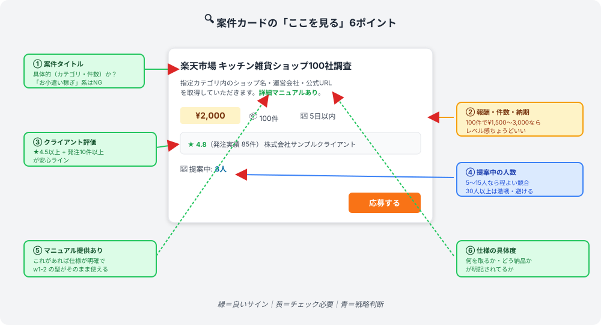
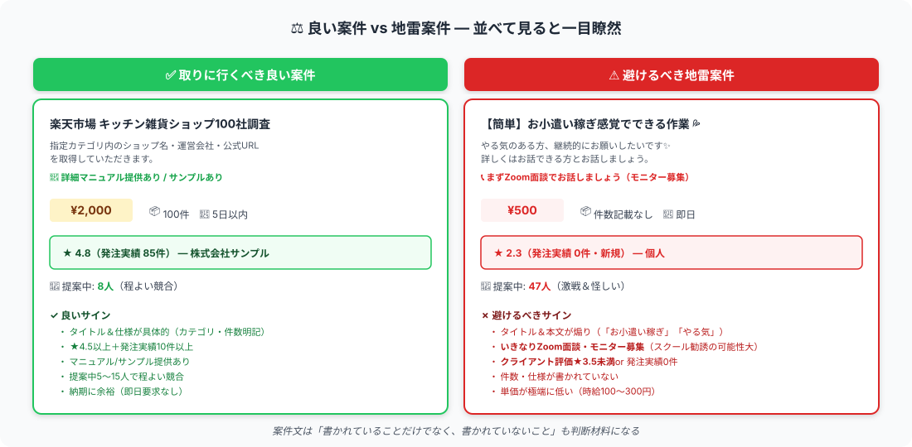

# 案件の選び方｜質を見抜いて地雷を避ける

> **ゴール**: 案件文を見て、**自分のレベル感に合うか** を即判断できる。**地雷案件を見抜いて避けられる** 。

---

## 案件選びは「単価」じゃない、「文」で決める

w1-3 を始めたばかりの今、最初に身につけるべきは **「案件文の質を読み解く」スキル** です。

なぜなら：

- 単価が低くても **良案件はある**
- 単価が高くても **地雷はある**
- **一番の判断材料は「案件文に書かれていること（と書かれていないこと）」**

最初は「単価」「件数の規模」「納期の余裕」よりも、**「この仕事、自分のレベル感に合ってる？」** を見る目を養うことが大事です。

---

## ステップ1｜案件文の質を見る（最重要）

クラウドワークスの案件カードを開いた瞬間に、**6つのポイント** を流し見してください。
（上の図と対応）

| ポイント | 見るところ | 良い案件のサイン |
|---|---|---|
| ① タイトル | 何を取得するかが書かれているか | 「楽天キッチン雑貨100社調査」のように **具体的** |
| ② 報酬・件数・納期 | 数字が明確か | 100件で¥1,500〜3,000なら **レベル感ちょうどいい** |
| ③ クライアント評価 | ★と発注実績 | **★4.5以上 + 発注実績10件以上** が安心 |
| ④ 提案中の人数 | 何人が応募中か | **5〜15人** なら程よい競合 |
| ⑤ マニュアル/サンプル | 提供があるか | **「マニュアルあり」と書いてあれば仕様明確** |
| ⑥ 仕様の具体度 | 何をどう納品するか | 取得項目・納品形式が **明記** されている |

---

## ステップ2｜「自分のレベル感」を判断する

良い案件の見極めは **「自分にできるか？」を案件文から読み解くこと**。

### レベル感が合うサイン

- ✅ 取得項目が **w1-2 で習った型** とほぼ同じ（カテゴリ→ショップ→運営会社→URL系）
- ✅ 件数が **100件前後** （多すぎ・少なすぎない）
- ✅ マニュアルに従えば **判断不要** で進められる仕事
- ✅ 納期に **2〜5日** の余裕がある（即日急ぎじゃない）

### レベルが合ってない案件のサイン（背伸び案件）

- ❌ 取得項目に **「分析」「考察」「提案」** が含まれる（リサーチを超えて頭脳労働）
- ❌ 件数が **1,000件以上** で納期 **3日以内**（時間との戦いになる）
- ❌ マニュアル提供なし、 **「いい感じに」「お任せします」** 系
- ❌ **特殊スキル要求**（プログラミング・SEO・特定ツール経験など）

最初の数件は **「w1-2の型がそのまま使える案件」** だけを狙う。これが採用される一番の近道です。

---

## ステップ3｜地雷案件を見抜く（2大フラグ）

避けるべき案件は実はシンプル。**2つのフラグ** だけ覚えればOK：

### 🚨 地雷フラグ①｜クライアント評価が低い

<strong>避ける基準</strong>： 
- ★3.5未満 
- 発注実績0件（新規クライアント） 
- レビュー欄に「連絡が取れない」「報酬が振り込まれない」などのコメント

**なぜ危ないか**：採用されても **報酬が支払われない** リスク、 **連絡が途絶える** リスク、 **無理な追加要求** が来るリスク。

新規クライアント全部を避ける必要はないけど、 **★4.5以上 + 発注実績10件以上** に絞ると地雷率が大きく下がります。

### 🚨 地雷フラグ②｜いきなりZoom面談を要求してくる

<strong>典型的な文言</strong>： 
- 「<strong>モニター募集</strong>」 
- 「詳しくは<strong>Zoom面談で</strong>お伝えします」 
- 「まずはお話だけでも📞」 
- 「<strong>無料相談</strong>します」

**なぜ危ないか**：これらは **副業スクールの勧誘** や **怪しい商材販売の入口** であることが大半です。

クラウドワークス自体に問題があるわけではなく、**プラットフォームを使って釣りをしている悪質ユーザー** が一定数いる。

<strong>例外</strong>: 通常の「カジュアル面談」「業務説明のためのMTG」は問題ありません。判断ポイントは： 
- 「<strong>モニター募集</strong>」「<strong>無料相談</strong>」の文言があるか 
- 案件タイトルが「副業を始めたい方へ」みたいな曖昧なものか 
→ これがあったら、報酬や仕事内容に関係なく <strong>避ける</strong>。

---

## 良い案件 vs 地雷案件｜並べて見る

並べて見ると違いは一目瞭然：

| 比較項目 | ✅ 良い案件 | ⚠️ 地雷案件 |
|---|---|---|
| タイトル | 具体的（カテゴリ・件数明記） | 煽り文・曖昧 |
| 仕様 | マニュアル/サンプルあり | 「お話しましょう」 |
| 評価 | ★4.5以上・発注10件以上 | ★3.5未満 or 新規 |
| Zoom面談 | なし（or 業務説明のみ） | **モニター募集の名目で要求** |
| 提案人数 | 5〜15人（適度） | 30人以上 or 怪しく多い |

---

## 狙うべき案件タイプ

### 🎯 タイプA｜100件前後の小規模リサーチ

| 項目 | 内容 |
|---|---|
| 件数 | 100件前後（80〜150件） |
| 単価 | ¥1,500〜3,000 |
| 所要時間 | 1〜2時間（Claude Code 活用前提） |
| 向き | **初心者の最初の1件目** に最適 |

### 🎯 タイプB｜カテゴリ縛りのある案件

| 項目 | 内容 |
|---|---|
| 例 | 「楽天キッチン雑貨ショップ」「化粧品ブランド企業」「東京都内の飲食店」 |
| メリット | スコープが明確 = 仕様が明確 |
| 向き | w1-2 で習った型 が **そのまま使える** |

### ベストはAとBの組み合わせ

「**カテゴリ縛り × 100件前後**」で **¥2,000〜3,000** の案件が、初心者にとってのスイートスポット。
こういう案件を **5件応募して1件採用** が、加藤さんの実例で示した黄金パターンです。

---

## 検索のコツ｜効率よく良案件を見つける

クラウドワークスの検索画面で、以下の **3つの絞り込み** を入れる：

1<strong>カテゴリ「データ収集・リサーチ」で絞る</strong>

左サイドバーから選択。これだけで関係ない案件は消える。

2<strong>「報酬1,500円以上」で絞る</strong>

時給換算で割に合わない案件を弾く第1フィルター。

3<strong>並び順「新着順」で並べる</strong>

新着案件は提案数がまだ少ない＝採用率が高い。

<strong>裏技</strong>: 検索結果ページを <strong>1日2回ブックマークから開く</strong> 習慣をつけると、新着案件をいち早く見つけられて応募の勝率が上がります。朝・夜の2回チェックがおすすめ。

---

## ✓ できたら、応募する案件を選べる！

👇 全部 ✓ できたら次へ

<label class="check-item">
<input type="checkbox" class="c-1">
案件文の質を見る6ポイント（タイトル／報酬／評価／提案人数／マニュアル／仕様）が頭に入った
</label>

<label class="check-item">
<input type="checkbox" class="c-2">
「自分のレベル感に合う案件」 のサインが分かる（w1-2 の型が使える）
</label>

<label class="check-item">
<input type="checkbox" class="c-3">
地雷フラグ①（クライアント評価が低い★3.5未満）が見抜ける
</label>

<label class="check-item">
<input type="checkbox" class="c-4">
地雷フラグ②（モニター募集・Zoom面談要求）が見抜ける
</label>

<label class="check-item">
<input type="checkbox" class="c-5">
狙うべき案件タイプ（カテゴリ縛り × 100件前後）が頭に入った
</label>

<label class="check-item">
<input type="checkbox" class="c-6">
クラウドワークスで検索の絞り込み3点（カテゴリ／報酬／新着順）を設定した
</label>

🎯

案件選びの目、開眼！

あとは応募するだけ。次は AI に応募文を書かせます。

---

## 次のアクションへ

**次のアクション** → [3-3 AIに応募文を書かせる](./3-3_AIに応募文を書かせる.html)
