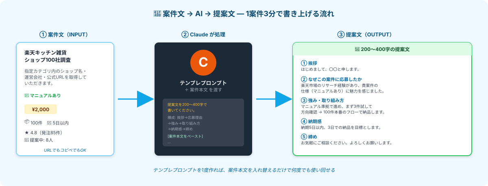

# AIに応募文を書かせる｜テンプレ化で量を打つ



> **ゴール**: **案件本文を入れ替えるだけで使い回せるテンプレプロンプト** を作って、1案件あたり **3分** で提案文を仕上げられる状態。

---

## なぜテンプレ化するのか

3-0 で見たように、**最初の4件は落ちる前提**で量を打つのが副業1ヶ月目のリアル。
1件ずつゼロから提案文を書いてたら、5件応募するのに半日かかります。

でも **テンプレ化** すれば：

- 案件本文を貼り付け → 数秒でAIが200〜400字に仕上げる
- 5件応募しても **15〜20分** で完了
- 「数を打つ」が苦痛にならない

提案文の品質を落とすわけじゃありません。**「型が固まっているから速い」** だけ。クライアント側からは丁寧な提案文に見えます。

---

## ステップ1｜案件本文を取得する

提案文は **案件文に書かれていた特徴に触れる** ことで通過率が上がります。だから、まず案件文をAIに渡せる形で手に入れる必要があります。

### 方法A｜案件本文をコピペ（一番確実）

クラウドワークスの案件詳細ページで：

<div class="step-card">
<span class="step-card__num">1</span><strong>案件タイトルから本文末尾までを範囲選択</strong>

「仕事の詳細」セクション全体をマウスでドラッグ。
</div>

<div class="step-card">
<span class="step-card__num">2</span><strong>コピー（Cmd+C / Ctrl+C）</strong>
</div>

<div class="step-card">
<span class="step-card__num">3</span><strong>後でテンプレプロンプトに貼り付け</strong>
</div>

### 方法B｜案件URLを渡す

Claude Code（または Claude チャット）の **Web Search / URL読み取り** が使える環境なら、URLを直接渡せます：

```
このクラウドワークス案件の提案文を書いてください: 
https://crowdworks.jp/public/jobs/12345678
```

<div class="callout callout--tip">
<strong>どっちがおすすめ？</strong> 確実なのは <strong>方法A（コピペ）</strong>。Claude が案件ページを取得できなかった時にやり直しになるリスクがゼロ。<br>
慣れてきたら方法Bで効率化、というステップでOK。
</div>

---

## ステップ2｜テンプレプロンプトを用意する

下のプロンプトをそのままコピーして、 **`案件001` フォルダ内の `提案文テンプレ.md`** などに保存しておきます。**1度作れば一生使えるテンプレ** です。

<div class="terminal-block">
<pre><code>あなたはクラウドワークスの応募文（提案文）を書くプロです。

下記の【案件情報】と【私の前提】を読んで、
200〜400字の提案文を書いてください。

【案件情報】
&lt;ここに案件本文をコピペ&gt;

【私の前提】
- 副業として始めたばかり、リサーチ案件中心に受注したい
- AIツール（Claude Code）活用で効率納品が可能
- 納期厳守、丁寧なコミュニケーション重視
- 過去実績：（あれば書く / なければ「これから積み上げ予定」）

【提案文に含めること】
① 簡潔な挨拶
② <strong>なぜこの案件に応募したか</strong>（案件文から読み取った特徴に触れる）
③ 自分の強み（リサーチ系・効率納品 etc）
④ 取り組み方（マニュアル準拠 → 3件試す → 本番のフロー）
⑤ 納期感の明示（早めの納品目標）
⑥ 確認したいこと（あれば1〜2点）
⑦ 「お気軽にご相談ください」で締め

【AI活用言及のルール】
- 案件文に「AI使用OK」「AI活用歓迎」とあれば、<strong>前面に出して</strong>アピール
- 言及がなければ「効率的な作業手順で」と<strong>暗に伝える程度</strong>
- 「AI禁止」「人力でお願いします」とあれば、<strong>AI言及はしない</strong>

【トーン】
親しみやすく、でも信頼感のあるビジネス調。
過剰な敬語・絵文字は避け、ハキハキした文章で。
</code></pre>
</div>

このテンプレの **賢いところ** は、最後の **「AI活用言及のルール」** で、Claudeが案件文を読んで自動的に判断してくれること。AIフレンドリーな案件には前面に出し、人力指定の案件には触れない。

---

## ステップ3｜実際に書かせてみる

<div class="step-card">
<span class="step-card__num">1</span><strong>テンプレプロンプトをコピー</strong>

上のテンプレを丸ごとコピー。
</div>

<div class="step-card">
<span class="step-card__num">2</span><strong>Claude Code（or Claudeチャット）に貼り付け</strong>
</div>

<div class="step-card">
<span class="step-card__num">3</span><strong>「&lt;ここに案件本文をコピペ&gt;」を実際の案件本文に置き換え</strong>

ステップ1で取得した案件本文を、そこに差し込む。
</div>

<div class="step-card">
<span class="step-card__num">4</span><strong>送信 → Claudeが200〜400字の提案文を出してくれる</strong>

数秒で出力完了。
</div>

<div class="step-card">
<span class="step-card__num">5</span><strong>必要に応じて微調整</strong>

たいてい80%くらいの品質で出てきます。<strong>気になるところだけ手で直す</strong>。
</div>

---

## ステップ4｜AI活用を「書く / 書かない」の判断基準

提案文で「AIを使ってます」と言うかどうかは **案件によって判断** します。

| 案件文に書かれていること | 提案文での扱い |
|---|---|
| 「AI使用OK」「AI活用歓迎」「効率的な方なら大歓迎」 | ✅ **前面に出してアピール**（採用率が上がる） |
| 何も書かれていない（多数派） | ◯ **「効率的な手順で進めます」と暗に伝える程度** |
| 「AI禁止」「人力でお願いします」「目視確認必須」 | ❌ **AI言及はしない**（要件に合わせて誠実に） |

<div class="callout callout--info">
<strong>大事な原則</strong>: クライアントが「AI禁止」と書いている案件で、隠してAIを使うのはNG。<br>
その場合は <strong>素直にスキップ</strong>するか、<strong>本当に人力で対応する案件</strong> として受ける。<br>
仕様要件と提案内容にズレがあると、後で炎上の原因になります。
</div>

---

## ステップ5｜微調整のコツ

Claude が出した提案文をそのままコピペしても、たいてい採用ラインには乗ります。
でも、**ひと手間かけると通過率がさらに上がる** ポイント：

### ① クライアント名を入れる

「貴社のキッチン雑貨案件に応募させていただきます」より、
「**株式会社サンプル様** のキッチン雑貨案件に応募させていただきます」と固有名詞で書く方が、テンプレ感が消えます。

### ② 案件文の独自表現を1つだけ拾う

案件文に「**初回確認の上スタート**」みたいな独自フレーズがあれば、提案文でも「初回確認のフローも問題ありません」と触れる。
「ちゃんと案件文を読んだ感」が出ます。

### ③ 質問を1〜2個入れる

「以下、確認させてください：① 取得項目に重複がある場合の扱いは？② 進捗報告の頻度はどの程度をご希望ですか？」

→ 「**ちゃんと考えてる人感**」が出て採用率UP。質問が1個もないと、「とりあえず応募」に見えます。

<div class="callout callout--warn">
<strong>やりすぎ注意</strong>: 質問を5個も6個も書くと「面倒な人」に見える。<strong>1〜2個に絞る</strong>のが鉄則。
</div>

---

## ✓ できたら、応募できる！

<div class="stage-checklist">
<p class="stage-checklist__title">👇 全部 ✓ できたら、いつでも応募できる状態</p>

<label class="check-item">
<input type="checkbox" class="c-1">
<span>テンプレプロンプトを <code>案件001/提案文テンプレ.md</code> に保存した</span>
</label>

<label class="check-item">
<input type="checkbox" class="c-2">
<span>1件の案件文をコピペして、Claudeに提案文を書かせてみた</span>
</label>

<label class="check-item">
<input type="checkbox" class="c-3">
<span>AI活用を「書く / 書かない」の判断基準が分かった（案件文を読んで判断）</span>
</label>

<label class="check-item">
<input type="checkbox" class="c-4">
<span>微調整の3コツ（クライアント名／独自表現／質問1〜2個）が頭に入った</span>
</label>

<label class="check-item">
<input type="checkbox" class="c-5">
<span>1案件あたり3〜5分で提案文を仕上げられそうな手応えがある</span>
</label>

<div class="stage-clear-banner">
<div class="stage-clear-banner__emoji">⚡</div>
<p class="stage-clear-banner__title">提案文・量産モード起動！</p>
<p class="stage-clear-banner__sub">テンプレを手にしたあなたは、もう量を打てる。次は応募の自動化で、さらに効率を上げます。</p>
</div>
</div>

---

## 次のアクションへ

**次のアクション** → [3-4 応募を量産する](./3-4_応募を量産する.html)
