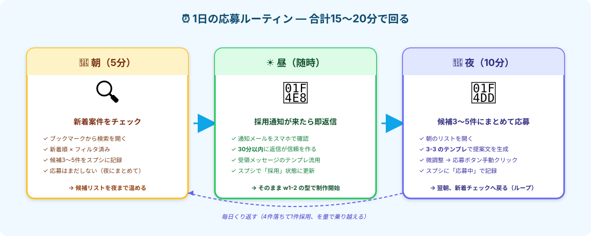

# 応募を量産する｜1日15〜20分のルーティンで回す



> **ゴール**: **朝5分・夜10分** の応募ルーティンを定着させて、1日3〜5件の応募を **無理なく出し続けられる** 状態。

---

## なぜ「量を打つ」のか

3-0 で見たように、副業1ヶ月目のリアルは **「4件落ちて1件採用」**。
1件しか応募しなかったら、たいてい落ちて終わり。**量を打つ仕組み** を作らない限り、月5万には届きません。

ここで大事なのは **「気合いで頑張る」じゃなくて「習慣で回す」** こと。
朝5分・夜10分のルーティンに落とし込めば、毎日無理なく続きます。

<div class="callout callout--info">
<strong>3-3 のテンプレが効くのはここ</strong>: 提案文をゼロから書くなら1件20分以上かかるけど、テンプレに案件文を差し込むだけなら3〜5分。<strong>5件で15〜25分</strong>、夜10分は実現可能なペース。
</div>

---

## ステップ1｜応募管理スプシを作る（5分）

応募活動を **「見える化」** するためのスプシを作ります。これが量を打つ仕組みの土台。

### スプシの構成（最小5列）

| 列 | 内容 | 例 |
|---|---|---|
| **A** 応募日 | yyyy/mm/dd | 2026/05/01 |
| **B** 案件名 | 案件タイトル | 楽天キッチン雑貨100社調査 |
| **C** クライアント | 会社/個人名 | 株式会社サンプル（★4.8） |
| **D** 単価 | 報酬金額 | ¥2,000 |
| **E** 状態 | 応募中/採用/落選 | 応募中 |
| **F** 結果メモ | 1行で振り返り | 落選：提案中30人で激戦だった |

### 作り方

<div class="step-card">
<span class="step-card__num">1</span><strong>Google Sheets で新規スプシを作成</strong>

ファイル名は「副業応募管理_2026」など分かりやすく。
</div>

<div class="step-card">
<span class="step-card__num">2</span><strong>1行目にヘッダーを入力</strong>

A1〜F1 に上記の列名をペースト。
</div>

<div class="step-card">
<span class="step-card__num">3</span><strong>E列に「応募中／採用／落選」のドロップダウンを設定</strong>

データ → データの入力規則 → リスト直接指定 → 「応募中,採用,落選」
</div>

<div class="step-card">
<span class="step-card__num">4</span><strong>ブックマークバーに登録</strong>

これから毎日開くページなので、すぐアクセスできるように。
</div>

---

## ステップ2｜朝のルーティン（5分・新着チェック）

朝起きたら、コーヒー片手にやることはこれだけ：

<div class="step-card">
<span class="step-card__num">1</span><strong>クラウドワークスの検索ページをブックマークから開く</strong>

3-2 で固めたフィルタ条件（カテゴリ：データ収集／報酬1,500円以上／新着順）が効いた状態で。
</div>

<div class="step-card">
<span class="step-card__num">2</span><strong>新着案件をザッと見て、3〜5件を候補に</strong>

3-2 の見極めポイント（タイトル具体性・★4.5以上・提案中5〜15人・マニュアル提供）でサクッと判断。<br>
迷ったら飛ばす。完璧を求めない。
</div>

<div class="step-card">
<span class="step-card__num">3</span><strong>候補のURLをスプシに貼り付け（B列に案件名、A列は仮で日付）</strong>

E列の状態は空欄のまま。これは「今夜応募する候補」のリスト。
</div>

<div class="callout callout--tip">
<strong>朝に応募しない理由</strong>: 朝は <strong>判断疲れを避ける</strong> ため、候補を見つけるだけにとどめる。応募文を書くのは夜にまとめて、集中してやる方が質が安定します。
</div>

---

## ステップ3｜夜のルーティン（10分・まとめて応募）

夜、寝る前の10分でまとめて応募します：

<div class="step-card">
<span class="step-card__num">1</span><strong>朝のスプシを開く</strong>

候補3〜5件のURLが並んでる状態。
</div>

<div class="step-card">
<span class="step-card__num">2</span><strong>1件目の案件本文をコピー</strong>

クラウドワークスの案件詳細ページから、本文をコピペ。
</div>

<div class="step-card">
<span class="step-card__num">3</span><strong>3-3 のテンプレプロンプトに差し込んで Claude に送信</strong>

`案件001/提案文テンプレ.md` を開いて、案件本文を差し込んだだけのプロンプトを Claude Code に投げる。
</div>

<div class="step-card">
<span class="step-card__num">4</span><strong>30秒で出てきた提案文を微調整 → 応募ボタンをクリック</strong>

3-3 で習った微調整3コツ（クライアント名・独自表現・質問1〜2個）を入れる。
</div>

<div class="step-card">
<span class="step-card__num">5</span><strong>スプシの状態を「応募中」に更新</strong>

E列をドロップダウンから「応募中」に切り替え。
</div>

<div class="step-card">
<span class="step-card__num">6</span><strong>2件目〜5件目を繰り返す</strong>

1件あたり 2〜3分 × 5件 = 10〜15分。
</div>

<div class="callout callout--info">
<strong>慣れてくると</strong>: 1件あたり <strong>1〜2分</strong> で応募が出せるようになります。テンプレが体に馴染んで、微調整の勘所も分かってくる。
</div>

---

## ステップ4｜採用通知が来たら即返信（30分以内）

採用通知が来たら **30分以内** の返信が信頼を作ります。

### 受領メッセージのテンプレ（コピペでOK）

<div class="terminal-block">
<pre><code>〇〇様

このたびはご採用いただき、ありがとうございます。
精一杯取り組ませていただきます。

早速ですが、マニュアルや必要な資料をお送りいただけますでしょうか。
受領後、納期から逆算して着手します。

ご質問が出てきた際は、その都度ご相談させてください。
どうぞよろしくお願いいたします。

〇〇（あなたの名前）
</code></pre>
</div>

### 即返信のメリット

| 項目 | 効果 |
|---|---|
| **30分以内に返信** | クライアント側で「動いてくれる人」と認識される |
| **資料受領を即依頼** | スピード感が伝わって、追加の指示も貰いやすい |
| **質問を予告しておく** | 「やり取りが煩わしい人」と思われない |

その後はスプシの状態を **「採用」** に更新して、w1-2 の型（計画→3件試す→100件本番→納品）で制作開始。

---

## ステップ5｜落ちた応募から学ぶ（週末5分）

採用通知が来ない案件は **「落選」** として記録 → 週末にまとめて振り返り。

### 落選傾向の分析（5分）

スプシで状態 = 落選 の行を見て、共通項を探します：

| パターン | 改善策 |
|---|---|
| 提案中人数 30人以上 → 落選率高い | **提案中5〜15人** に絞って応募 |
| 単価¥3,000以上 → 採用率低い | 経験浅い時期は **¥1,500〜¥2,500** から |
| クライアント発注実績100件以上 → 落選 | プロを多数知っているクライアント、避ける |
| 応募が翌日以降 → 落選率高い | **新着12時間以内** で応募できるように |

### 結果メモ列に1行記録

落選した案件の F列（結果メモ）に、1行で記録：

> 落選：提案中35人の激戦、単価が高かったのも要因かも

これが翌週の **応募基準アップデート** の種になります。

---

## 1日のルーティンまとめ

```
🌅 朝（5分）   ← 新着チェック → 候補3〜5件をスプシに
☀️ 昼（随時）  ← 採用通知が来たら30分以内に返信
🌙 夜（10分）  ← テンプレで5件応募 → スプシ更新
🔁 週末（5分） ← 落選傾向を振り返って改善
```

トータル **1日15〜20分** で、月50件くらいの応募が出せます。
**4件落ちて1件採用** なら、月10件採用されるペース。月5万は普通に届きます。

---

## ✓ できたら、応募ルーティン定着！

<div class="stage-checklist">
<p class="stage-checklist__title">👇 全部 ✓ できたら、量を打つ仕組みが完成</p>

<label class="check-item">
<input type="checkbox" class="c-1">
<span>応募管理スプシを作って、ヘッダー6列を設定した</span>
</label>

<label class="check-item">
<input type="checkbox" class="c-2">
<span>クラウドワークス検索ページをブックマーク登録した</span>
</label>

<label class="check-item">
<input type="checkbox" class="c-3">
<span>朝5分のルーティン（新着チェック → 候補リスト化）が頭に入った</span>
</label>

<label class="check-item">
<input type="checkbox" class="c-4">
<span>夜10分のルーティン（テンプレで5件応募）が頭に入った</span>
</label>

<label class="check-item">
<input type="checkbox" class="c-5">
<span>採用通知への即返信テンプレを保存した（30分以内返信を意識）</span>
</label>

<label class="check-item">
<input type="checkbox" class="c-6">
<span>週末の落選振り返りで、応募基準をアップデートする習慣を持った</span>
</label>

<div class="stage-clear-banner">
<div class="stage-clear-banner__emoji">🔁</div>
<p class="stage-clear-banner__title">応募ルーティン、起動！</p>
<p class="stage-clear-banner__sub">あとは毎日回すだけ。1ヶ月後、月5万円が見えてくる。</p>
</div>
</div>

---

## 🎮 もっと効率化したい？ → エキストラステージへ

3-4 のルーティンで、すでに **1日15〜20分** で回せるところまで来ました。
ここから先は任意。**Claude Code に検索〜応募フォーム入力までやらせる** 完全自動化を学びたい人は、エキストラへ。

<div class="callout callout--info">
<strong>⚠️ エキストラは中〜上級者向け</strong>。3-4 ライト版で「量を打つ感覚」が体に入ってからの方が、自動化のメリットも見えやすいです。<strong>まずは3-4を1〜2週間運用してみてから</strong>、エキストラへ進むのがおすすめ。
</div>

**エキストラ（任意）** → [3-EX 応募の完全自動化](./3-EX_応募の完全自動化.html)

---

## 次のアクションへ

**次のアクション** → [3-5 採用後の動き方](./3-5_採用後の動き方.html)
