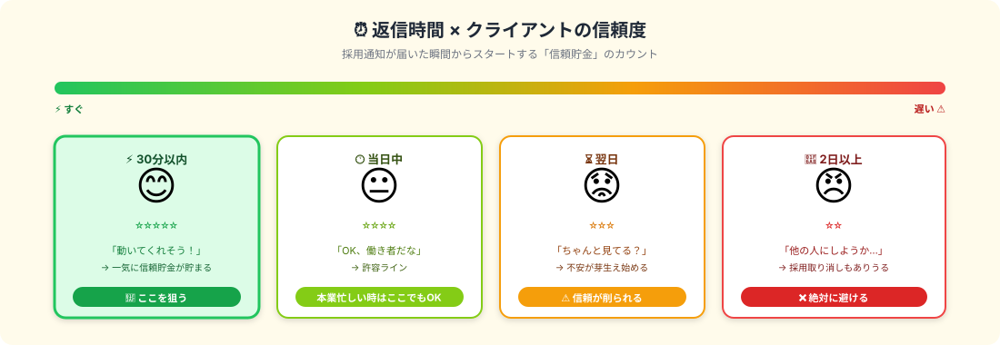

# 採用通知への即返信｜30分が信頼を作る

> **ゴール**: 採用通知が届いてから **30分以内** にテンプレで返信して、最初の **信頼貯金** を作る。

---

## 採用された瞬間、時計が動き出す

採用通知が届いた瞬間、あなたとクライアントの **「信頼貯金」のカウントがスタート** します。

最初の **30分** で、その案件の評価がかなりのところまで決まる。
これは大げさではなく、 **クライアントの心理が時間と一緒に動いていく** からです。

---

## クライアントの心理を覗いてみる

採用通知を出したクライアント側で何が起きてるか：

| 経過時間 | クライアントの内心 | 評価への影響 |
|---|---|---|
| 採用通知 | 「ちゃんと動いてくれる人だといいな…」 | 中立スタート |
| **30分以内に返信** | 「**動いてくれそう！**」 | ⭐⭐⭐⭐⭐ 一気に信頼貯金UP |
| 当日中 | 「OK、働き者だな」 | ⭐⭐⭐⭐ 普通レベル |
| 翌日 | 「ちゃんと見てる…？」 | ⭐⭐⭐ 不安が芽生える |
| 2日以上 | 「他の人にしようか…」 | ⭐⭐ **採用取り消しもありうる** |

クライアントが不安なのは **「ちゃんと動いてくれるか」** だけ。  
それを **30分で解消できる** のが即返信です。

<strong>本業がある人へ</strong>: 「30分以内」が理想ですが、本業中で気付かないこともあります。<strong>気づいた瞬間にすぐ返信</strong>が原則。最低でも当日中なら ⭐⭐⭐⭐ を維持できます。 
<strong>絶対NGは「翌日以降の沈黙」</strong>。これだけは避けてください。

---

## 即返信のテンプレ（コピペでOK）

採用通知が来たら、 **このテンプレをそのまま** 送ればOKです。

<pre><code>〇〇様

このたびはご採用いただき、ありがとうございます。
精一杯取り組ませていただきます。

早速ですが、作業マニュアルや必要な資料をお送りいただけますでしょうか。
受領次第、納期から逆算してスケジュールを立て、着手いたします。

進める中で確認したい点が出た際は、その都度ご相談させてください。
不明点はまとめて1回でお伝えするようにしますので、ご負担をおかけしません。

どうぞよろしくお願いいたします。

〇〇（あなたの名前）
</code></pre>

### このテンプレの効くポイント

| 一文 | クライアントが受け取る印象 |
|---|---|
| ご採用いただき、ありがとうございます | 礼儀正しい |
| 精一杯取り組ませていただきます | やる気がある |
| **マニュアル・資料をお送りいただけますか** | **次のアクションを促してくれる** = 動ける人 |
| **納期から逆算してスケジュール** | **計画的に進めてくれそう** |
| 確認したい点はまとめて1回で | **やり取りが少なくて済みそう** |

→ 5つの「**安心ポイント**」がたった100文字程度に詰め込まれてます。

---

## なぜ「資料を送って」を最初に書くのか

このテンプレの **核** は、 **「マニュアル・資料をお送りください」** の一文。

理由は3つ：

1. **クライアントに次の動きを促せる** → やり取りが止まらない
2. **「分かってる人」感が出る** → 案件の流れを把握してる証拠
3. **着手まで時間がかからない** → スピード感が伝わる

逆にこれを書かないと、 **クライアントが「次は何を送ればいい？」と迷う** 状態になり、お互いやり取りが止まります。

<strong>マニュアルが既に届いている場合</strong>：その文を「<strong>マニュアル拝受しました。本日中に内容を確認して、不明点があればまとめてご連絡します</strong>」に置き換えてください。

---

## AIに書かせるバリエーション

クライアントの文面が硬い／柔らかい等で、テンプレを **少し調整したい** こともあります。  
そんな時は Claude Code にこう頼む：

<pre><code>クラウドワークスで採用通知が届きました。
以下のクライアントメッセージのトーンに合わせて、
即返信用のお礼メッセージを書いてください。

【クライアントのメッセージ】
&lt;ここにクライアントの採用通知をコピペ&gt;

【条件】
- 私の名前：〇〇
- 必ず「マニュアル・資料の送付依頼」を含める
- クライアントのトーンに合わせる
  - 硬い → 敬語ガッチリ
  - 柔らかい → 親しみやすく、でも敬意は忘れず
- 100〜200文字程度
</code></pre>

→ 30秒で返信文が完成。コピペで送信。

---

## やってはいけないこと

| ❌ NG | なぜダメか |
|---|---|
| **1日以上放置** | 信頼が崩れる。最初の不安を解消できない |
| **「了解しました」だけの一行返信** | 礼儀がなく、次のアクションも見えない |
| **マニュアル無し / 質問もせず着手** | 後で認識ズレが発覚して炎上の元 |
| **絵文字過多 / フランクすぎる** | ビジネスの信頼が削れる（クライアントが硬い場合特に） |
| **長文すぎる返信** | 読むのに負担。100〜200文字が黄金 |

<strong>特に避けたいのは「了解しました」だけの一行返信</strong>。短さじゃなくて、<strong>「資料を送ってください」「いつまでに着手します」が含まれてない</strong>のが致命的。

---

## 即返信のためのスマホ通知設定（おすすめ）

「30分以内」を実現するため、クラウドワークスの通知をスマホで受け取れるように：

1<strong>クラウドワークスのスマホアプリをインストール</strong>

App Store / Google Play で「クラウドワークス」を検索。

2<strong>プッシュ通知を ON にする</strong>

設定 → 通知 → 「メッセージ受信時に通知」を有効化。

3<strong>採用通知が来たら即返信できるように、テンプレをスマホメモに保存</strong>

iOS なら「メモ」アプリ、Android なら「Keep」など、すぐコピペできる場所に上記テンプレを置いておく。

これで **電車の中・休憩中でも30分以内返信** が現実的になります。

---

## ✓ できたら、次のアクションへ

👇 全部 ✓ できたら次へ

<label class="check-item">
<input type="checkbox" class="c-1">
「30分以内返信」が信頼貯金を作る最大の要因だと理解した
</label>

<label class="check-item">
<input type="checkbox" class="c-2">
即返信のテンプレをスマホメモに保存した
</label>

<label class="check-item">
<input type="checkbox" class="c-3">
テンプレの核は「<strong>マニュアル・資料をお送りください</strong>」だと分かった
</label>

<label class="check-item">
<input type="checkbox" class="c-4">
クラウドワークスのスマホアプリで通知を ON にした
</label>

<label class="check-item">
<input type="checkbox" class="c-5">
NG行動（1日放置／一行返信／長文すぎ）が頭に入った
</label>

⚡

即返信スタンバイ完了！

採用通知が来たら、30分以内に動ける状態。次は「質問の仕方」で信頼をさらに積み上げます。

---

## 次のアクションへ

**次のアクション** → [4-2 不明点の質問の仕方](./4-2_不明点の質問の仕方.html)
