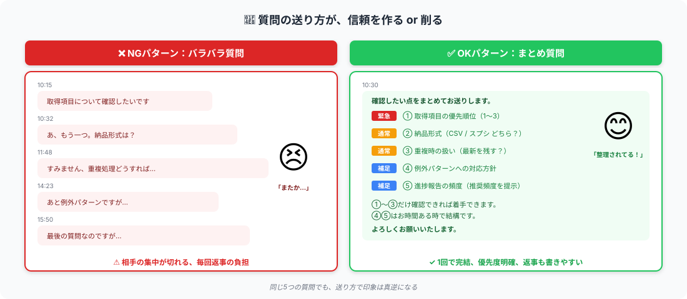

# 不明点の質問の仕方｜まとめて1回で信頼アップ

> **ゴール**: 不明点を **怖がらず・1回でまとめて・優先度をつけて** 質問できる状態。質問が信頼を **作る** 動きになる。

---

## 質問は「怖い」じゃない、「価値ある」

新人だから質問が怖い。気持ちは分かります。
でも、**プロほど質問する** んです。理由はシンプル：

- 案件文だけだと **必ず** 曖昧な部分がある
- それを **着手前に解消** するのが、品質を担保する近道
- クライアントから見ても、「**ちゃんと確認してから始める人**」は安心感がある

逆に、 **質問なしでいきなり着手** すると：
- 認識ズレが後で発覚 → やり直し
- 納品物がクライアントの想定と違う → 修正依頼が連発
- 結果、評価★3以下に転落

質問は **「分かってる人」のサイン** です。胸を張って送ってください。

---

## 大事なのは「送り方」

質問する **内容** より、**送り方** がクライアントの印象を決めます。

上の図にある通り、 **同じ5つの質問でも**：
- バラバラに5回送る → クライアントが疲れる、信頼削れる
- まとめて1回で送る → 整理されてる、信頼が積み上がる

たったこの差で、評価が★1〜2変わるくらいの破壊力があります。

---

## まとめ質問の3原則

質問を送る時、 **この3つだけ** 守ってください：

### 原則①｜まとめて1回で送る

不明点が出たら **すぐ送らない**。30分〜半日かけて、 **メモに書き溜める**。
ある程度溜まったら、まとめて1通で送る。

<strong>例外</strong>: 「これが分からないと一歩も進まない」という<strong>致命的な質問</strong>は即送ってOK。 
判断基準は <strong>「これを聞かないと作業が止まるか？」</strong>。止まらないなら、まとめて送る。

### 原則②｜優先度をつけて分類する

質問を **3段階** にラベル付け：

| ラベル | 意味 | 例 |
|---|---|---|
| 🔴 **緊急** | これがないと着手できない | 取得項目の優先順位、納品形式 |
| 🟡 **通常** | 着手はできるが、進める前に確認したい | 重複処理、エラー時の扱い |
| 🔵 **補足** | お時間ある時で結構 | 進捗報告の頻度、追加質問の頻度 |

→ クライアントは **緊急だけ即答** すればOK、と分かるので返事の負担が下がります。

### 原則③｜答えやすい形にする

**Yes/No か選択肢** の形で聞くと、クライアントの返事が早くなります：

| ❌ 答えにくい | ✅ 答えやすい |
|---|---|
| 「重複時はどうしますか？」 | 「重複時は **A: 最新を残す / B: 全件保持** どちらがよいでしょうか？」 |
| 「納期はいつ頃まで？」 | 「納期 **○月○日 で進めて問題ないでしょうか？** （余裕があれば前倒しします）」 |
| 「進捗報告は？」 | 「進捗報告は **3件試した時点 + 全件完了時の2回** でよろしいでしょうか？」 |

→ クライアントは「YES」「A で」と短く答えるだけで済む。

---

## まとめ質問のテンプレ

このテンプレをそのまま使えます：

<pre><code>〇〇様

お世話になっております、〇〇（あなたの名前）です。
着手前に確認したい点をまとめてお送りします。

【🔴 緊急】着手のために確認させてください
① 取得項目の優先順位は &lt;確認したい内容&gt; でよろしいでしょうか？
② 納品形式は &lt;A or B&gt; のどちらがご希望でしょうか？

【🟡 通常】進める中で出た疑問点
③ 重複時は A: 最新を残す / B: 全件保持 どちらがよろしいでしょうか？
④ &lt;判断に迷う内容&gt; への対応方針を教えてください

【🔵 補足】お時間ある時で結構です
⑤ 進捗報告のタイミング・頻度のご希望はありますか？

①〜②さえ確認できれば着手できます。
③〜⑤はお手すきの時にご返答いただければ幸いです。

どうぞよろしくお願いいたします。

〇〇
</code></pre>

### このテンプレが効くポイント

- 🔴🟡🔵 の **絵文字でラベリング** → 視認性が高い
- **「①〜②さえ確認できれば着手できます」** の一文で、返答の優先度が伝わる
- **選択肢提示（A or B）** で答えやすい
- **5問程度に絞る** → 一気に10個聞かない

---

## AIに質問を整理させる（推奨）

「自分で質問を整理するのが大変」「優先度の判断に迷う」場合、**Claude に整理させる** のが一番ラクです。

<pre><code>クラウドワークスで採用された案件のマニュアルを読みました。
不明点を整理して、クライアントへの「まとめ質問」メッセージを書いてください。

【マニュアル本文】
&lt;ここにマニュアル全文をコピペ&gt;

【私が気になっている点】
- &lt;気になる点1&gt;
- &lt;気になる点2&gt;
- &lt;気になる点3&gt;

【条件】
- 緊急/通常/補足の3段階で優先度をつける
- 各質問は選択肢提示（A or B）の形にする
- 「①〜②さえ答えられれば着手できる」と明示
- 5問以内に絞る
- ビジネス調・親しみやすく
</code></pre>

→ Claude が **整理された質問メッセージを生成** してくれます。コピペして送るだけ。

---

## 質問してはいけないこと

| ❌ NG質問 | なぜダメか |
|---|---|
| 案件文に書いてある内容 | 「読んでない」がバレる |
| 「自分で調べれば分かる」内容 | 怠惰に見える（例：用語の意味） |
| 答えが「お任せします」になりがちな open question | クライアントも判断に困る |
| 5個以上の長すぎる質問リスト | 重い、回答負担大 |
| 1日に2〜3回送るバラバラ質問 | 集中力削る |

<strong>「分からないことを全部聞く」は逆効果</strong>。 
受講生がやるべきは「<strong>クライアントしか答えられない質問だけを、まとめて1回で送る</strong>」こと。 
自分で調べられることは自分で調べる。判断が分かれることだけ聞く。

---

## やり取りの黄金ルール

質問・返答・追加質問のリズムは **「24時間ルール」** で動かしましょう：

| アクション | タイミング |
|---|---|
| クライアントから返信が来た | **24時間以内** に受領メッセージ |
| 受領後、追加質問が出た | **まとめて翌朝に1回** で送る |
| クライアントの返事が遅い時 | 24時間経ったら **「ご返答お待ちしております。お手すきの際で結構です」** と一言 |

→ **やり取りが滞らない** 状態を作るのが、信頼の作り方。

---

## ✓ できたら、次のアクションへ

👇 全部 ✓ できたら次へ

<label class="check-item">
<input type="checkbox" class="c-1">
「質問は怖くない、プロほど質問する」と腹落ちした
</label>

<label class="check-item">
<input type="checkbox" class="c-2">
3原則（まとめて／優先度付け／答えやすい形）が頭に入った
</label>

<label class="check-item">
<input type="checkbox" class="c-3">
まとめ質問テンプレをスマホメモに保存した
</label>

<label class="check-item">
<input type="checkbox" class="c-4">
AIに質問を整理させるプロンプトを試してみた
</label>

<label class="check-item">
<input type="checkbox" class="c-5">
NGパターン（案件文に書いてある／open question／バラバラ送り）が分かった
</label>

<label class="check-item">
<input type="checkbox" class="c-6">
24時間ルール（やり取りを滞らせない）が頭に入った
</label>

📨

質問スタイル習得！

これでクライアントから「整理されてる人だな」と思ってもらえます。次は納品の仕方へ。

---

## 次のアクションへ

**次のアクション** → [4-3 納品の仕方](./4-3_納品の仕方.html)
