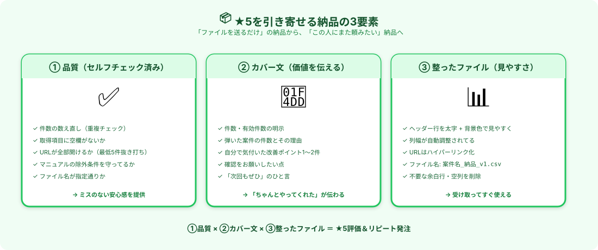

# 納品の仕方｜★5を引き寄せる3要素

> **ゴール**: 納品時に **「ファイルを送るだけ」じゃなく、★5評価とリピート発注を引き寄せる動き** ができる状態。

---

## 「納品」で評価がほぼ決まる

ここまでの動き（即返信・質問）で **信頼貯金** を作ってきました。
納品は、その貯金を **★5評価に変換するラスト** の関門です。

ここでよくある落とし穴：
- ❌ ファイルだけ送って「終わりました」
- ❌ 納品メッセージが「ご確認ください」だけ
- ❌ ファイル名が `untitled-1.csv` みたいなまま

これだと、 **作業はやってる** のに **評価★3〜4** で止まりがち。
**+α の動き** を3つ加えるだけで、★5率が一気に上がります。

---

## ★5を引き寄せる納品の3要素

3つあります。図の通り：

| 要素 | 内容 | クライアントが受け取るもの |
|---|---|---|
| ① **品質** | セルフチェック済み | **ミスのない安心感** |
| ② **カバー文** | 価値を伝えるメッセージ | **「ちゃんとやってくれた」感** |
| ③ **整ったファイル** | 見やすく整形された納品物 | **受け取ってすぐ使える便利さ** |

順番に見ていきます。

---

## 要素①｜セルフチェック（品質）

納品ボタンを押す **前に** 、自分で **5点チェック** を入れます。

- ✅ **件数の数え直し**（重複が混入してないか）
- ✅ **取得項目に空欄がないか**（やむを得ない空欄は理由をメモ）
- ✅ **URLが全部開けるか**（最低5件は抜き打ちでクリック確認）
- ✅ **マニュアルの除外条件を守ってるか**（個人運営／モール内URL等）
- ✅ **ファイル名が指定通りか**（指定がなければ「案件名_納品_v1」形式）

これだけで、ミスの大半は事前に潰せます。
所要時間 **5〜10分**。納品ボタンを押す前に、必ず。

<strong>Claudeに頼むと早い</strong>: 「<code>output.csv の中身を確認して、上記5点チェックを実行してレポートして</code>」と頼めば、Claudeが代わりにチェックしてくれます。

---

## 要素②｜カバー文（納品メッセージ）

ファイルだけ送るのではなく、 **価値を伝える納品メッセージ** を添える。
これがあるだけで、★5率が **目に見えて上がります** 。

### カバー文テンプレ

<pre><code>〇〇様

お世話になっております、〇〇（あなたの名前）です。
納品物をお送りいたします。ご確認ください。

【納品概要】
- 案件：〇〇（案件名）
- 取得件数：100件（うち有効 87件）
- 弾いた件数：13件
  - 個人運営：5件
  - 重複：4件
  - モール内URLのみ：4件

【ファイル】
- 〇〇_納品_v1.csv（メインデータ）
- 〇〇_除外リスト_v1.csv（除外した13件と理由）

【気付いた点（ご参考まで）】
- マニュアルの「カテゴリAに属する案件」のうち、
  実質はカテゴリBに分類されている可能性のあるものが2件ありました。
  該当行に「※要確認」のメモを入れてあります。

【ご確認お願いしたい点】
- 除外件数13件の判断基準が、ご想定と合っているかご確認ください。

ご不明点・修正のご要望がございましたら、お気軽にお申し付けください。
今後ともよろしくお願いいたします。

〇〇
</code></pre>

### このカバー文の効くポイント

| 一文 | 印象 |
|---|---|
| 件数の明示（100件・有効87件） | **正確に把握してる** |
| 弾いた件数とその理由 | **論理的に作業してる** |
| 自分で気付いた改善点 | **+αの気配り** |
| 確認お願いしたい点 | **判断を押し付けない** |
| 「お気軽にお申し付けください」 | **修正に柔軟** |

→ クライアントから見ると **「丁寧な仕事してくれたな」** が伝わる文章になっています。

<strong>「気付いた点」がある時の威力</strong>: 「<strong>マニュアル通りにやっただけ</strong>」じゃなくて「<strong>頭を使って取り組んでくれた</strong>」の証拠になります。 
小さな気付きでもOK。1〜2個書くだけで★4 → ★5の差が生まれます。

### AIにカバー文を書かせる

<pre><code>クラウドワークスの納品メッセージ（カバー文）を書いてください。

【案件情報】
- 案件名：&lt;案件名&gt;
- 取得件数：&lt;X件&gt;
- 有効件数：&lt;Y件&gt;
- 弾いた件数とその理由：
  - &lt;理由1&gt;: &lt;件数&gt;
  - &lt;理由2&gt;: &lt;件数&gt;

【気付いたこと（あれば）】
- &lt;気付き1&gt;
- &lt;気付き2&gt;

【条件】
- 件数を明示
- 弾いた理由を分類して伝える
- 気付いた点を1〜2個含める
- 「ご確認お願いしたい点」を1個入れる
- 親しみやすく、でも信頼感のあるビジネス調
- 300〜500文字
</code></pre>

---

## 要素③｜整ったファイル（見やすさ）

スプシ・CSV を渡す時、 **受け取った瞬間に「使いやすい」と感じてもらう** 工夫：

### 5つのチェックポイント

- ✅ **ヘッダー行を太字 + 背景色** で見やすく
- ✅ **列幅を自動調整**（ダブルクリックで自動フィット）
- ✅ **URLはハイパーリンク化**（クリックで開ける）
- ✅ **ファイル名は分かりやすく**: `案件名_納品_v1.csv`
- ✅ **不要な余白行・空列を削除**（A1から始まる）

### 「+α」で差をつける気配り（任意）

| 工夫 | 効果 |
|---|---|
| **シート2に「除外リスト」を別途用意** | 透明性UP・確認しやすい |
| **シート3に「集計サマリー」**（カテゴリ別件数等） | クライアントの意思決定が早くなる |
| **A列に通し番号** | 後で参照しやすい |
| **コメント機能で備考メモ** | クライアントが見落とさない |

→ ★5評価をもらってる人は **このどれかを必ずやってます** 。

<strong>Claude に整形を頼む</strong>: 「<code>output.csv をスプシに整形して、ヘッダー太字・列幅自動調整・URLハイパーリンク化・集計シート追加でアップロードして</code>」と頼めば全部やってくれます。

---

## 納品時のリスク管理

### リスク①｜納期に間に合いそうにない時

**遅れる前に予告** が大原則（4-0で確認した通り）。

<pre><code>〇〇様

お世話になっております、〇〇です。
進捗のご報告です。

現在 70件まで完了しており、
残り30件の対応が必要な状況です。

正確性を担保したく、納期を1日延ばさせていただけないでしょうか？
具体的には、明日の20時頃のご納品を目標としております。

申し訳ございません。ご検討よろしくお願いいたします。
</code></pre>

→ **進捗状況 + 具体的な再納期** をセットで伝えるのがコツ。

### リスク②｜納品後に修正依頼が来た時

<strong>修正依頼は「期待通り」</strong>。1回目で完璧は求められていません。 
「ご指摘ありがとうございます。<strong>本日中に修正版をお送りします</strong>」と即返信して、Claudeで素早く対応すればOK。むしろ <strong>誠実な対応で信頼が深まる</strong>機会です。

---

## ✓ できたら、次のアクションへ

👇 全部 ✓ できたら次へ

<label class="check-item">
<input type="checkbox" class="c-1">
納品の3要素（品質・カバー文・整ったファイル）が頭に入った
</label>

<label class="check-item">
<input type="checkbox" class="c-2">
セルフチェック5点（件数／空欄／URL／除外条件／ファイル名）を確認するクセが付いた
</label>

<label class="check-item">
<input type="checkbox" class="c-3">
カバー文テンプレをスマホメモに保存した
</label>

<label class="check-item">
<input type="checkbox" class="c-4">
整ったファイルの5チェック（ヘッダー／列幅／URL／ファイル名／余白）が頭に入った
</label>

<label class="check-item">
<input type="checkbox" class="c-5">
「気付いた点を1〜2個」入れる習慣を持った
</label>

<label class="check-item">
<input type="checkbox" class="c-6">
遅れそうな時は「進捗+具体的な再納期」を予告する、と覚えた
</label>

📦

★5納品の型、完成！

これで★5評価が取れる納品ができます。次は「リピートを引き出す」最後の動きへ。

---

## 次のアクションへ

**次のアクション** → [4-4 リピート発注を引き出す動き](./4-4_リピート発注を引き出す動き.html)
