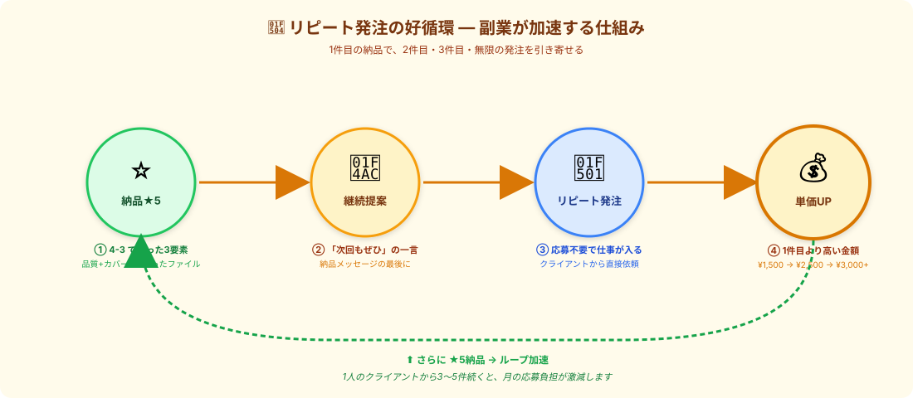

# リピート発注を引き出す動き｜「次もぜひ」を生む最後の一押し

> **ゴール**: 1件目の納品で **「次もぜひ」を引き出す** 動きが体に入って、リピート発注の好循環を起動できる状態。

---

## なぜリピートが副業を加速させるのか

副業1ヶ月目にやることは「**応募で量を打つ**」（w1-3）。
副業2ヶ月目から効いてくるのは「**リピートで量を減らす**」（w1-4）。

なぜリピートが強いか：

| 比較項目 | 新規応募 | リピート発注 |
|---|---|---|
| 応募活動 | 必要（4件落ちて1件採用） | **不要**（クライアントから直接依頼） |
| 採用率 | 20% | **ほぼ100%** |
| 単価 | 相場ベース ¥1,500 | **積み上げで¥2,500〜¥3,000** |
| 信頼関係 | ゼロから | 蓄積済み |
| 仕様の認識合わせ | 毎回必要 | 短縮（1〜2分） |

→ リピートは **「応募ゼロで、単価UP案件が入ってくる」** 状態。
1人のクライアントから3〜5件のリピートが続くと、 **月の応募負担が激減** します。

---

## リピートが起きる条件

クライアントが「**次もこの人にお願いしたい**」と思うのは、 **3つの条件** が揃った時：

| 条件 | クライアントの内心 | 4-X で習った動き |
|---|---|---|
| ① **品質に問題がない** | 「ミスなく仕上げてくれた」 | [4-3 納品の3要素](./4-3_納品の仕方.html) |
| ② **やり取りがラク** | 「コミュニケーションコストが低い」 | [4-1 即返信](./4-1_採用通知への即返信.html) + [4-2 まとめ質問](./4-2_不明点の質問の仕方.html) |
| ③ **継続提案の存在** | 「次もお願いできるんだ」 | **このページ ←** |

①②は、ここまでの章で習ってきた通り。
③が **このページの本題** です。せっかく ①② が揃っても、③ がないと **「単発で終わる」** 確率が高い。

---

## 動き①｜納品メッセージに「継続提案の一言」を入れる

[4-3 のカバー文](./4-3_納品の仕方.html) の最後に、 **必ずこの一言** を追加します：

<pre><code>今後、類似のリスト作成案件や継続的なご依頼が
ございましたら、優先的にご対応させていただきます。

ぜひお気軽にお声かけいただければと思います。
</code></pre>

たった2行。でもこれがあるかないかで、 **「次もこの人」と思い出してもらえる確率が3倍** になります。

### なぜ効くのか

| クライアントの心理 | 効果 |
|---|---|
| 「あ、また頼めるんだ」 | リピートの選択肢が頭に入る |
| 「優先的に対応してくれる」 | 急ぎの仕事の時、まず候補に上がる |
| 「気軽に声かけて」とある | 連絡のハードルが下がる |

### 言ってはいけないこと

| ❌ NG | なぜダメか |
|---|---|
| 「ぜひ次もお願いします」 | プッシュが強すぎ、押し付けがましい |
| 「単価UPでお願いします」 | 1件目の段階で要求するな |
| 「定期契約しませんか」 | 重い、関係が浅い段階では時期尚早 |
| 何も書かない | 単発で終わる確率が高い（多くの人がここで終わる） |

→ **「あくまで控えめに、でも『また使えますよ』を伝える」** が黄金。

---

## 動き②｜★5評価を取りに行く

リピート発注は **★5評価がついた人** にしか来ません（★3〜4だと「まあ、別の人でいいか」になる）。

### ★5を取るためのチェックリスト

- ✅ **納期前に納品**（数時間〜1日早めると印象が大きく変わる）
- ✅ **件数の達成**（マニュアル通りの目標件数を満たす）
- ✅ **+α の気付き**（自分で気付いた改善点1〜2個）
- ✅ **整ったファイル**（4-3 の5要素）
- ✅ **修正依頼への即対応**（24時間以内に修正版）

### 修正依頼が来た時の対応で★5かどうか決まる

実は、 **★5評価のかなりの部分は「修正対応」で決まります** 。

<strong>クライアント目線</strong>: 「指摘したらすぐ直してくれた」「文句を言わずに対応してくれた」が <strong>一番嬉しい</strong>。 
逆に、修正依頼に対して<strong>「言い訳」「渋る態度」</strong>が見えると一気に★3に落ちます。

修正依頼への返信テンプレ：

<pre><code>〇〇様

ご指摘ありがとうございます。
早速確認の上、本日中に修正版をお送りいたします。

ご不便をおかけし申し訳ございません。
今後ともよろしくお願いいたします。
</code></pre>

→ 5分以内にこれを送って、Claudeで素早く修正対応すれば、 **修正依頼が逆に信頼を深める機会** になります。

---

## 動き③｜クライアント情報のメモ習慣

リピートが起きた時、 **クライアントの好み・癖を覚えてる** と圧倒的に有利になります。

### メモするべき5項目

専用のスプシ（または Notion）を作って、案件1件ごとに記録：

| 項目 | 記録内容例 |
|---|---|
| **クライアント名** | 株式会社サンプル |
| **やり取りのトーン** | 硬め敬語、絵文字なし |
| **重視するポイント** | 件数より品質重視、URL確認を細かく見る |
| **苦手なこと** | 早朝の連絡を嫌う、長文の質問は読まない |
| **過去の発注内容** | 楽天キッチン雑貨100社、楽天家電200社 |

### リピート時の使い方

リピート発注が来た時、メモを見て **「前回の続きを思い出した感」** で返信：

<pre><code>〇〇様

ご連絡ありがとうございます。
前回のキッチン雑貨案件、無事完了できて何よりでした。

今回も同じく100件ペースで進めればよろしいでしょうか？
&lt;前回の好みを思い出して、軽く触れる&gt;の点も
今回も同様の方針で対応いたします。

それでは納期確認の上、着手いたします。
</code></pre>

→ クライアントから見ると、 **「ちゃんと覚えてくれてる」** で信頼が深まります。

---

## 動き④｜単価UPを引き出すタイミング（応用）

リピート発注が **3件目以降** で、信頼が積み上がってきたら、 **そっと単価UP** を提案できます。

### 単価UPの切り出し方

<pre><code>〇〇様

いつもお世話になっております。
今回もお声かけありがとうございます。

恐縮ですが、こちらの案件規模ですと
&lt;前回 ¥2,000 → 今回 ¥2,500&gt; あたりが
適正かと考えております。

ご検討いただけますと幸いです。
ご予算が合わない場合は、無理にお引き受けは
いたしませんので、お気軽にご相談ください。
</code></pre>

### 単価UPが通る条件

- **3件目以降**（1〜2件目では時期尚早）
- **★5評価が連続している**
- **「無理にお願いはしない」とエスケープ口を残す**
- **金額幅は10〜25%**（30%以上のジャンプは引かれる）

<strong>断られても、関係は壊れません</strong>。「<strong>今回はご予算優先で〇〇円でお引き受けします、次回以降ご検討いただければ</strong>」と返せばOK。 
むしろ「単価交渉できる人」 = 「自分の価値を分かってる人」と認識される効果もあります。

---

## ✓ できたら、次のアクションへ

👇 全部 ✓ できたら次へ

<label class="check-item">
<input type="checkbox" class="c-1">
リピート発注の威力（応募ゼロ・単価UP・信頼蓄積）が頭に入った
</label>

<label class="check-item">
<input type="checkbox" class="c-2">
納品メッセージに「継続提案の一言」を入れる習慣を持った
</label>

<label class="check-item">
<input type="checkbox" class="c-3">
★5評価のチェックリスト5項目（納期前/件数/+α/ファイル/修正対応）が分かった
</label>

<label class="check-item">
<input type="checkbox" class="c-4">
修正依頼への即返信テンプレを覚えた
</label>

<label class="check-item">
<input type="checkbox" class="c-5">
クライアント情報メモのスプシを作った（または作る予定）
</label>

<label class="check-item">
<input type="checkbox" class="c-6">
単価UPを切り出すタイミング（3件目以降・★5連続）が分かった
</label>

🔁

リピート発注スキル獲得！

これで副業が加速する好循環が起動できます。次は w1-4 通し攻略で実案件1件を完走へ。

---

## 次のアクションへ

**次のアクション** → [4-5 w1-4 通し攻略](./4-5_w1-4通し攻略.html)
