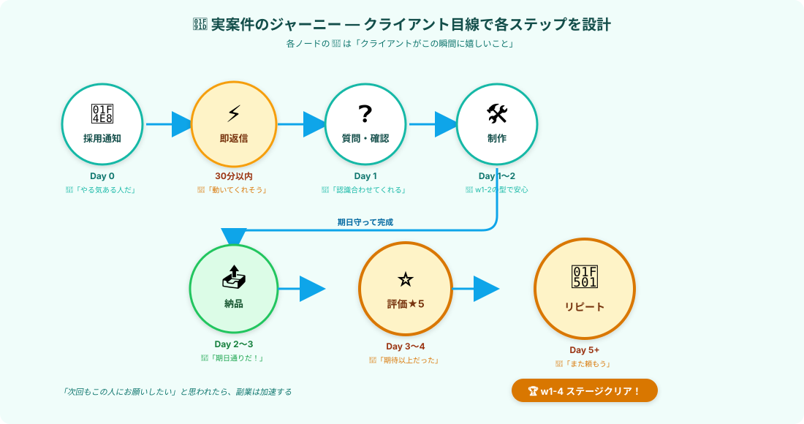

# w1-4 通し攻略｜実案件を1件完走する

> **ゴール**: 実案件を1件 **採用 → ★5納品 → 継続提案** まで通しで完走した状態。
> w1-4 の checkpoint であり、副業1ヶ月目の **集大成** 。

---

## 完走条件

w1-4 を「クリア」と呼べるのは、 **次の3つを全部達成** した時です：

- ✅ **実案件を1件、採用された**（w1-3 で習った応募で）
- ✅ **★5評価で納品** された（カバー文 + 整ったファイル + +αの気配り）
- ✅ **継続提案の一言** を納品メッセージに含めた（次のリピートへの種まき）

これが揃えば、副業1ヶ月目で **「単発の1件」じゃなく「継続案件の入口」** を作れたことになります。

---

## 進め方｜w1-4 の全アクションを通しで使う

実案件を取った時の **動きの順序** はこうなります：

### Step 1｜採用通知が届く（Day 0）

w1-3 で出した応募の中から **5件目あたり** で採用通知が来ます。
落ち着いて、深呼吸して、 **まず嬉しさを味わう** ところから。

### Step 2｜30分以内に即返信（[4-1](./4-1_採用通知への即返信.html)）

採用通知に気付いたら、すぐにテンプレを送る：

<pre><code>〇〇様

このたびはご採用いただき、ありがとうございます。
精一杯取り組ませていただきます。

早速ですが、作業マニュアルや必要な資料をお送り
いただけますでしょうか。受領次第、納期から逆算
してスケジュールを立て、着手いたします。

進める中で確認したい点が出た際は、その都度
ご相談させてください。不明点はまとめて1回で
お伝えするようにします。

どうぞよろしくお願いいたします。

〇〇
</code></pre>

### Step 3｜マニュアル受領 → 質問をまとめて送る（[4-2](./4-2_不明点の質問の仕方.html)）

マニュアルが届いたら：
1. 全部読む
2. 不明点をメモに書き溜める
3. **緊急/通常/補足** の3段階で優先度をつける
4. **まとめて1回で** 送る

質問の返事が返ってきたら、「ありがとうございます、〇月〇日までに完了予定で進めます」と進捗予告。

### Step 4｜制作（[w1-2 の型をそのまま使う](./2-0_w1-2攻略.html)）

w1-2 で習った **3ステップ** をそのまま実行：

| 段階 | やること |
|---|---|
| 試す | Claude Code に **3件だけ** 試させる |
| 直す | ズレを修正 → OK出るまで繰り返す |
| 本番 | 全件（100件等）取得 → スプシに書き込み |

慣れていれば **1〜2時間** で完成します。

### Step 5｜納品（[4-3](./4-3_納品の仕方.html)）

納品ボタンを押す **前に** ：

- ✅ セルフチェック5項目（件数／空欄／URL／除外条件／ファイル名）
- ✅ ファイル整形（ヘッダー太字／列幅自動／URLハイパーリンク）
- ✅ カバー文を作成（件数明示 + 弾いた件数 + 気付き + 確認お願い）

→ Claudeに「セルフチェックして、カバー文書いて」と頼めば、5分でOK。

### Step 6｜★5評価 + 継続提案（[4-4](./4-4_リピート発注を引き出す動き.html)）

カバー文の最後に **必ず** この一言：

<pre><code>今後、類似のリスト作成案件や継続的なご依頼が
ございましたら、優先的にご対応させていただきます。

ぜひお気軽にお声かけいただければと思います。
</code></pre>

クライアントから修正依頼が来たら、 **5分以内に「ありがとうございます、本日中に修正版をお送りします」** と即返信 → Claude で対応。

評価が **★5** で来たら、完走です。

---

## 完走の証｜実案件1件分のスプシをメモる

w1-4 を完走できたら、 **実案件の記録を [応募管理スプシ（3-4で作ったやつ）](./3-4_応募を量産する.html)** に残しましょう：

| 項目 | 記入例 |
|---|---|
| 案件名 | 楽天キッチン雑貨ショップ100社調査 |
| クライアント | 株式会社サンプル |
| 単価 | ¥2,000 |
| 状態 | **採用 → 納品完了 → ★5評価** |
| 結果メモ | 修正1回、所要1.5時間、継続案件示唆あり |

**「結果メモ」に "★5評価獲得" と書ける** のが、w1-4 完走の証。

---

## 詰まった時のヘルプ

実案件は予想通りに進まないこともあります。よくあるトラブル：

### Q. クライアントの返信が3日以上来ない

**A**: 「お手すきの際にご返答お待ちしております」と一言送る。
それでも来ない場合は、クラウドワークス上の「メッセージ確認」機能で既読確認。
1週間以上動きがないなら、運営に相談（採用取り消し的な処理になる場合あり）。

### Q. マニュアルがふわっとしすぎて、何を作るか分からない

**A**: **絶対に勘で進めない**。「申し訳ございません、以下の点について先にご確認させてください」と質問を送る。
仕様が明確になるまで着手しない。これが品質トラブル回避の鉄則。

### Q. 制作中に Claude Code の挙動がおかしい

**A**: w1-2 の型をもう一度確認。3件試す → 直す → 本番のフローを守る。
1件もうまく取れない時は、マニュアルの解釈をクライアントに再確認するチャンス。

### Q. 納期に間に合わない

**A**: **遅れる前に予告** （4-0で確認した通り）。「納期を1日延ばせますか」を **2日前** に送る。

---

## ✓ 完走したら、ステージクリア！

👇 全部 ✓ できたら w1-4 クリア

<label class="check-item">
<input type="checkbox" class="c-1">
実案件を1件、採用された
</label>

<label class="check-item">
<input type="checkbox" class="c-2">
採用通知から30分以内に即返信した（または気づいて即対応）
</label>

<label class="check-item">
<input type="checkbox" class="c-3">
不明点を「まとめ質問」で1回で送った
</label>

<label class="check-item">
<input type="checkbox" class="c-4">
w1-2の型（試す→直す→本番）で制作した
</label>

<label class="check-item">
<input type="checkbox" class="c-5">
納品の3要素（品質・カバー文・整ったファイル）を全部入れた
</label>

<label class="check-item">
<input type="checkbox" class="c-6">
納品メッセージに「継続提案の一言」を入れた
</label>

<label class="check-item">
<input type="checkbox" class="c-7">
★5評価をもらった（または★4以上）
</label>

<label class="check-item">
<input type="checkbox" class="c-8">
応募管理スプシに完走記録を残した
</label>

🏆

w1-4 STAGE CLEAR!

実案件1件、★5納品で完走しました。これで「副業ができる人」の側に立てました。

---

## 次のステージへ

w1-4 を完走したあなたは、もう **「初案件を取って、★5納品して、リピートの種を撒ける人」** です。

次の w1-5 では、これを **「月5万円稼ぐ仕組み」** に進化させていきます。
複数案件の並行・収益のパターン化・リピートの育て方など。

**次のステージ** → [5-0 w1-5攻略｜月5万への道筋](./5-0_w1-5攻略.html)
