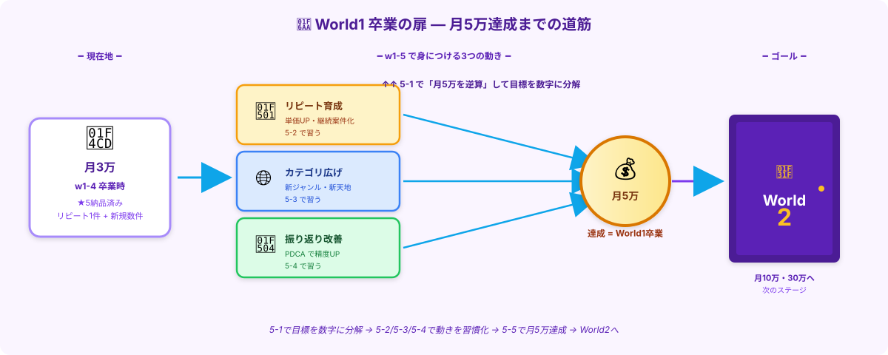

# w1-5攻略｜月5万への道筋

> **ゴール**: 月5万円を **実際に達成** した状態。そして、 **World2への扉が開く** 。

---

## 現在地：月3万エリア

w1-4 を完走したあなたは、ざっくり **月3万円のエリア** にいます。
- 採用された案件 1〜3件 / 月
- 単価 ¥1,500〜¥2,000
- リピート発注の種が1〜2件

ここから **月5万円** へ。差し引き **月+2万** の伸ばし方を、w1-5 で身につけます。

---

## w1-5 で身につける3つの動き

月5万への道は、ガッツや根性ではなく **「3つの動き」を仕組み化すること** で作ります：

| 動き | 内容 | 効く理由 |
|---|---|---|
| 🔁 **リピート育成**（5-2） | 1人のクライアントから3〜5件続ける | **応募ゼロ**で案件が入る |
| 🌐 **カテゴリ広げ**（5-3） | 楽天以外の新ジャンルに進出 | **新天地で単価UP**も狙える |
| 🔄 **振り返り改善**（5-4） | 週次・月次でPDCA | **採用率・単価が徐々に上がる** |

そして **5-1で月5万を「数字で分解」** してから始めます。漠然と「月5万を目指す」じゃなく、 **「リピート2件×¥2,500 + 新規3件×¥2,000 = ¥11,000/週 = 月¥44,000」** みたいに **計算で道のりを見える化** します。

---

## ⚠️ ここで起きる「3つの不安」に先回り

副業1ヶ月目から2ヶ月目に進むこの段階、多くの人が **この3つの不安** で止まります。
それぞれ **どう対処するか** を最初に話しておきます。

### 不安①｜「これ続けて意味あるのかな…」

最初の熱が冷めてきて、 **「副業ってこんなもんか」** と感じる時期があります。
月3万くらいで止まってると、特に出やすい疑問です。

**対処：数字で逆算して「あと何が足りないか」を可視化する**

具体的にやるのは [5-1 月5万を分解する](./5-1_月5万を分解する.html)。
- 「リピートが1件増えれば月+¥2,500」
- 「単価¥1,500 → ¥2,500 になれば月+¥1万」

→ **意味あるかどうかは、数字で見える化すれば分かる** 。漠然とした不安が、具体的な行動目標に変わります。

### 不安②｜「単価が低くてやってられない…」

¥1,500 の案件を5件やっても ¥7,500。
時給換算すると微妙な数字になって、 **「本業の方がコスパ良くない？」** と思い始めます。

**対処：単価UPの仕組みを2つ持つ**

| 仕組み | 内容 | 5-X |
|---|---|---|
| **リピート育成** | 同じクライアントで信頼貯金 → 単価UP交渉 | 5-2 |
| **カテゴリ広げ** | 高単価ジャンル（業界別/専門系）への進出 | 5-3 |

単価が上がらない原因は **「同じ低単価案件を何度もやってる」** だけ。  
動きを変えれば単価は上がります。

### 不安③｜「いい案件がない…」

応募リストを見ても **「ピンとくる案件がない」** 「単価安い案件ばかり」 — これも頻出。

**対処：原因を「振り返り」で特定する**

[5-4 振り返りと改善](./5-4_振り返りと改善.html) で、 **応募管理スプシのデータを週次で見返す** 習慣を持ちます。
- 落選傾向（提案中人数？単価帯？クライアント評価？）
- 採用された案件の共通項
- 応募タイミング（朝・夜どちらが通る？）

データを見れば、 **「いい案件がない」ではなく「いい案件の見極めが甘い」or「応募タイミングが悪い」** だと気付けます。

<strong>「いい案件がない」と感じる時は、たいてい「自分の見極め力 or 応募タイミング」の問題</strong>。 
案件側のせいにすると、改善できる余地が消えます。<strong>振り返りで原因を見つける</strong>と、世界が変わります。

---

## このステージの進み方

w1-5 は **5つのアクション** で構成されています：

| アクション | 内容 | ねらい |
|---|---|---|
| **5-1** | 月5万を分解する | 漠然とした目標を **数字で逆算** |
| **5-2** | リピート案件を育てる | 1人のクライアントから3〜5件 |
| **5-3** | 案件カテゴリを広げる | 楽天以外の **新天地** へ |
| **5-4** | 振り返りと改善 | 週次・月次の **PDCA** |
| **5-5** | World1 卒業 \| World2 への扉 | 月5万達成の **最終 checkpoint** |

---

## ✓ できたら、次のアクションへ

👇 全部 ✓ できたら次へ

<label class="check-item">
<input type="checkbox" class="c-1">
現在地が「月3万エリア」だと自覚した
</label>

<label class="check-item">
<input type="checkbox" class="c-2">
月5万への道筋は「リピート育成・カテゴリ広げ・振り返り改善」の3動きだと理解した
</label>

<label class="check-item">
<input type="checkbox" class="c-3">
不安①（続ける意味）への対処：<strong>数字で逆算する</strong>が頭に入った
</label>

<label class="check-item">
<input type="checkbox" class="c-4">
不安②（単価が低い）への対処：<strong>リピート×カテゴリ広げ</strong>が頭に入った
</label>

<label class="check-item">
<input type="checkbox" class="c-5">
不安③（いい案件がない）への対処：<strong>振り返りで原因特定</strong>が頭に入った
</label>

<label class="check-item">
<input type="checkbox" class="c-6">
5-1〜5-5 のアクション地図が見えた
</label>

🌟

w1-5 STAGE START!

月5万達成、そしてWorld2への扉が見えてきました。まずは数字で目標を分解するところから。

---

## 次のアクションへ

**次のアクション** → [5-1 月5万を分解する](./5-1_月5万を分解する.html)
