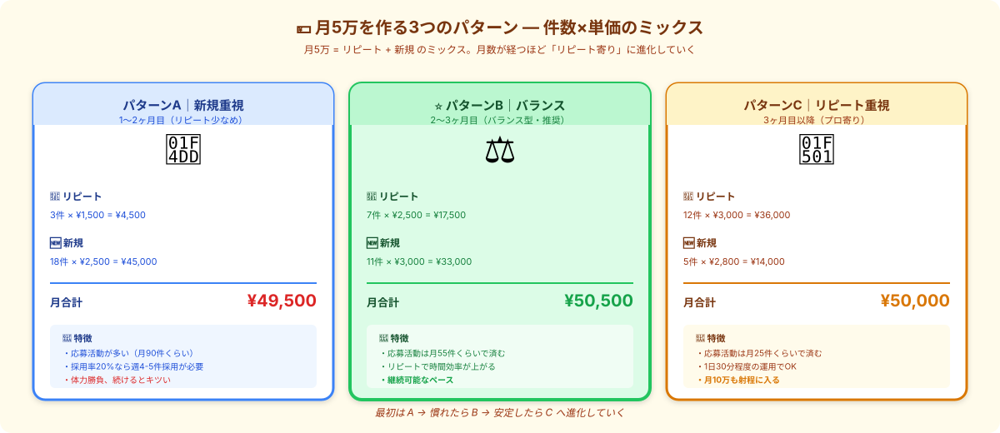

# 月5万を分解する｜数字で逆算すれば道筋は見える

> **ゴール**: 月5万円を **件数 × 単価** に分解して、自分の現在地から **「あと何件・何円足りない」** が即答できる状態。

---

## なぜ「分解」が大事なのか

「月5万を目指す」と漠然と思っていると、 **「どれくらいやれば届くのか」が見えない** ので、不安が雪だるま式に膨らみます。

逆に、 **数字で分解** すると：
- 「あと月+¥2万」じゃなく「あと **リピート4件 × ¥2,500** か **新規6件 × ¥3,000**」
- 「いつ達成するか分からない」じゃなく「来月にはこのペースで届く」

→ **モチベーションは数字でしか維持できない** のです。
「漠然とした目標」は **どれだけ近づいても達成感がない** からです。

---

## 月5万を作る3パターン（基本形）

月5万 = 件数 × 単価 のミックス。
副業のフェーズで、**バランスが進化していきます**：

### パターンA｜新規重視（1〜2ヶ月目）

| 項目 | 内容 |
|---|---|
| リピート | 3件 × ¥1,500 = ¥4,500 |
| 新規 | 18件 × ¥2,500 = ¥45,000 |
| **月合計** | **¥49,500** |
| 応募活動 | **月90件くらい**（採用率20%想定）|
| 特徴 | 体力勝負、続けるとキツい |

→ **副業を始めたばかりの段階** ではこのパターン。リピートがまだ少ないから、量で稼ぐしかない。

### パターンB｜バランス（2〜3ヶ月目・推奨）⭐

| 項目 | 内容 |
|---|---|
| リピート | 7件 × ¥2,500 = ¥17,500 |
| 新規 | 11件 × ¥3,000 = ¥33,000 |
| **月合計** | **¥50,500** |
| 応募活動 | **月55件くらい** |
| 特徴 | リピートで時間効率が上がる |

→ **w1-5 で目指すべきバランス**。リピートが育って、応募負担が下がっていく途中段階。

### パターンC｜リピート重視（3ヶ月目以降）

| 項目 | 内容 |
|---|---|
| リピート | 12件 × ¥3,000 = ¥36,000 |
| 新規 | 5件 × ¥2,800 = ¥14,000 |
| **月合計** | **¥50,000** |
| 応募活動 | **月25件くらい** |
| 特徴 | 1日30分程度で運用可能、月10万も射程 |

→ **副業の理想形**。応募はほぼせず、リピートが回っている状態。

<strong>3ヶ月で進化していく</strong>のが普通の流れ。最初から C を目指す必要はありません。<strong>A → B → C へ自然に育っていく</strong>のが、副業を続ける上での王道。

---

## 自分の現在地を測ってみる

[3-4 で作った応募管理スプシ](./3-4_応募を量産する.html) を開いて、 **先月の数字** を出してみてください：

| 項目 | あなたの数字 |
|---|---|
| リピート件数 | _____ 件 |
| リピート平均単価 | ¥_____ |
| 新規件数 | _____ 件 |
| 新規平均単価 | ¥_____ |
| **先月の月合計** | **¥_____** |

→ 上記3パターンのどれに **一番近いか** を見ます。

### 月5万に **あと何が足りないか** を計算

例：あなたが先月 ¥30,000 だった場合、 **あと¥20,000の上乗せ** が必要：

| 上乗せ方 | 必要な動き |
|---|---|
| **リピート増やす** | 4件 × ¥2,500 = ¥10,000 / 月 → 5-2 で実践 |
| **単価UPする** | 既存リピートを ¥1,500 → ¥2,500 にする → 5-2 で実践 |
| **新規でカテゴリ広げる** | 高単価カテゴリ 4件 × ¥3,000 = ¥12,000 / 月 → 5-3 で実践 |
| **応募回数増やす** | 月+10件応募 → 採用2件追加 → ¥3,000-6,000 / 月 |

→ 自分の状況に合わせて、 **2〜3個を組み合わせる** と確実に届きます。

---

## 1日のペース計算

月5万を達成する人が **1日に何をしているか** ：

### パターンB（バランス・推奨）の1日

| 時間帯 | やること | 所要 |
|---|---|---|
| 朝 | 新着案件チェック・候補リスト | 5分 |
| 昼 | 採用通知への即返信（来てたら） | 5分 |
| 夜 | テンプレで2〜3件応募 + 制作1件 | 60〜90分 |
| **1日合計** | | **約70〜100分** |

→ **平日夜 + 週末で回せる** ペース。本業との両立は十分可能。

### 週単位で見ると

| 曜日 | 主な動き |
|---|---|
| 月〜金 | 朝チェック + 夜の応募 + 制作1件 |
| 土曜 | 制作2〜3件まとめて + 振り返り |
| 日曜 | 休む or 単発1件 |

→ **週合計 8〜12時間** で月5万が達成可能。時給換算すると ¥1,000〜¥1,500 のライン。

<strong>「時給1500円かよ…」と思った方へ</strong>: 副業の時給を本業と比較するのは早計。 
副業のリピートは <strong>「資産」</strong> です。3ヶ月後にはパターンCに進化し、<strong>1日30分で月5万</strong>になります。時給換算は <strong>長期で見る</strong>のがコツ。

---

## 自分のパターンを Claude に設計させる

「自分にどのパターンが合うか分からない」場合、Claude に相談：

<pre><code>副業で月5万円を目指しています。
私の現状を踏まえて、最適な月5万達成パターンを提案してください。

【現在の状況】
- 副業歴：&lt;X ヶ月&gt;
- 先月の収益：¥&lt;XX,000&gt;
  - リピート：&lt;X件 × ¥XX&gt; = ¥XX
  - 新規：&lt;X件 × ¥XX&gt; = ¥XX
- 平日確保できる時間：&lt;X時間/日&gt;
- 週末確保できる時間：&lt;X時間/日&gt;

【相談したいこと】
- 月5万達成までに、リピート/単価UP/カテゴリ広げ/応募回数増、どれを優先すべきか
- 具体的な1日・1週間のペース提案
- 1ヶ月後の現実的な目標（¥XX,000 → ¥YY,000）
</code></pre>

→ Claudeが **あなた専用の月5万到達プラン** を設計してくれます。

---

## ✓ できたら、次のアクションへ

👇 全部 ✓ できたら次へ

<label class="check-item">
<input type="checkbox" class="c-1">
「月5万を漠然と目指す」じゃなく「件数×単価で分解する」が腹落ちした
</label>

<label class="check-item">
<input type="checkbox" class="c-2">
3パターン（A新規重視 / Bバランス / Cリピート重視）が頭に入った
</label>

<label class="check-item">
<input type="checkbox" class="c-3">
応募管理スプシで先月の数字（リピート/新規 件数・単価）を出した
</label>

<label class="check-item">
<input type="checkbox" class="c-4">
「あと月+¥XX,000」のために、何件・何円足りないか具体的に計算した
</label>

<label class="check-item">
<input type="checkbox" class="c-5">
1日・1週間の現実的なペースが見えた
</label>

📊

月5万までの地図、見えた！

あとは「リピート育成」「カテゴリ広げ」「振り返り改善」で、その地図を歩くだけ。

---

## 次のアクションへ

**次のアクション** → [5-2 リピート案件を育てる](./5-2_リピート案件を育てる.html)
