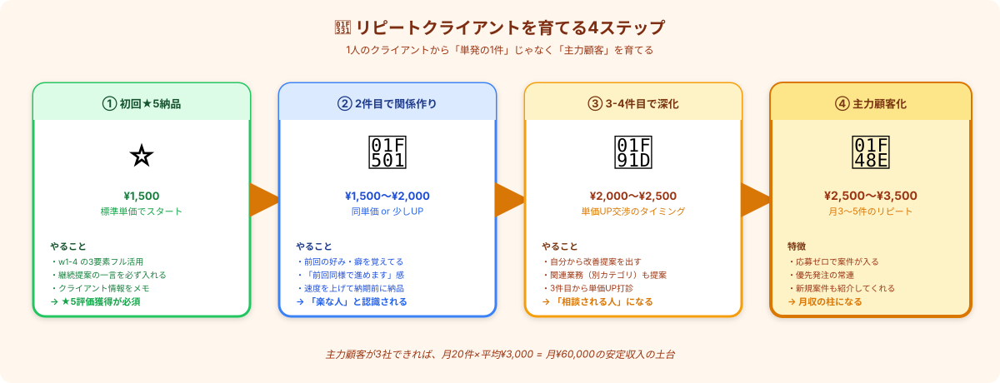

# リピート案件を育てる｜1人のクライアントから「主力顧客」へ

> **ゴール**: 1人のクライアントから **3〜5件の継続発注** を引き出して、 **主力顧客** として育てられる状態。

---

## 「リピート1件」と「リピート5件」は別物

[4-4](./4-4_リピート発注を引き出す動き.html) で **リピートの基礎** を学びました。
ここではその発展版、 **リピートを「育てる」** 動きを習います。

「リピート1件で終わる人」と「主力顧客を3社抱えてる人」では、月収が **2倍以上違います** ：

| 比較 | リピート1件で終わる人 | 主力顧客を育てた人 |
|---|---|---|
| 月の応募活動 | 多い（応募で量を打つ） | 少ない（リピートで埋まる） |
| 単価 | ¥1,500前後で停滞 | ¥2,500〜¥3,500 |
| 案件選定 | 自分で探す | クライアントから依頼が来る |
| 月収（参考） | ¥30,000〜¥40,000 | ¥60,000〜¥100,000 |

リピートを **「単発で終わらせない仕組み」** が、月5万 → 月10万 を分ける核心です。

---

## リピートを育てる4ステップ

### ステップ①｜初回 ★5納品（基礎固め）

これは [4-3](./4-3_納品の仕方.html) と [4-4](./4-4_リピート発注を引き出す動き.html) で習った通り。
- 納品の3要素（品質・カバー文・整ったファイル）
- 「次回もぜひ」の継続提案一言
- クライアント情報をメモ（次の案件で使う）

★5評価が取れないと、ステップ②以降は始まりません。

### ステップ②｜2件目で「関係作り」

リピートが来た瞬間が、勝負どころ。 **「楽な人」と認識してもらう** のが目的です。

#### 2件目に意識する3つのこと

| 動き | クライアントが感じること |
|---|---|
| **前回の好み・癖を覚えてる** | 「説明が省ける、ラクだ」 |
| **「前回と同様の進め方で」と一言** | 「認識が合ってる、安心」 |
| **納期前に納品**（半日〜1日早め） | 「期待を超えてくれる」 |

#### 2件目の返信テンプレ

<pre><code>〇〇様

ご連絡ありがとうございます。
前回のキッチン雑貨案件、無事完了できて何よりでした。

今回も同じく100件ペースで進めればよろしいでしょうか？
&lt;前回の好み（例：URL確認の細かさ）&gt; の点も
今回も同様の方針で対応いたします。

それでは納期確認の上、着手いたします。
</code></pre>

→ クライアントから見ると **「思い出してくれてる」** が伝わります。

### ステップ③｜3-4件目で「関係深化」

ここから **「楽な人」 → 「相談される人」** への進化が始まります。

#### 3-4件目に意識する3つのこと

| 動き | 効果 |
|---|---|
| **自分から改善提案を出す** | プロ意識を見せる |
| **関連業務（別カテゴリ）も提案** | 案件の幅を広げる |
| **3件目から単価UP打診** | 価値の正当な対価を要求 |

#### 改善提案の例

納品時のカバー文に、こういう一言を：

<pre><code>【ご提案（任意）】
今回の取得項目を見ていて気付いたのですが、
「&lt;追加項目候補&gt;」を追加すると、
営業活動でより使いやすいリストになると思いました。

もしご興味あれば、次回以降の案件で
+¥XX で対応可能ですので、お気軽にご相談ください。
</code></pre>

→ クライアントから「この人、ちゃんと考えてる」が伝わります。

#### 単価UP打診のタイミング

[4-4 で習った単価UP切り出し](./4-4_リピート発注を引き出す動き.html) を、 **3件目以降** に実行：

- 1〜2件目：絶対やらない（時期尚早）
- 3件目：そっと打診（10〜20%UP）
- 4-5件目：単価が定着する

### ステップ④｜5件目以降で「主力顧客化」

ここまで来ると、 **応募ゼロでこのクライアントから月3〜5件の発注** が来るようになります。

#### 主力顧客の特徴

| 特徴 | 受講生の状態 |
|---|---|
| 月3〜5件の発注 | 応募活動の負担が激減 |
| 単価 ¥2,500〜¥3,500 | 1件あたりの収益UP |
| 新規案件の紹介もしてくれる | 「あの人、紹介できる人いる？」と聞かれる |
| 急ぎ案件で優先指名 | 高単価の特別案件のチャンス |

#### 主力顧客を3社作る目標

主力顧客が3社できれば、 **月20件 × 平均¥3,000 = 月¥60,000** の安定収入の土台ができます。
ここから先は、 **新規開拓は楽しい範囲で** やればOK。

---

## リピートを失わないためのメンテナンス

主力顧客になったら、 **関係維持** も大事になります。

### NG行動（リピートが切れる原因）

| ❌ NG | 結果 |
|---|---|
| 急に納期遅れ | 「忙しくなったのかな」「他の人探そう」 |
| 品質低下（飽きてきた感） | 「前は良かったのに…」 |
| 連絡が遅くなる | 「優先度下がったのか」 |
| 単価UPを連発 | 「足元見られてる」 |

### YES行動（関係を強化する）

| ✅ YES | 効果 |
|---|---|
| 月1回の **「いつもありがとうございます」** メッセージ（案件外でもOK） | 親近感UP |
| 業界ニュース・関連トレンドの **共有** （任意） | 「気にかけてくれてる」 |
| 自分の **休業期間を事前予告** （年末年始等） | 「計画的だな」 |
| 紹介してくれた感謝を **しっかり返す** | リピートが続く |

<strong>主力顧客は「メンテナンス」が必要</strong>。一度関係ができたら勝手に続くと思わない。 
月1回の挨拶、関連情報の共有、休業の事前予告 — <strong>こうした「気配り」が長期のリピートを支えます</strong>。

---

## リピートクライアントの管理スプシ

応募管理スプシとは別に、 **リピートクライアント専用の管理シート** を作りましょう。

### 列構成（推奨）

| 列 | 内容 | 例 |
|---|---|---|
| クライアント名 | 株式会社サンプル |
| 関係性ステージ | 初回 / 2件目 / 3-4件目 / 主力 |
| 発注実績件数 | 7件 |
| 平均単価 | ¥2,500 |
| 累計収益 | ¥17,500 |
| トーン・癖 | 硬め敬語、URL確認細かい |
| 重視ポイント | 件数より品質 |
| 次の打診案 | 単価UP（4件目で）・別カテゴリ提案 |
| 直近メッセージ日 | 2026/05/01 |

→ 案件が来た時に **このシートを見て対応** すれば、毎回ベスト対応ができます。

---

## ✓ できたら、次のアクションへ

👇 全部 ✓ できたら次へ

<label class="check-item">
<input type="checkbox" class="c-1">
4ステップ（初回★5 → 関係作り → 関係深化 → 主力顧客化）が頭に入った
</label>

<label class="check-item">
<input type="checkbox" class="c-2">
2件目で「楽な人」、3件目から「相談される人」への進化が分かった
</label>

<label class="check-item">
<input type="checkbox" class="c-3">
改善提案テンプレを覚えた（次回案件で使う）
</label>

<label class="check-item">
<input type="checkbox" class="c-4">
単価UP打診のタイミング（3件目以降・10〜20%UP）が分かった
</label>

<label class="check-item">
<input type="checkbox" class="c-5">
主力顧客3社で月¥60,000の土台、というゴールが見えた
</label>

<label class="check-item">
<input type="checkbox" class="c-6">
リピートクライアント管理スプシを作った（または作る予定）
</label>

🌱

リピート育成スキル獲得！

これで主力顧客を育てる動きが体に入りました。次は「カテゴリ広げ」で新天地を開拓。

---

## 次のアクションへ

**次のアクション** → [5-3 案件カテゴリを広げる](./5-3_案件カテゴリを広げる.html)
