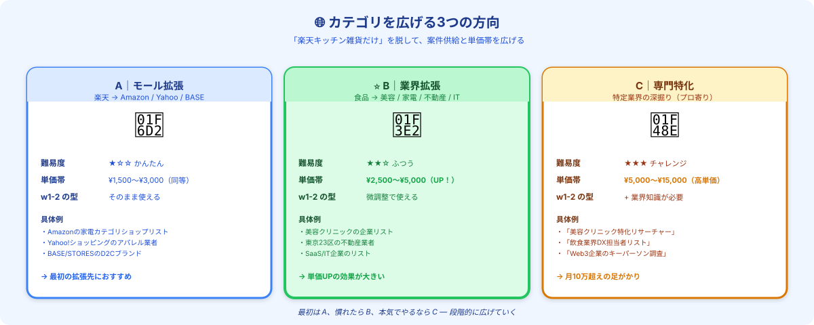

# 案件カテゴリを広げる｜新天地で単価UPと案件供給を増やす

> **ゴール**: 「楽天キッチン雑貨」だけに依存せず、 **新しいカテゴリ** に進出して **案件供給と単価帯を広げた** 状態。

---

## なぜカテゴリを広げるのか

w1-2〜w1-3 で楽天キッチン雑貨でリサーチの型を作りました。
ここに **2つの限界** があります：

| 限界 | 内容 |
|---|---|
| 案件の数 | 同じカテゴリだけだと、月の発注数に上限がある |
| 単価の上限 | 「楽天ショップ調査」の相場は ¥1,500〜¥3,000 で頭打ち |

→ **同じカテゴリの中で頑張る** より、 **新しいカテゴリに進出** する方が、月5万 → 月10万への近道です。

---

## カテゴリを広げる3方向

### 方向A｜モール拡張（最初の一歩）

**楽天 → Amazon / Yahoo!ショッピング / BASE / STORES** へ展開。

#### メリット
- **w1-2 の型がそのまま使える**（HTMLパース・URLパターン取得など）
- 仕様の理解が早い（モール内ショップ調査の構造は似てる）
- 採用率が高い（実績「楽天キッチン雑貨」が応募時アピールになる）

#### 単価感
**¥1,500〜¥3,000**（楽天と同じ相場帯）

#### 探し方

クラウドワークスで以下のキーワードで検索：
- 「Amazon 出品者リスト」
- 「Yahoo!ショッピング 業者調査」
- 「BASE D2Cブランド」
- 「ECモール 店舗一覧」

#### 応募時のアピール

> 「楽天市場のキッチン雑貨ショップ100社調査の実績がございます。
> 同様の手順で、Amazon/Yahoo!ショッピングのショップ調査も対応可能です。」

→ クライアントから見て **「他モールでもできるんだな」** と即理解されます。

---

### 方向B｜業界拡張（推奨・単価UPの本命）⭐

**EC調査 → 美容 / 家電 / 不動産 / 飲食 / IT** などの業界別企業調査へ。

#### メリット
- **単価が一気に上がる**（¥2,500〜¥5,000）
- 業界知識を持つ人が少ない → 採用率も維持しやすい
- リピートに繋がりやすい（業界特化は重宝される）

#### 単価感
**¥2,500〜¥5,000**（楽天より +50〜100%）

#### 探し方

クラウドワークスで業界キーワードで検索：
- 「美容クリニック リスト」
- 「不動産業者 一覧」
- 「IT企業 調査」
- 「飲食店 リスト 〇〇区」
- 「SaaS 企業 リサーチ」

#### 応募時のアピール

> 「ECモール（楽天）の調査経験を活かし、
> 業界別の企業情報リストも丁寧に整備して納品いたします。
> 営業視点での項目整理もご相談可能です。」

→ **「ただの作業者じゃない感」** を出すと採用率が上がります。

#### 高単価業界の見極め方

「予算規模が大きい業界」ほど高単価：
- ✅ **不動産・金融・医療** — 1顧客あたりの取引額が大きい → 調査予算もある
- ✅ **IT・SaaS** — マーケ予算が大きい
- ✅ **美容・健康** — ニッチで専門性が評価される
- ❌ **個人飲食店・小売店** — 単価安め（除外候補）

---

### 方向C｜専門特化（プロ寄り・月10万超え）

**特定業界の深掘り** で「〇〇のリサーチならこの人」のポジションを取る。

#### メリット
- 単価が **¥5,000〜¥15,000** に跳ねる
- 「同業者の中で第一想起される」状態
- 月10万 → 月30万への足がかり

#### デメリット
- **業界知識が必要**（数ヶ月かけて学ぶ）
- 案件数自体は少ないので、最初は新規開拓が必要

#### 例

- 「美容クリニックのDX動向リサーチャー」
- 「飲食業界のSaaS導入企業調査専門」
- 「Web3/暗号資産企業のキーパーソン調査」

#### どうやって専門特化する？

1. **方向A・Bで案件を回しながら**、興味ある業界を見つける
2. その業界の **記事・YouTube・本** を月10時間くらい読む
3. 案件で扱う中で、徐々に **業界用語・トレンド** が分かるようになる
4. 応募時に「**〇〇業界専門**」とプロフィール変更
5. 半年〜1年かけて、その業界での実績を積む

→ 最初から目指す必要はなく、 **長期目標として置いておく** のがおすすめ。

---

## カテゴリ拡張の進め方

副業の経過月数別の **おすすめ拡張順序** ：

| 月数 | 状態 | やるべき拡張 |
|---|---|---|
| 1ヶ月目 | 楽天キッチン雑貨で1件納品 | 拡張せず、楽天の他カテゴリ（家電・食品など）でリピート増やす |
| 2ヶ月目 | 楽天で月3万くらい | **方向A**：Amazon/Yahooに展開 |
| 3-4ヶ月目 | EC全般で月3-4万 | **方向B**：業界拡張（不動産・IT・美容など） |
| 5-6ヶ月目 | 月5万達成 | **方向B拡大** + 興味ある業界を1つ深掘り開始 |
| 半年〜1年 | 月7-10万 | **方向C**：専門特化で月10万超え |

---

## カテゴリ調査を Claude にやらせる

「自分にどのカテゴリが合うか分からない」「どの業界が高単価か知りたい」場合、Claude に相談：

<pre><code>クラウドワークスでデータ収集・リサーチ案件のカテゴリ拡張を考えています。
私の現状から、おすすめの次の拡張先を3つ提案してください。

【現在の経験】
- 楽天キッチン雑貨ショップ100社調査の実績
- リピート2件
- 月収 ¥&lt;XX,000&gt;

【興味・知識のある業界】
- &lt;業界1&gt;
- &lt;業界2&gt;

【相談したいこと】
- 次に挑戦すべきカテゴリ（モール拡張 / 業界拡張 / 専門特化のどれか）
- 想定単価帯
- 採用されやすい応募文の方向性
- 必要なら学ぶべき業界知識
</code></pre>

→ Claude が **あなた専用のカテゴリ拡張プラン** を出してくれます。

---

## 拡張時の注意点

### ⚠️ いきなり全カテゴリに手を出さない

3つも4つも同時に新規カテゴリに応募すると、 **どれも中途半端** になります。  
**1ヶ月に1〜2カテゴリずつ** 増やすのが王道。

### ⚠️ プロフィールを更新する

新カテゴリに進出したら、 **クラウドワークスのプロフィール** も更新：

- 自己紹介に「〇〇業界の調査経験あり」を追記
- スキルタグに該当業界を追加
- ポートフォリオに「実績例」を1〜2件追加（クライアント名は伏せて）

→ プロフィールが古いままだと、新カテゴリの採用率が上がりません。

### ⚠️ リピートクライアントから別カテゴリ提案も

[5-2 で習った関係深化](./5-2_リピート案件を育てる.html) と組み合わせると最強：

> 「貴社では〇〇業界のリスト調査もお考えでしたら、
> 同様の進め方で対応可能です」

→ **リピートクライアント経由で別カテゴリに進出** できると、応募ゼロで案件が来ます。

---

## ✓ できたら、次のアクションへ

👇 全部 ✓ できたら次へ

<label class="check-item">
<input type="checkbox" class="c-1">
3方向（A モール / B 業界 / C 専門特化）が頭に入った
</label>

<label class="check-item">
<input type="checkbox" class="c-2">
自分の現状（月収・経験月数）から、次の拡張先を1つ決めた
</label>

<label class="check-item">
<input type="checkbox" class="c-3">
新カテゴリで使えるアピール文（楽天実績 → 他モール／業界へ）が頭に入った
</label>

<label class="check-item">
<input type="checkbox" class="c-4">
新カテゴリに進出する時はプロフィール更新が必要、と覚えた
</label>

<label class="check-item">
<input type="checkbox" class="c-5">
リピートクライアントから別カテゴリ提案する動きがあると分かった
</label>

<label class="check-item">
<input type="checkbox" class="c-6">
Claudeにカテゴリ拡張プランを設計させるプロンプトを試した
</label>

🌐

カテゴリ拡張モード起動！

楽天だけの世界から、複数カテゴリを行き来する副業屋へ。次は振り返りと改善で精度を上げます。

---

## 次のアクションへ

**次のアクション** → [5-4 振り返りと改善](./5-4_振り返りと改善.html)
