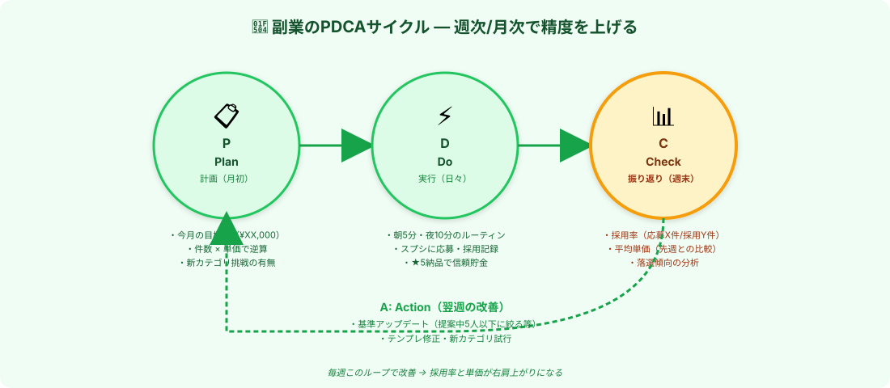

# 振り返りと改善｜PDCAで採用率と単価を上げる

> **ゴール**: **週次・月次の振り返り** で採用率・単価・件数を計測し、 **翌週・翌月の動きを改善** する仕組みが回っている状態。

---

## なぜ振り返りが必要なのか

副業で月3万→月5万を目指す時、 **「同じやり方を続ける」だけだと天井が来ます** 。

- 応募しても落ちる → 「いい案件がない」と感じる
- 単価が上がらない → 「やってられない」と感じる
- リピートが続かない → 「私じゃダメなのか」と感じる

→ これ、 **振り返りで原因を特定すれば改善できる** ことばかり。

[応募管理スプシ（3-4）](./3-4_応募を量産する.html) と [リピート管理スプシ（5-2）](./5-2_リピート案件を育てる.html) のデータを **週末に5分** 見返すだけで、世界が変わります。

---

## PDCAサイクルの設計

副業のPDCAは **シンプルに4ステップ** ：

| 段階 | タイミング | やること |
|---|---|---|
| **P (Plan)** | 月初 | 月の目標・件数・カテゴリ拡張の計画 |
| **D (Do)** | 日々 | 朝5分・夜10分のルーティンを実行 |
| **C (Check)** | 週末 | 採用率・単価・落選傾向を振り返る |
| **A (Action)** | 翌週月曜 | 基準・テンプレ・カテゴリを更新 |

これを **毎週まわす** だけで、3ヶ月後には別人レベルで上達します。

---

## P｜月初の計画（10分）

月の最初の日に、**応募管理スプシの一番上のセル** にこんなふうに書く：

<pre><code># 5月の目標

- 月収目標: ¥50,000
- 内訳: リピート 7件 × ¥2,500 + 新規 11件 × ¥3,000
- 応募活動: 月55件（採用率20%想定）
- 新カテゴリ挑戦: 不動産業者リスト（1〜2件）
- 単価UP: 主力クライアントAに3件目で +¥500 打診

# 先月（4月）からの改善点
- 提案中30人以上の案件への応募はやめる
- 朝チェックを必ず7:30までに（通勤前）
</code></pre>

→ **目標を文字にする** だけで、達成率が大きく変わります。

---

## D｜日々の実行（朝5分・夜10分）

[3-4 で習った1日のルーティン](./3-4_応募を量産する.html) を回します。

- 朝：新着チェック → 候補リスト
- 夜：5件まとめて応募 → スプシ更新
- 採用通知が来たら：30分以内に即返信

ここでは **「やる」だけ** に集中。改善や反省は週末のCheckフェーズで。

---

## C｜週末の振り返り（5分）

毎週日曜の夜（または土曜の朝）に、 **応募管理スプシのデータ** を5分見返します。

### 見るべき3指標

| 指標 | 計算方法 | 目安 |
|---|---|---|
| **採用率** | 採用数 ÷ 応募数 × 100 | 20%以上が目安 |
| **平均単価** | 採用された案件の単価平均 | 月ごとに上昇傾向か |
| **週収** | その週の採用案件の単価合計 | 月収目標 ÷ 4 と比較 |

### 落選傾向の分析

応募して採用されなかった案件（状態=落選 or 応募中のまま放置）を眺めて、 **共通項を探す** ：

| パターン | よくある原因 |
|---|---|
| 提案中30人以上の案件に応募してた | 競合多すぎ、提案中5〜15人に絞る |
| 単価¥3,000以上の案件で落選 | プロフィールが弱い、実績アピール不足 |
| 翌日以降の応募で落選 | タイミング遅い、新着12時間以内を狙う |
| 応募文がテンプレ丸出し | クライアント名・案件特有表現を入れる |

### Claudeに振り返り分析を任せる

数字を眺めるのが面倒なら、 **Claudeに分析を頼む** のが一番ラク：

<pre><code>応募管理スプシの先週分のデータを分析してください。

【データ（応募管理スプシのコピペ）】
&lt;ここに先週分の行をコピペ&gt;

【分析してほしいこと】
1. 採用率（採用数 ÷ 応募数）
2. 平均単価（採用案件のみ）
3. 落選した案件の共通項（提案中人数、単価帯、応募タイミングなど）
4. 翌週の改善アクション3つ

具体的な数字と、すぐできるアクションで提案してください。
</code></pre>

→ Claude が **データを読んで具体的な改善案** を出してくれます。

---

## A｜翌週月曜の改善（5分）

Checkで見つかった **改善ポイントを翌週から実行** ：

### 改善の例

| 発見 | 改善アクション |
|---|---|
| 提案中30人以上で全部落選 | **応募基準：提案中15人以下のみ** に絞る |
| 単価¥3,000以上で採用ゼロ | プロフィールに **「楽天キッチン雑貨100社実績」を追記** |
| 応募タイミングが翌日以降が多い | スマホ通知を **音ありON** にして即対応 |
| カバー文がテンプレすぎる | 微調整3コツ（クライアント名・独自表現・質問1〜2個）を **毎回入れる習慣** |

→ **小さな改善1つ** でも、3ヶ月続けると効果が積み上がります。

---

## 月次の大きな振り返り（30分）

月末の最終日曜などに、 **月単位の大きな振り返り** を：

### 月次振り返りシート

<pre><code># 5月の振り返り

## 達成度
- 目標 ¥50,000 → 実績 ¥XX,XXX（達成率 XX%）
- 採用件数: 目標 XX件 → 実績 XX件
- 採用率: 目標 20% → 実績 XX%
- 平均単価: 目標 ¥XXX → 実績 ¥XXX

## うまくいったこと
- &lt;1〜3個書く&gt;

## うまくいかなかったこと
- &lt;1〜3個書く&gt;

## 来月（6月）の改善
- &lt;3つに絞る&gt;

## 来月の目標
- 月収: ¥XX,XXX
- 内訳: リピート XX件 × ¥XXX + 新規 XX件 × ¥XXX
- 新挑戦: &lt;新カテゴリなど&gt;
</code></pre>

→ **3ヶ月続けると、自分の成長が数字で見える** 。これが副業継続の最大のエネルギー源になります。

---

## 不安②③の本当の対処法

[5-0](./5-0_w1-5攻略.html) で先回りした不安、ここで解消できます：

### 「単価が低くてやってられない…」への対処

- 振り返りで **平均単価の推移** を見る
- 上がっていれば「順調」、停滞なら **5-2 リピート単価UP** や **5-3 カテゴリ拡張** を試す
- 数字を見れば、 **「やってられない」じゃなく「どう動けば上がるか」** に変わります

### 「いい案件がない…」への対処

- 振り返りで **落選傾向** を見る
- 「提案中人数の問題か」「単価帯の問題か」「タイミングの問題か」を特定
- 改善アクションを翌週試す
- → **問題は案件側じゃなく、自分の動きの中にある** ことが分かります

---

## ✓ できたら、次のアクションへ

👇 全部 ✓ できたら次へ

<label class="check-item">
<input type="checkbox" class="c-1">
PDCAの4ステップ（P 月初・D 日々・C 週末・A 翌週）が頭に入った
</label>

<label class="check-item">
<input type="checkbox" class="c-2">
応募管理スプシの上部に「月の目標」を書く習慣を持った
</label>

<label class="check-item">
<input type="checkbox" class="c-3">
週末5分の振り返り（採用率・平均単価・落選傾向）を予定に入れた
</label>

<label class="check-item">
<input type="checkbox" class="c-4">
Claudeに振り返り分析を頼むプロンプトを試した
</label>

<label class="check-item">
<input type="checkbox" class="c-5">
月次振り返りシートのテンプレを作った
</label>

<label class="check-item">
<input type="checkbox" class="c-6">
「いい案件がない／単価が低い」は振り返りで原因特定できる、と腹落ちした
</label>

📈

PDCA起動！改善ループON

これで勝手に上達する仕組みが回り始めます。次は最終ステージ・World1卒業へ。

---

## 次のアクションへ

**次のアクション** → [5-5 World1卒業｜World2への扉](./5-5_world1卒業.html)
