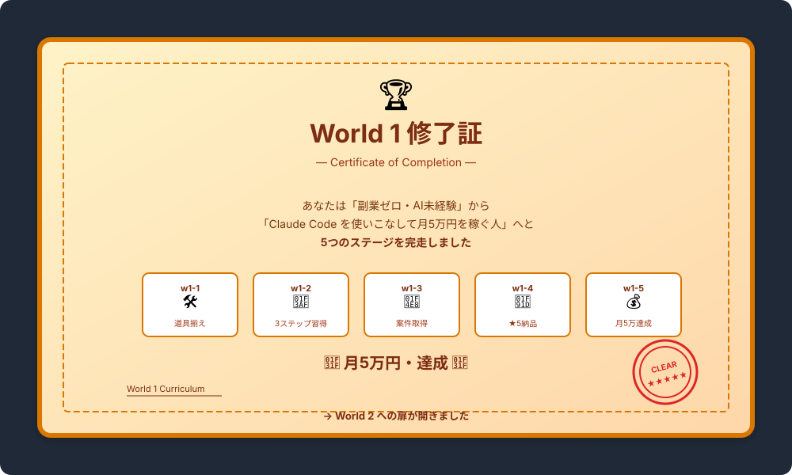

# World1 卒業｜World2 への扉が開く

> **ゴール**: 月5万円を **実際に達成** して、World1 を **卒業** する。次のステージ（月10万・30万）への扉が開く。

---

## おつかれさまでした

ここまで読み進め、実行してきたあなたは、もう **「副業ゼロ・AI未経験」じゃありません** 。

最初のページ（[0-0 World1の始まり](./0-0_world1の始まり.html)）で見た、 **「自分にもできそう」という安心感** を、 **実際の月5万円という結果** に変えられた。

これは小さな一歩じゃなくて、 **人生が動き出した一歩** です。

---

## World1 で身につけたもの

5つのステージで、こんな力が身につきました：

### 🛠️ w1-1｜道具揃え
- Claude Code Desktop の使いこなし
- 作業フォルダの整理スキル
- AI と道具で仕事を回す感覚

### 🎯 w1-2｜3ステップ習得
- 「試す → 直す → 本番」の半自動化リズム
- マニュアル → AI → 納品物 のパイプライン
- 100件のリサーチを1〜2時間で完成させる力

### 📨 w1-3｜案件取得
- クラウドワークスでの戦略的応募
- AIで応募文・自己紹介を量産する仕組み
- 「4件落ちて1件採用」を量で乗り切るマインド

### 🤝 w1-4｜★5納品
- クライアント目線でのコミュニケーション
- 即返信・まとめ質問・★5を引き寄せる納品
- リピート発注を引き出す動き

### 💰 w1-5｜月5万達成
- 件数×単価の数字逆算で目標を可視化
- リピートクライアントを育てる戦略
- カテゴリを広げて新天地で単価UP
- PDCAで継続的に改善する仕組み

---

## ✓ 卒業条件チェック

最終 checkpoint。 **全部 ✓** が付いたら World1 卒業 = World2 への扉オープンです。

👇 全部 ✓ できたら World 1 卒業

<label class="check-item">
<input type="checkbox" class="c-1">
Claude Code を使って、リサーチ案件を1人で完走できる
</label>

<label class="check-item">
<input type="checkbox" class="c-2">
クラウドワークスで案件を取って、★5評価で納品した（実績1件以上）
</label>

<label class="check-item">
<input type="checkbox" class="c-3">
リピートクライアントを1人以上獲得した
</label>

<label class="check-item">
<input type="checkbox" class="c-4">
1ヶ月で月5万円（または ¥40,000以上）を達成した
</label>

<label class="check-item">
<input type="checkbox" class="c-5">
応募管理スプシで PDCAを回す習慣ができた
</label>

<label class="check-item">
<input type="checkbox" class="c-6">
「副業を続けられる仕組み」が体に入った
</label>

🏆

WORLD 1 COMPLETE!

月5万円達成。あなたは「副業ができる人」の側に立ちました。次は World 2 へ。

---

## 月5万達成の意味

「月5万円稼げた」は数字の話だけじゃありません。

| 数字の裏にあるもの | 意味 |
|---|---|
| **月5万円** | 副業として「**形になった**」サイン |
| **AIを使う仕事の経験** | 一生役立つ汎用スキル |
| **クラウドワークスでの実績** | 次の案件・別プラットフォームへの **パスポート** |
| **★5評価** | あなたが「**信頼される人**」だという証明 |
| **PDCAの習慣** | 副業以外でも武器になる思考法 |

→ 月5万円は **入口** 。本当のリターンは、ここから10年20年で積み上がっていきます。

---

## World 2 のプレビュー

World 2 では、月5万を **月10万・30万** に伸ばす段階に進みます。

### World 2 で扱う予定のテーマ

| テーマ | 内容 |
|---|---|
| 🚀 **複数プラットフォーム展開** | クラウドワークス + ランサーズ + ココナラ + 直契約 |
| 💎 **高単価案件への進出** | ¥10,000〜¥50,000の案件、業界専門ポジション |
| 🤖 **業務自動化の深化** | Claude Code + GCP + 各種API でビジネス側に近づく |
| 🌐 **直契約・継続クライアント開拓** | 営業力をAIで補完、自分のサービス化 |
| 📈 **副業から事業化への道** | 個人事業主・法人化のタイミング |
| 🎯 **時間を売らない収益モデル** | テンプレ販売・コンサル・教える側へ |

詳しい内容は **World 2 のリリース時にご案内** します。

---

## 受講生（あなた）へのメッセージ

ここまで頑張ってきたあなたへ、World1 のラストにメッセージです。

### 「自分にもできた」という事実を持ち続けてください

副業を始めた最初の不安、覚えてますか？

- 「自分にもできるのか？」
- 「AIってよくわからない」
- 「プログラミングなんて当然できない」

→ ここまで来たあなたは、 **その不安を1つずつ越えてきた** 証拠を持ってます。

これから先、新しい挑戦をする時、 **「あの時できたんだから、これもできる」** と思い出してください。
それが、人生で一番強い武器になります。

### 「副業を続ける」が一番の宝

月5万円を達成したのも凄いですが、 **「これを続けられる」** という事実の方が遥かに価値があります。

3ヶ月続ければ、半年続けられる。
半年続ければ、1年続けられる。
1年続ければ、人生が変わる。

→ 大切なのは **続けられる仕組み** を作ったこと。  
それが [w1-5 のPDCA](./5-4_振り返りと改善.html) で身についています。

### AIは武器、でも主役はあなた

最後に、忘れないでほしいのは。

**Claude Code はあくまで武器** で、 **主役はあなた** です。

AIは作業を効率化してくれる。でも、 **どんな案件を取るか、どんなクライアントと関係を築くか、どこへ向かうか** を決めるのは、あなた自身。

AIに任せきりにせず、 **「自分が主役」** でハンドルを握り続けてください。
それが副業を **長く続ける** 秘訣であり、 **本当の価値を生む** 道です。

---

## 最後に｜次の一歩

**今日からやってほしいこと**：

1<strong>応募管理スプシのメモ欄に「World1卒業」と書く</strong>

達成した日の日付と一緒に。後で見返すと宝物になります。

2<strong>家族・友人に「副業で月5万稼げるようになった」と伝える</strong>

達成を共有することで、自信が定着します。

3<strong>来月の目標を「月7万 or 月10万」に設定する</strong>

PDCAをそのまま回せば、自然に到達できる範囲です。

4<strong>World 2 のリリースを楽しみに、副業を回し続ける</strong>

月5万を維持できれば、World 2 で月10万への道がスッと開きます。

---

  <h2 style="font-size: 28px; color: #d97706;">🌟 World 1 STAGE CLEAR! 🌟</h2>
  
あなたの副業ライフは、ここから始まります。

  
— World 2 でまたお会いしましょう —

---

## トップへ戻る

**[🏠 World1 教材トップ](./index.html)**
